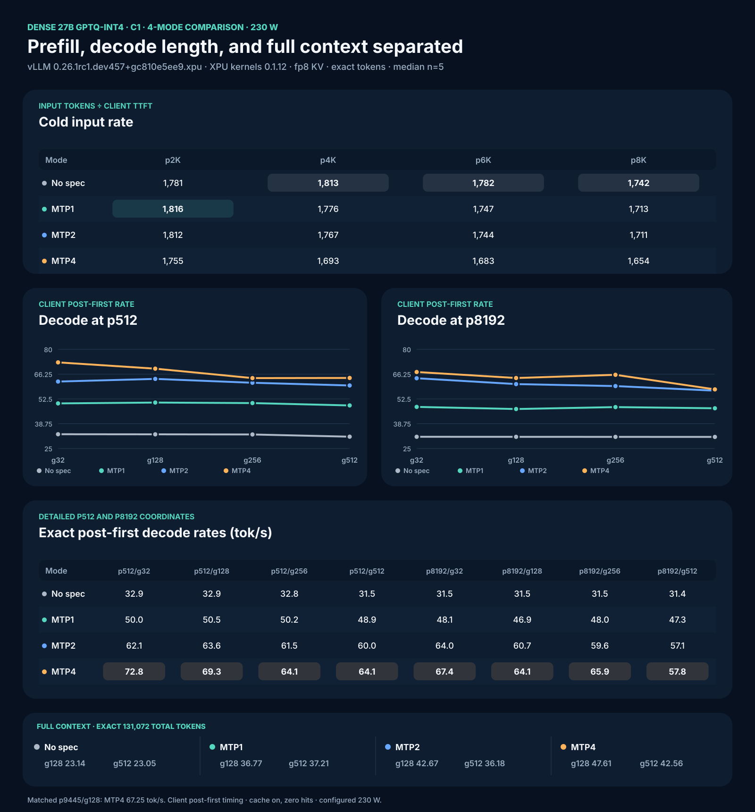
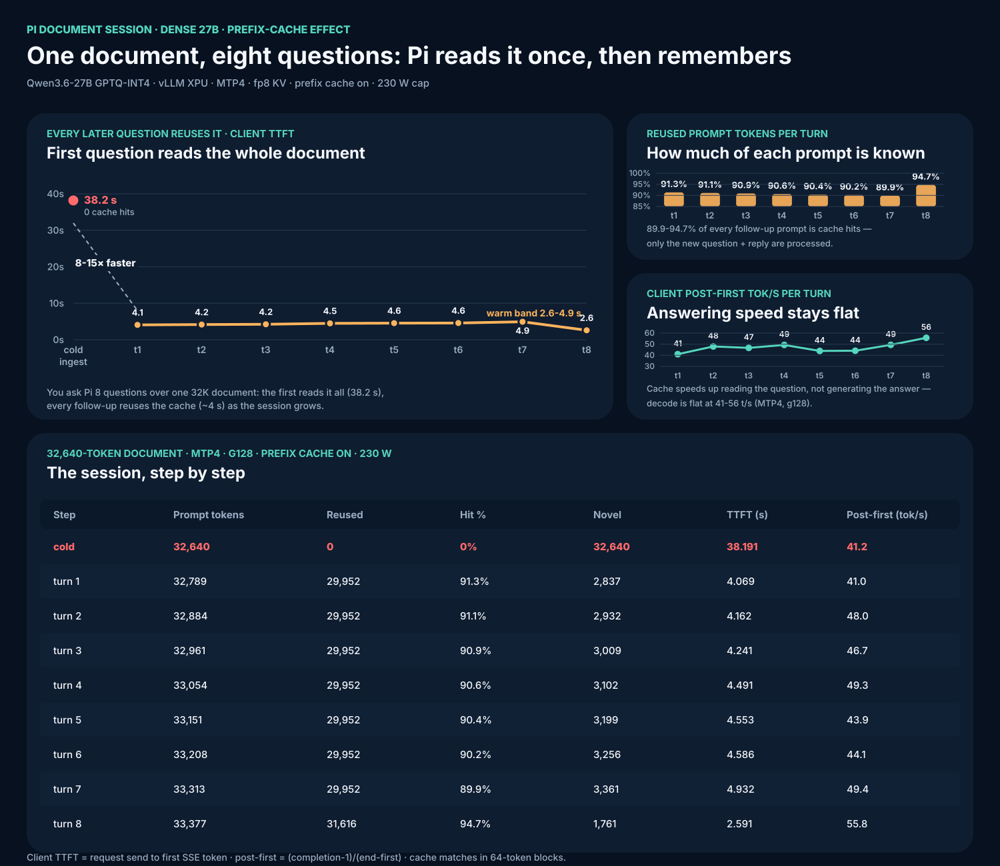
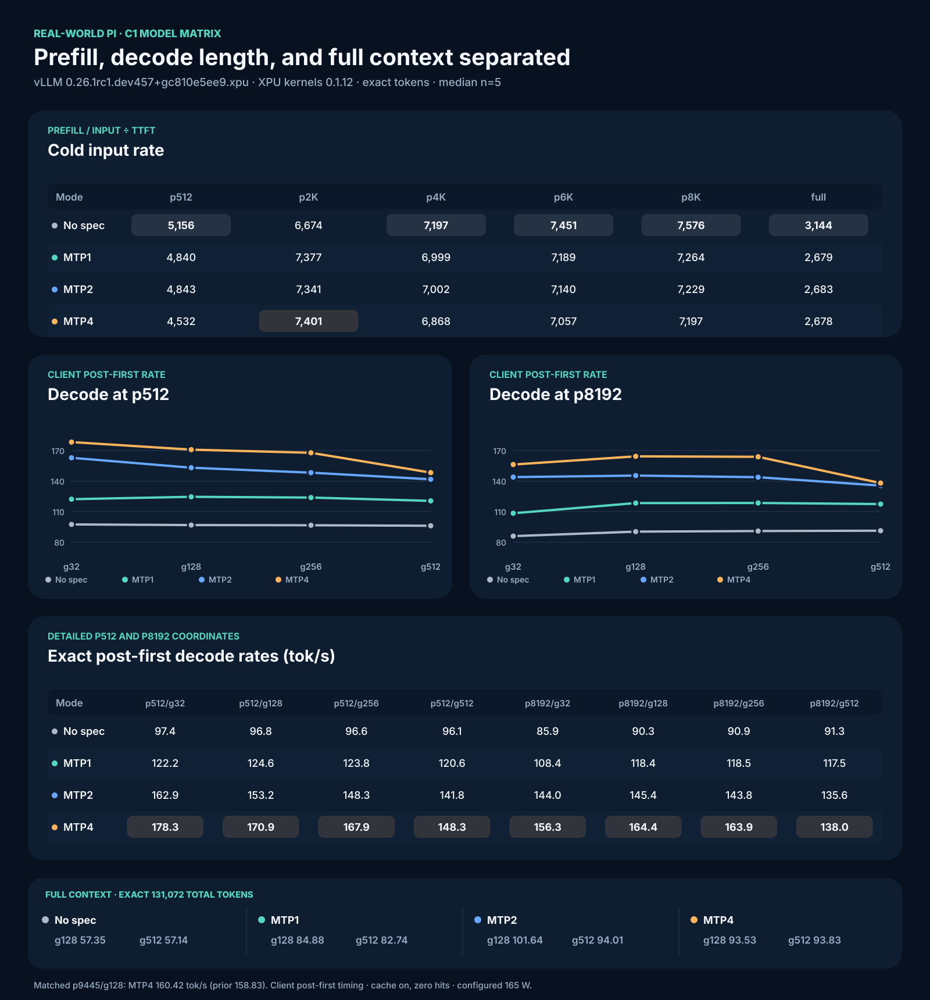
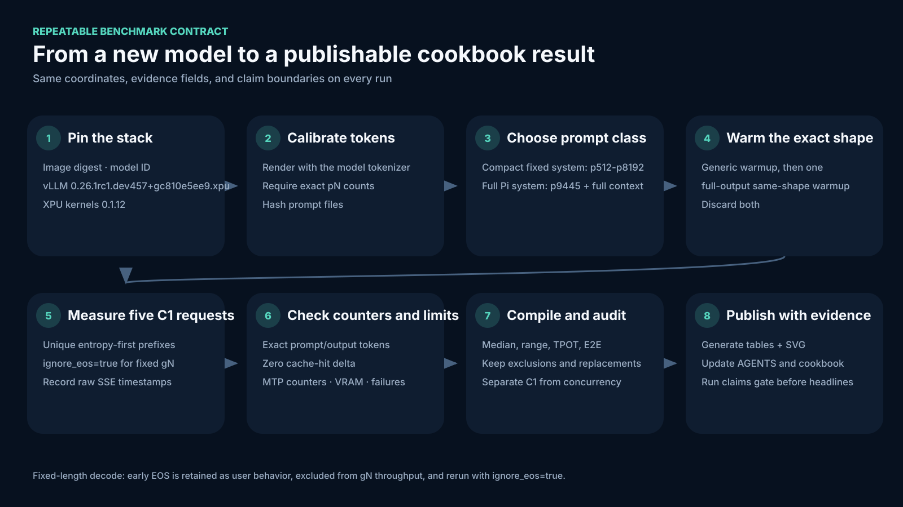

# Real-World Pi, Phase-Separated, Cache, and Exact 128K Results on B70

**Current tested stack:** image `vllm/vllm-openai-xpu@sha256:2c427ef477da092eb6f2cdbbbd24950b5fa171565b916db69d4c7bb10e68ca97`; vLLM `0.26.1rc1.dev457+gc810e5ee9.xpu`; `vllm-xpu-kernels 0.1.12`; Qwen3.6-35B-A3B preserved-MTP GPTQ-INT4 and Qwen3.6-27B preserved-MTP GPTQ-INT4. PyPI kernel package 0.1.12.2 is newer but untested.

## Current result: dense 27B 4-mode Lane 1 model card (2026-08-09)

**Scope for all dense tables:** C1, median of `n=5` after one full-output
same-shape warmup, prefix cache enabled, entropy-first unique cold prefixes, zero
cache-hit delta, scheduler 8,192, context 131,072, **`--kv-cache-dtype fp8`**
(required for dense 128K), `gpu-memory-utilization=0.88` (MTP4) / `0.90`
(no-spec/MTP1/MTP2), configured cap 230 W, client monotonic SSE timing.
Dense 27B GPTQ-INT4 runs on the pinned nightly via
`XPUwNa16LinearKernel`; both MTP patches apply unchanged to the dense
`Qwen3_5ForConditionalGeneration` architecture.



### Cold input rate: actual endpoint input tokens / TTFT (tok/s)

| Mode | p2048 | p4096 | p6144 | p8192 |
|---|---:|---:|---:|---:|
| No spec | 1,781 | 1,813 | 1,782 | 1,742 |
| MTP1 | 1,816 | 1,776 | 1,747 | 1,713 |
| MTP2 | 1,812 | 1,767 | 1,744 | 1,711 |
| MTP4 | 1,755 | 1,693 | 1,683 | 1,654 |

### Decode at p512: client post-first tok/s

| Mode | g32 | g128 | g256 | g512 |
|---|---:|---:|---:|---:|
| No spec | 32.90 | 32.85 | 32.78 | 31.54 |
| MTP1 | 50.00 | 50.47 | 50.19 | 48.88 |
| MTP2 | 62.15 | 63.59 | 61.45 | 59.95 |
| MTP4 | 72.78 | 69.30 | 64.06 | 64.13 |

### Decode at p8192: client post-first tok/s

| Mode | g32 | g128 | g256 | g512 |
|---|---:|---:|---:|---:|
| No spec | 31.48 | 31.46 | 31.45 | 31.42 |
| MTP1 | 48.08 | 46.90 | 47.97 | 47.33 |
| MTP2 | 63.98 | 60.73 | 59.62 | 57.10 |
| MTP4 | 67.44 | 64.11 | 65.87 | 57.79 |

### Historical control: p9445/g128

| Mode | Client post-first median (tok/s) |
|---|---:|
| No spec | 31.35 |
| MTP1 | 48.41 |
| MTP2 | 60.12 |
| MTP4 | 67.25 |

### Full-context decode (exact 131,072 total tokens)

| Mode | p130944/g128 (tok/s) | MTP accept | p130560/g512 (tok/s) | MTP accept |
|---|---:|---:|---:|---:|
| No spec | 23.14 | n/a | 23.05 | n/a |
| MTP1 | 36.77 | 90.9% | 37.21 | 93.6% |
| MTP2 | 42.67 | 91.1% | 36.18 | 87.8% |
| MTP4 | 47.61 | 89.2% | 42.56 | 75.9% |

### Real Pi workload — document session with follow-ups (MTP4, g128 outputs)

**Short-turn context (single requests, warm server):** cold conversation
54.2 tok/s (TTFT 0.424 s) · warm shared system 62.9 (0.423) · short multi-turn
46.9 (0.477) · RAG append 55.4 (0.574) · cold 32K document 43.7 (25.201 s,
1,295 input t/s). These short scenarios show **0 cache hits by design**: the
shared prefix is the 557-token Pi system prompt, shorter than one 1,088-token
cache page — a hit requires a full page, so only page-spanning content
(documents, long sessions) reuses cache. Realistic short-turn serving decode
is **44–56 t/s**, not the 73 t/s synthetic peak.

### Real-world Pi scenario: one document, eight follow-up questions (2026-08-10)

**The scenario.** You use Pi as a document assistant. You drop a long
document into a session — say a 32K-token project brief — and then ask it
questions one after another: *"what are the constraints?", "which risk first?",
"give me a next action"*… In a real session the conversation keeps growing,
and the document stays resident.

**The process (what actually happens on the server):**

1. **First message (cold ingest):** Pi has never seen the document. It must
   read all 32,640 tokens from scratch — **38.2 s TTFT**.
2. **Follow-up 1:** the document is already in the prefix cache from step 1.
   Pi reuses 29,952 of the 32,789 prompt tokens (91.3%) and only processes the
   ~2.8K new ones — **4.1 s TTFT**.
3. **Follow-ups 2-8:** every turn *appends* the previous question + answer to
   the session, so the prompt keeps growing (32.8K → 33.4K tokens). The
   document stays cached, so every turn still runs at **2.6-4.9 s TTFT** —
   8-15× faster than the first read, *despite* the growing prompt.

| Step | Prompt tokens | Reused | Hit % | New tokens | TTFT (s) | Post-first (tok/s) |
|---:|---:|---:|---:|---:|---:|---:|
| 1. First read (cold) | 32,640 | 0 | 0% | 32,640 | 38.191 | 41.2 |
| 2. Follow-up 1 | 32,789 | 29,952 | 91.3% | 2,837 | 4.069 | 41.0 |
| 3. Follow-up 2 | 32,884 | 29,952 | 91.1% | 2,932 | 4.162 | 48.0 |
| 4. Follow-up 3 | 32,961 | 29,952 | 90.9% | 3,009 | 4.241 | 46.7 |
| 5. Follow-up 4 | 33,054 | 29,952 | 90.6% | 3,102 | 4.491 | 49.3 |
| 6. Follow-up 5 | 33,151 | 29,952 | 90.4% | 3,199 | 4.553 | 43.9 |
| 7. Follow-up 6 | 33,208 | 29,952 | 90.2% | 3,256 | 4.586 | 44.1 |
| 8. Follow-up 7 | 33,313 | 29,952 | 89.9% | 3,361 | 4.932 | 49.4 |
| 9. Follow-up 8 | 33,377 | 31,616 | 94.7% | 1,761 | 2.591 | 55.8 |

**In plain words:**

- **The first question costs 38 s; every later question costs ~4 s.** The
  document is read once, then stays resident in the prefix cache. Pi never
  re-reads it, even though the full session is sent with every request.
- **The conversation tail is nearly free.** Even at turn 8 the prompt is
  33.4K tokens, but only ~1.8-3.4K of *new* tokens are actually processed —
  the rest is cache hits.
- **Why the hit number isn't smooth (91.3%, 90.4%, … 94.7%):** the cache
  matches in 64-token blocks. The document's tail blocks sit right at the
  boundary where the re-rendered assistant text begins, and those boundary
  blocks don't always align — so reuse wobbles between 89.9% and 94.7% as the
  growing conversation shifts the boundary. This is a cache-alignment detail,
  not a quality or correctness issue.
- **Cache speeds up *reading*, not *thinking*:** post-first decode stays flat
  at 41-56 t/s across all turns (MTP4, g128). What the cache eliminates is
  input-token processing — which is exactly why TTFT collapses while decode
  does not.

**Serving takeaway:** for document-grounded assistants, a cold document costs
~38 s once; every follow-up over that document is ~4 s regardless of session
length. That is the RAG pattern working as intended on this stack.

The resident-session dashboard below is the public record of that campaign.



### Dense measured power draw — matched A/B (2026-08-10, authoritative)

Same mixed workload (1× p2048/g1 prefill + 2× p2048/g128 decode), fresh
entropy prompts, true per-mode server, 230 W cap, monitor windowing only the
active requests, cooldown ≤55°C between modes. Live `energy1_input` deltas,
0.5 s interval average:

| Mode | Mean (W) | Max 0.5s (W) | pkg max (°C) |
|---|---:|---:|---:|
| No spec | 149.9 | 238.2 | 70 |
| MTP4 | 151.0 | 251.5 | 73 |
| MTP1 | 156.1 | 249.6 | 74 |
| MTP2 | 153.3 | 242.9 | 72 |

All four modes within a 6 W band — MTP depth is not a power lever on dense.
(An earlier campaign-window table showed 195/197/146/146 W; those were
coverage artifacts — full-context prefill cells inside the no-spec/MTP1
windows and a 223 s decode-only MTP2 window — and are superseded by this
matched A/B.)

Client post-first rate is `(completion_tokens - 1) / (request_end -
first_generated)`. It is request-side, not engine-native vLLM decode or
llama-bench `tg`. Dense prefill is compute-bound and collapses at long context
(p130944 ≈ 547 t/s input rate) — the full-attention O(N²) term.

Evidence:

- `results/qwen36-27/prefill-decode-matrix-20260809-dense27-summary.json`
- [`BENCHMARK-FORMAT.md`](BENCHMARK-FORMAT.md)

## Prior result: MoE phase-separated C1 matrix (2026-08-09)

**Scope for all prior MoE tables:** C1, median of `n=5` after one full-output
same-shape warmup, prefix cache enabled, entropy-first unique cold prefixes, zero
cache-hit delta, scheduler 8,192, context 131,072,
`gpu-memory-utilization=0.85`, configured cap 165 W, client monotonic SSE timing.
Measured card draw is not part of these tables.

Standard p512 through p8192 cells use the compact fixed benchmark system prompt.
The p9445 historical control and full-context cells use the full Pi system prompt.



### Cold input rate: actual endpoint input tokens / TTFT (tok/s)

| Mode | p512 | p2048 | p4096 | p6144 | p8192 | Full p131071 |
|---|---:|---:|---:|---:|---:|---:|
| No spec | 5,156 | 6,674 | 7,197 | 7,451 | 7,576 | 3,144 |
| MTP1 | 4,840 | 7,377 | 6,999 | 7,189 | 7,264 | 2,679 |
| MTP2 | 4,843 | 7,341 | 7,002 | 7,140 | 7,229 | 2,683 |
| MTP4 | 4,532 | 7,401 | 6,868 | 7,057 | 7,197 | 2,678 |

Input rate includes scheduling, uncached prompt processing, and first-token work.
It is not isolated engine prefill and not llama-bench `pp`.

### Decode at p512: client post-first tok/s

| Mode | g32 | g128 | g256 | g512 |
|---|---:|---:|---:|---:|
| No spec | 97.43 | 96.79 | 96.60 | 96.13 |
| MTP1 | 122.21 | 124.57 | 123.82 | 120.58 |
| MTP2 | 162.90 | 153.17 | 148.31 | 141.80 |
| MTP4 | 178.34 | 170.91 | 167.85 | 148.35 |

### Decode at p8192: client post-first tok/s

| Mode | g32 | g128 | g256 | g512 |
|---|---:|---:|---:|---:|
| No spec | 85.92 | 90.34 | 90.91 | 91.26 |
| MTP1 | 108.41 | 118.41 | 118.49 | 117.45 |
| MTP2 | 143.95 | 145.43 | 143.82 | 135.61 |
| MTP4 | 156.28 | 164.36 | 163.89 | 138.03 |

### Historical control: p9445/g128

| Mode | Client post-first median (tok/s) |
|---|---:|
| No spec | 89.68 |
| MTP1 | 116.85 |
| MTP2 | 142.02 |
| MTP4 | 160.42 |

MTP4 at 160.42 tok/s reproduces the prior 158.83 tok/s scheduler result within
1.0%. Exact-128K is a different workload and is reported separately.

### Full-context decode

| Mode | p130944/g128 (tok/s) | MTP accept | p130560/g512 (tok/s) | MTP accept |
|---|---:|---:|---:|---:|
| No spec | 57.35 | n/a | 57.14 | n/a |
| MTP1 | 84.88 | 89.22% | 82.74 | 85.32% |
| MTP2 | 101.64 | 85.81% | 94.01 | 76.45% |
| MTP4 | 93.53 | 66.91% | 93.83 | 59.81% |

Client post-first rate is
`(completion_tokens - 1) / (request_end - first_generated)`. It is request-side,
not engine-native vLLM decode or llama-bench `tg`.



The original no-spec p130560/g512 cell stopped at EOS in three of five requests.
It remains excluded in the evidence. The accepted 57.14 tok/s value is the
forced exact-output replacement. Decode cells now use `ignore_eos=true`.

Prompt hashes match across no-spec, MTP1, MTP2, and MTP4, but output parity is
incomplete. Depending on the longer-decode cell, exact text matched all four
modes in only 0–4 of five repetitions. Speed and exact request shape are not
token, logit/KL, task-quality, or independent correctness proof.

Evidence:

- `results/prefill-decode-matrix-20260809-summary.json`
- [`BENCHMARK-FORMAT.md`](BENCHMARK-FORMAT.md)
- [`FULL-SETUP-COMMANDS.md`](FULL-SETUP-COMMANDS.md)
- private raw root `vllm-pi-prefill-decode-matrix-20260809T060920Z-238794`

The remaining sections retain the 2026-08-08 cache/resident, scheduler, capacity,
mixed-load, and boundary-repair campaigns as history. Their numbers keep their
original scope and must not be merged with the phase-separated matrix.

## Prior matched cache/spec matrix (2026-08-08)

This earlier campaign uses the same exact prompts and settings for no-spec, MTP1, MTP2, and MTP4 with prefix caching explicitly on and explicitly off. Every table cell contains five measured C1 requests after warmup.

### Cold exact p130944/g128

| Mode | Cache | TTFC median (s) | End-to-end median (s) | Client post-first median (tok/s) | MTP acceptance |
|---|---|---:|---:|---:|---:|
| No spec | On | **41.589** | **43.793** | 57.57 | n/a |
| No spec | Off | 42.192 | 44.413 | 57.19 | n/a |
| MTP1 | On | 48.865 | 50.358 | 85.10 | 90.36% |
| MTP1 | Off | 45.262 | 46.749 | 86.21 | 90.69% |
| MTP2 | On | 48.564 | 49.946 | 98.81 | 80.54% |
| MTP2 | Off | 45.347 | 46.653 | **101.68** | 82.77% |
| MTP4 | On | 48.761 | 50.011 | **102.30** | 61.22% |
| MTP4 | Off | 45.473 | 46.865 | 93.60 | 62.31% |

All cold requests used unique entropy-first prefixes and recorded zero cache-hit tokens. The cache-on/off pair therefore measures feature overhead, not reuse.

### Changed follow-ups over a resident 120K session

| Mode | Cache | Reused / recomputed tokens median | TTFC median (s) | End-to-end median (s) | Client post-first median (tok/s) |
|---|---|---:|---:|---:|---:|
| No spec | On | 119,680 / 468 | **0.554** | 2.671 | 59.90 |
| No spec | Off | 0 / 120,148 | 36.770 | 38.921 | 59.04 |
| MTP1 | On | 118,592 / 1,556 | 1.222 | 2.666 | 88.57 |
| MTP1 | Off | 0 / 120,148 | 39.342 | 40.808 | 86.64 |
| MTP2 | On | 118,592 / 1,556 | 1.251 | **2.504** | 101.39 |
| MTP2 | Off | 0 / 120,148 | 39.408 | 40.634 | 104.62 |
| MTP4 | On | 118,592 / 1,556 | 1.256 | 2.517 | 104.37 |
| MTP4 | Off | 0 / 120,148 | 39.508 | 40.657 | **110.48** |

Prefix caching cut resident TTFC by 31.46–66.32× and end-to-end latency by 14.57–16.23×. MTP2 + cache on had the best resident end-to-end median. No-spec + cache on had the fastest first visible token.

The failed first cache-off attempt is retained as an exclusion. This vLLM V1 build defaults prefix caching to on; omitting the cache flag did not disable it. The accepted cache-off cells use `--no-enable-prefix-caching`, show `enable_prefix_caching: False` in server logs, and record zero cache hits.

Evidence:

- `results/cache-spec-matrix-20260808-summary.json`
- [`FULL-SETUP-COMMANDS.md`](FULL-SETUP-COMMANDS.md)
- `vllm-pi-128k-cache-spec-matched-20260808T224033Z-101198` in the private raw evidence workspace

The sections below preserve the earlier capacity, scheduler, mixed-load, and repaired MTP4-boundary campaign. Do not merge its one-off or different-context rows into the matched matrix above.


## Earlier single-cell MTP4 128K reproduction

The compact public result artifact is `results/realworld-pi-20260808-summary.json`. The full raw SSE, server, hwmon, VRAM, and manifest archive remains in the private measurement workspace; the public artifact retains the reported coordinates and formulas.

1. Launch the pinned nightly with both source patches:

```bash
bash benchmarks/qwen36-35a3/launch-mtp4-128k-nightly.sh /path/to/model 8000
```

2. Generate two exact p130944 Pi prompts without exposing the GPU:

```bash
docker run --rm \
  -v /path/to/model:/model:ro \
  -v "$PWD/benchmarks:/benchmarks:ro" \
  -v /tmp:/out \
  --entrypoint python \
  vllm/vllm-openai-xpu@sha256:2c427ef477da092eb6f2cdbbbd24950b5fa171565b916db69d4c7bb10e68ca97 \
  /benchmarks/b70-generate-exact-prompts.py \
  --model /model \
  --system-prompt-file /benchmarks/pi-system-prompt.txt \
  --output /out/exact-pi-p130944.json \
  --targets 130944 --per-target 2
```

3. Run one same-shape warmup and one measured cold-prefix request:

```bash
python3 benchmarks/b70-realworld-context-harness.py \
  --mode context --prompts /tmp/exact-pi-p130944.json \
  --target 130944 --output 128 --budget 8192 --reps 1 \
  --model Qwen3.6-35B-A3B-MTP-Preserved-GPTQ-Int4 \
  --root http://127.0.0.1:8000 \
  --outdir /tmp/b70-mtp4-128k-result
```

Accept the result only if prompt tokens are 130,944, completion tokens are 128, finish reason is `length`, prefix-cache hit delta is zero, and the server log has no error.

## 1. Configuration and metric boundaries

| Field | Value |
|---|---|
| GPU | Intel Arc Pro B70 32 GB |
| vLLM image | `vllm/vllm-openai-xpu@sha256:2c427ef477da092eb6f2cdbbbd24950b5fa171565b916db69d4c7bb10e68ca97` |
| Model | `Qwen3.6-35B-A3B-MTP-Preserved-GPTQ-Int4` |
| Target dtype / quant | FP16 target / GPTQ INT4 weights |
| Speculation | MTP4 unless a row says MTP2 or no-spec |
| Scheduler budget | 8,192 selected; sweep tested 8,192–16,384 |
| Prefix caching | Enabled; token-level query/hit deltas retained |
| Configured cap | 165 W during measured campaigns; restored to 150 W afterward |
| Concurrency | C1 except the declared mixed-load campaign |
| Pi system file SHA-256 | `49eadcaef1b05b5ca376673c4b0be6b004e72a0fc4e48c050c781e10c90a4339` |
| Pi rendered system-message SHA-256 | `40129118db2a03006d00f0a36bfd6b62cb9606c39cec3c7787a79b1a1511791f` |

- **Input tokens / TTFT** is actual endpoint prompt tokens divided by client-observed time to first token. It includes queueing, chunked prefill, and first-token work. It is not isolated engine prefill throughput.
- **Client post-first tok/s** is `(completion_tokens - 1) / (request_end - first_token)`. It is not a vLLM engine-native decode rate.
- **TPOT** is the corresponding post-first-token time per token.
- **Aggregate output tok/s** is all successful generated tokens divided by the declared campaign wall-clock interval.
- **Peak interval W** is a counter-derived 0.5-second interval average, not instantaneous power.

## 2. Scheduler budget at exact p9445/g128

Five measured C1 repetitions per cell. Exact rendered Pi-style prompt, cold unique prefix, zero cache hits, MTP4, `max_model_len=16384`, `gpu_memory_utilization=0.85`.

| Budget | TTFT median (s) | TTFT range (s) | Input tokens / TTFT median (tok/s) | Client post-first median (tok/s) | MTP accept | Cache-hit delta | Free after load (MiB) |
|---:|---:|---:|---:|---:|---:|---:|---:|
| **8,192** | **1.2600** | 1.2583–1.2942 | **7,495.93** | 158.83 | 82.89% | 0 | 2,601 |
| 9,600 | 1.2645 | 1.2522–1.3020 | 7,469.27 | 159.50 | 83.61% | 0 | 2,720 |
| 10,240 | 1.2646 | 1.2612–1.2993 | 7,469.03 | 160.35 | 83.61% | 0 | 2,802 |
| 12,288 | 1.2643 | 1.2511–1.2900 | 7,470.81 | 157.72 | 83.61% | 0 | 3,116 |
| 16,384 | 1.2672 | 1.2573–1.2953 | 7,453.66 | 159.18 | 83.61% | 0 | 3,654 |

**Decision:** keep 8,192 for this C1 workload. Every larger budget was within 0.57% and slightly slower by median TTFT-normalized rate. A larger budget is not a free speed gain.

Raw evidence: `results/vllm-realworld-scheduler-20260808T193702Z-13490/`.

## 3. Request-window power and thermals

The average uses the clipped measured subwindow from the first in-window sampler point through the last in-window point. It excludes unmeasured request-edge fractions rather than estimating them.

| Budget | Average card draw (W) | Peak 0.5 s interval-average (W) | GPU package max (°C) | VRAM max (°C) |
|---:|---:|---:|---:|---:|
| 8,192 | 163.98 | 209.57 | 68 | 68 |
| 9,600 | 163.90 | 207.55 | 68 | 68 |
| 10,240 | 164.10 | 209.09 | 68 | 68 |
| 12,288 | 163.30 | 209.72 | 67 | 68 |
| 16,384 | 164.46 | 200.64 | 68 | 68 |

The configured cap was 165 W. The energy counter produced short 0.5-second interval averages above that value. Do not describe these values as instantaneous peaks or claim that card draw never exceeded the configured cap.

## 4. Exact long-context scaling

One C1 capacity observation per cell, exact rendered prompt, g128 requested, cold unique prefix, cache-hit delta zero. These rows prove completion boundaries, not representative medians.

| Spec | Prompt | Output | Total sequence | TTFT (s) | Input tokens / TTFT (tok/s) | Client post-first (tok/s) | MTP accept | Result |
|---|---:|---:|---:|---:|---:|---:|---:|---|
| MTP4 | 16,256 | 128 | 16,384 | 2.403 | 6,763.59 | 161.23 | 85.34% | Completed |
| MTP4 | 32,640 | 128 | 32,768 | 5.785 | 5,642.19 | 139.99 | 71.21% | Completed |
| MTP4 | 65,408 | 128 | 65,536 | 15.093 | 4,333.65 | 111.17 | 58.55% | Completed |
| MTP4 | 98,176 | 128 | 98,304 | 28.078 | 3,496.48 | 117.36 | 76.56% | Completed |
| MTP4 | 122,880 | 128 | 123,008 | 44.057 | 2,789.14 | 95.13 | 62.84% | Completed |
| MTP4 + boundary patch | 130,944 | 128 | 131,072 | 48.601 | 2,694.25 | 96.87 | 72.31% | Completed |
| MTP2 | 130,944 | 128 | 131,072 | 48.559 | 2,696.59 | 103.63 | 86.96% | Completed |
| MTP4, before boundary patch | 130,944 | 124 observed | 131,068 observed | not valid | not valid | not valid | not valid | Fatal XPU spec-token alignment assertion |

MTP4 now completes the exact 131,072-token boundary. The original run exposed a final-step metadata defect: sequence space allowed four tokens, while the GDN XPU kernel requires a complete five-token MTP4 group (`1 target + 4 drafts`). `patch_mtp_boundary.py` reclassifies only that truncated final group as stateful non-spec prefill. It does not pad beyond 128K or reduce the requested output.

The repaired p130944/g128 request completed with 128 output tokens, `finish_reason=length`, zero cache hits, and no server error. Full harness-window telemetry was 160.23 W average card draw, 210.24 W maximum 0.5-second interval average, 74°C maximum GPU package, and 76°C maximum VRAM.

MTP2 remains a valid unpatched fallback and was 6.98% faster than MTP4 by client post-first rate in these single exact-128K observations (103.63 versus 96.87 tok/s). More draft tokens do not guarantee more speed when acceptance falls. A configured 128K server alone did not establish either claim; completed requests did.

Raw evidence:

- `results/vllm-realworld-mtp4-capacity-20260808T201134Z-31970/`
- `results/vllm-pi-mtp4-longctx-20260808T202455Z-38872/`
- `results/vllm-pi-128k-mtp-fallback-20260808T203735Z-44148/`
- `results/vllm-pi-mtp4-128k-boundary-fix-20260808T214938Z-77748/`

## 5. Real Pi flow

One observation per state, MTP4, budget 8,192, `max_model_len=65536`, `gpu_memory_utilization=0.83`, 3,273 MiB free after load, logged KV capacity 121,946 tokens.

| Scenario | Prompt | Output | TTFT (s) | TTFC (s) | TPOT (ms) | E2E (s) | Cache hits / queries | Client post-first (tok/s) | MTP accept |
|---|---:|---:|---:|---:|---:|---:|---:|---:|---:|
| Cold new conversation | 595 | 128 | 0.811 | 0.811 | 7.36 | 1.746 | 0 / 595 | 135.79 | 62.16% |
| Warm shared system prefix | 591 | 128 | 0.148 | 0.148 | 7.30 | 1.075 | 0 / 591 | 136.98 | 60.81% |
| Warm multi-turn session | 753 | 128 | 0.157 | 0.157 | 8.93 | 1.291 | 0 / 753 | 111.97 | 46.11% |
| New RAG/tool payload on warm session | 930 | 128 | 0.236 | 0.236 | 6.23 | 1.027 | 0 / 930 | 160.51 | 77.42% |
| Warm system + cold 32K document | 32,640 | 128 | 5.802 | 5.802 | 7.03 | 6.694 | 0 / 32,640 | 142.27 | 77.34% |
| Warm follow-up over resident 32K document | 32,795 | 128 | 0.676 | 0.676 | 8.26 | 1.726 | 30,464 / 32,795 | 121.01 | 60.81% |

The exact Pi system prompt is shorter than the model's 1,088-token cache page. The first four warm states therefore had no cacheable full block. Their lower TTFT reflects a warm model/JIT state, not prefix-cache reuse. The resident-document follow-up reused 30,464 tokens and reduced TTFT from 5.802 seconds to 0.676 seconds for a similar 32K context. This is an 8.58× single-observation reduction, not a median claim.

Full harness-window telemetry: 134.97 W average card draw, 206.71 W maximum 0.5-second interval average, 68°C maximum GPU package, 68°C maximum VRAM.

Raw evidence: `results/vllm-pi-realworld-flow-20260808T210237Z-56507/`.

## 6. Output-length / tg characterization

These measurements are client-observed. The original harness counted all output tokens while timing after the first token. The corrected values below use `(output - 1) / post-first interval`; they are approximate because the old raw run did not retain the corrected field directly. Do not publish them as vLLM engine-native decode throughput.

| Requested output | Original stored median (tok/s) | Approx. corrected post-first median (tok/s) | Direct MTP acceptance |
|---:|---:|---:|---:|
| tg32 | 189.2 | 183.3 | 91.43% |
| tg128 | 169.9 | 168.6 | 75.00% |
| tg256 | 154.3 | 153.7 | 69.76% |
| tg512 | 125.7 | 125.5 | 55.12% |

The output-length trend is real in the retained samples: longer generations reduce direct MTP acceptance and client-observed rate. The exact engine-native rate remains not measured for these four cells.

## 7. Earlier honest cold-prompt coordinates

These came from the clean stock campaign before the exact Pi scheduler sweep. They used unique prefixes and zero cache-hit deltas. The rate is the campaign's reported cold prefill value; do not merge it with llama-bench pp values or the later input-tokens/TTFT metric.

| Actual prompt tokens | Reported cold rate median (tok/s) | Status |
|---:|---:|---|
| 2,421 | 6,360 | retained |
| 4,757 | 6,969 | first shape samples showed warmup sensitivity |
| 9,445 | 7,218 | retained |

The old 8.7K prefill headline was not reproduced and remains superseded. Prefix caching in the old constant-filler harness could inflate later repetitions by about 5×.

Evidence root: `results/vllm-publication-phase-20260808T174831Z-138768/`.

## 8. Mixed load: one cold 64K document plus short chats

Declared mix: one exact p65408/g128 cold document; 20 g64 short Pi requests arriving at 5 requests/s; 10 short sequential baseline requests first; budget 8,192; `max_model_len=65536`; `gpu_memory_utilization=0.83`.

### 8.1 MTP4 failure

| Phase | Completed | Failed | TTFT p50 (s) | TTFT p95 (s) | Result |
|---|---:|---:|---:|---:|---|
| Sequential short baseline | 10 | 0 | 0.148 | 0.491 | Stable |
| Mixed short requests | 0 | 20 | not available | not available | Engine died |
| Mixed long document | 0 | 1 | not available | not available | Engine died |

Root cause:

```text
causal_conv1d does not support spec-decode and non-spec
(prefill + decode) tokens in the same invocation
```

This vLLM XPU MTP path cannot currently mix long prefill and speculative decode in one invocation. The failure is not a throughput result. It is a production blocker for MTP4 under this workload.

Raw evidence: `results/vllm-pi-mixed-load-20260808T211221Z-60972/`.

### 8.2 No-spec fallback

No-spec loaded with 5,402 MiB free and a logged 240,624-token KV capacity. All 21 mixed requests completed.

| Workload | n | Failed | TTFT p50 / p95 / max (s) | TPOT p50 / p95 / max (ms) | E2E p50 / p95 / max (s) |
|---|---:|---:|---:|---:|---:|
| Sequential short baseline | 10 | 0 | 0.112 / 0.284 / 0.421 | 10.34 / 10.38 / 10.39 | 0.763 / 0.933 / 1.071 |
| Mixed short requests | 20 | 0 | 12.855 / 13.674 / 13.862 | 34.88 / 50.49 / 56.23 | 15.144 / 16.834 / 17.024 |
| Mixed 64K document | 1 | 0 | 15.345 | 24.42 | 18.446 |

| Mixed campaign metric | Value |
|---|---:|
| Successful output-token numerator | 1,374 tokens |
| Campaign duration | 18.452 s |
| Aggregate successful output throughput | 74.46 tok/s |
| Median per-request post-first rate | 28.67 tok/s |
| Maximum running requests | 21 |
| Maximum waiting requests | 20 |
| Prefix-cache hit delta | 0 |
| Harness-window average card draw | 150.71 W |
| Maximum 0.5-second interval-average draw | 198.14 W |
| GPU package maximum | 69°C |
| VRAM maximum | 70°C |

The 74.46 tok/s value is aggregate over the whole mixed interval: `1,374 / 18.452`. It is not per stream and is not the card's maximum concurrent decode rate. The denominator includes the 64K request's 15.345-second TTFT, when the GPU was processing input rather than emitting output. The clean single-request baseline in this no-spec run was about 96.8 tok/s from 10.34 ms TPOT, not the roughly 160 tok/s MTP4 C1 rate.

Historical Run 19 reported **694 tok/s wall-clock aggregate at C16** for an all-short no-spec decode workload. That number answers a different question: maximum aggregate decode without a simultaneous cold 64K ingest. It is not directly comparable to this mixed-input/output cell.

No-spec is stable, but budget 8,192 gives poor mixed-load latency. Short-chat TTFT rose from 0.112 seconds p50 to 12.855 seconds p50 while the 64K prefill ran. This policy should not serve interactive chat and large document ingestion in one queue without scheduler/QoS changes.

Raw evidence: `results/vllm-pi-mixed-load-nospec-20260808T212657Z-68780/`.

## 9. VRAM and KV capacity

| Profile | Max model length | Spec | GPU memory utilization | Free after load (MiB) | Logged KV capacity (tokens) | Proven request boundary |
|---|---:|---:|---:|---:|---:|---|
| Scheduler sweep, budget 8,192 | 16,384 | MTP4 | 0.85 | 2,601 | 84,811 | p9445/g128 ×5 |
| Capacity gate | 65,536 | MTP4 | 0.85 | 2,613 | 143,515 | p65408/g128 |
| Long-context gate, boundary patched | 131,072 | MTP4 | 0.85 | 2,619 | 165,961 | p130944/g128 completed |
| Exact 128K unpatched fallback | 131,072 | MTP2 | 0.85 | 2,958 | 173,448 | p130944/g128 completed |
| Pi flow / mixed MTP4 | 65,536 | MTP4 | 0.83 | 3,273 | 121,946 | p32640/g128 flow; mixed failed on kernel path |
| Mixed no-spec | 65,536 | none | 0.83 | 5,402 | 240,624 | p65408/g128 + 20 concurrent short requests |

Free VRAM is not the only limit. Spec-buffer layout, KV page alignment, and the mixed prefill/decode kernel path failed before raw memory capacity did.

Updated operator policy:

| Free VRAM after load | Allowed use |
|---:|---|
| <500 MiB | Abort |
| 500–1,023 MiB | Isolated C1 capacity observation only; no mixed traffic |
| 1,024–2,047 MiB | Staged C1 research allowed |
| ≥2,048 MiB | Preferred C1 performance work |
| ≥3,072 MiB | Target for mixed/concurrent serving |

This policy permits high-risk 500 MiB capacity cells but does not call them production-safe.

## 10. Corrections and retained failures

| Event | Cause | Status |
|---|---|---|
| First exact-token generator created a huge prompt | Used `len(BatchEncoding)` instead of `len(encoded["input_ids"])` | Fixed; exact p9445 tokenizer test passed |
| Initial scheduler run contaminated cold prompts | Shape warmup reused the measured prefix | Fixed; accepted sweep has zero hit delta |
| MTP4 exact 128K initially failed | Final four-token sequence space truncated a required five-token MTP4 GDN group | Fixed; final partial group uses stateful non-spec prefill; exact p130944/g128 completed |
| First MTP2 wrapper exited 1 after a successful request | Cleanup re-enabled `set -e`; expected `pkill` status 1 aborted trap | Fixed; request evidence remains valid |
| First Pi flow aborted on zero warm-system cache hits | System prefix shorter than 1,088-token cache page | Fixed; zero hits are now retained |
| Second Pi flow failed | Harness edit removed `records = []` | Fixed; successful run repeated from clean load |
| First no-spec mixed launch stopped | Tokenizer container teardown exceeded fixed 3-second wait | Fixed with bounded wait plus strict empty-GPU gate |
| Second no-spec mixed attempt stopped | Metrics reader required absent MTP counters | Fixed; no-spec mode keeps cache counters strict and makes MTP counters optional |
| MTP4 mixed workload died | `causal_conv1d` rejects simultaneous spec-decode and non-spec prefill/decode tokens | Open XPU kernel limitation |

Historical evidence is preserved. Failed or contaminated runs are not merged into accepted tables.

## 11. Assessment

### What is exceptional for this 32 GB card

1. **Interactive serial Pi use is fast.** Warm short requests reached 0.148–0.236 second TTFT; the cold 595-token request stayed below one second.
2. **MTP4 single-stream output is fast.** Exact p9445/g128 cells delivered about 158–160 client post-first tok/s. The exact 16K cell delivered 161.23 tok/s.
3. **Resident long context works well.** A 32K follow-up reused 30,464 tokens and reached first content in 0.676 seconds.
4. **Long context is proven by completed requests.** Boundary-patched MTP4 and unpatched MTP2 both completed exact 131,072-token requests.
5. **Thermals stayed controlled.** Campaign maxima were 67–76°C at a configured 165 W cap; the exact 128K MTP4 harness reached 74°C package and 76°C VRAM.

For one 32 GB Arc card, the serial assistant profile is unusually strong: GPTQ-INT4 MoE weights, exact 128K completion with MTP4, and sub-second warm interaction coexist.

### Material improvement margin

| Priority | Problem | Best next experiment |
|---:|---|---|
| 1 | MTP crashes when long prefill and speculative decode share an invocation | Fix or update the XPU `causal_conv1d` mixed-token path; rerun the identical workload |
| 2 | No-spec budget 8,192 starves short chats during 64K ingest | Sweep 2,048/4,096/8,192 under the same 5 req/s mix; compare short p95 against document TTFT |
| 3 | One queue serves incompatible latency classes | Test separate chat/document profiles or request priority/preemption |
| 4 | Cold TTFT rises from 2.4 s at 16K to 48.6 s at exact 128K | Profile chunked-prefill scheduling and attention kernels at 64K–128K |
| 5 | MTP acceptance drops with longer outputs and some contexts | Tune speculative token count by workload; do not assume MTP4 is optimal everywhere |

The best gains now come from scheduler policy and the mixed-token XPU kernel path. Raising the scheduler budget above 8,192 did not improve the tested C1 p9445 cell. Pushing VRAM toward 500 MiB may extend isolated capacity, but it will not fix mixed queueing or the `causal_conv1d` incompatibility.

## 12. Evidence index

| Evidence | Path |
|---|---|
| Standards/tooling audit | `docs/benchmark-standards-audit-2026-08-08.md` |
| Clean stock publication phase | `results/vllm-publication-phase-20260808T174831Z-138768/` |
| Exact scheduler sweep | `results/vllm-realworld-scheduler-20260808T193702Z-13490/` |
| MTP4 16K/32K/64K capacity | `results/vllm-realworld-mtp4-capacity-20260808T201134Z-31970/` |
| MTP4 96K/123K/exact-128K attempt | `results/vllm-pi-mtp4-longctx-20260808T202455Z-38872/` |
| MTP2 exact 128K fallback | `results/vllm-pi-128k-mtp-fallback-20260808T203735Z-44148/` |
| Boundary-patched MTP4 exact 128K | `results/vllm-pi-mtp4-128k-boundary-fix-20260808T214938Z-77748/` |
| Pi real-world flow | `results/vllm-pi-realworld-flow-20260808T210237Z-56507/` |
| MTP4 mixed-load failure | `results/vllm-pi-mixed-load-20260808T211221Z-60972/` |
| No-spec mixed-load success | `results/vllm-pi-mixed-load-nospec-20260808T212657Z-68780/` |

## Public artifact

Machine-readable summary: `results/realworld-pi-20260808-summary.json`.
