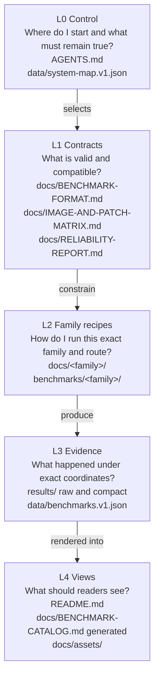
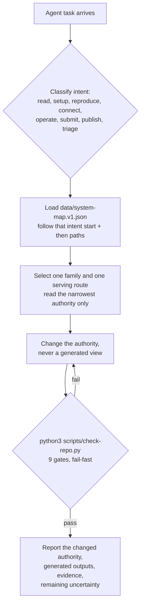
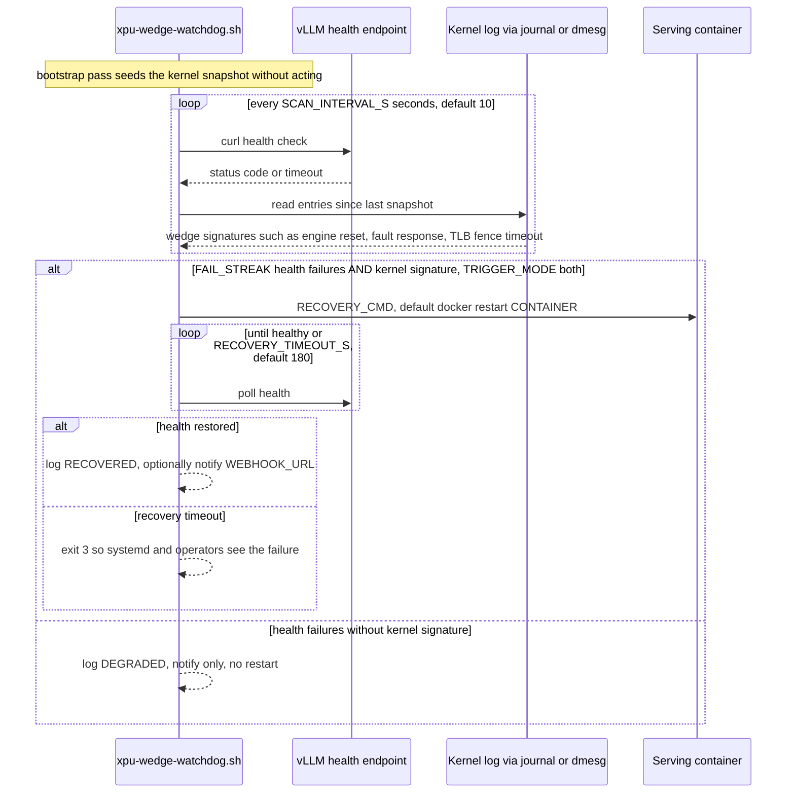

# Architecture

One page that shows how the cookbook fits together. Everything here is derived
from the repository's own authorities:

- Layers and routing: `data/system-map.v1.json` and `docs/AGENT-SYSTEM.md`
- Watchdog behavior: `watchdog/README.md`
- Runtime env flags: `docs/FEATURE-FLAGS.md`
- OpenVINO GenAI vs Cascadia: `docs/architecture/openvino-and-cascadia.md`

If this page and an authority disagree, the authority wins. Fix this page or
file an issue.

## The five layers

Each layer answers one question and is owned by specific files. Decisions flow
downward (control selects contracts, contracts constrain recipes, recipes
produce evidence). Publication flows upward (renderers turn evidence into
views).

Rules that hold across layers:

1. Generated views (BENCHMARK-CATALOG.md, SVGs) are never edited as authorities.
2. Every public number resolves to a benchmark record with commit-pinned evidence.
3. A changed image, model, patch, runtime, workload, or timing definition starts
   a new result generation; history is superseded by links, never rewritten.
4. Private host paths, addresses, credentials, and unpublished image names never
   enter public artifacts.

## Agent intent routing

An agent classifies its task, loads the mapped authority, changes that
authority, and validates with the one stable command.

The 9 gates in `scripts/check-repo.py`: system-map, markdown-links, todos,
stdlib-only, file-sizes, generated-catalog, python-syntax, unit-tests,
triage-lib. Each gate runs as a subprocess; the first failure stops the run and
every event is logged with a shared run_id (`scripts/cookbook_log.py`).

## Watchdog wedge detection and recovery

Production reliability path, owned by `watchdog/README.md` and
`docs/RELIABILITY-REPORT.md`. The watchdog restarts the serving container when
the Level-Zero context wedges instead of serving dead traffic.

Health failure without a kernel signature means an app-level hang that a GPU
restart will not fix, so the watchdog stays quiet and notifies. In-flight
requests are lost on restart; front the server with a retrying proxy for
production traffic. Full config reference and install steps:
[watchdog/README.md](../../watchdog/README.md).

## Service and dependency pins

The authoritative compatibility tables live in the contract documents. This
table only routes you there; do not copy values from it into recipes.

| Dependency | Pinned coordinate | Authority |
|---|---|---|
| Serving image, Qwen3.6 family | `vllm/vllm-openai-xpu@sha256:2c427ef4…` (vLLM 0.26.1rc1.dev457+gc810e5ee9.xpu) | [IMAGE-AND-PATCH-MATRIX.md](../IMAGE-AND-PATCH-MATRIX.md) |
| Serving image, Qwen3.8 champion stack | `vllm/vllm-openai-xpu@sha256:f01e24f6…` (vLLM 0.27.2rc1.dev77, vllm-xpu-kernels 0.1.12.3) | [IMAGE-AND-PATCH-MATRIX.md](../IMAGE-AND-PATCH-MATRIX.md) |
| Model checkpoint, Qwen3.8-27B | HF Hub `SergiioB/Qwen3.8-27B-GPTQ-Int4-sym-G128-MTP-BF16`, revision `9d189a60…` | [FULL-SETUP-COMMANDS.md §11](../FULL-SETUP-COMMANDS.md) |
| Upstream wedge reports | intel/compute-runtime#948, vllm-project/vllm#41663, intel/llm-scaler#594 | [RELIABILITY-REPORT.md](../RELIABILITY-REPORT.md), [watchdog/README.md](../../watchdog/README.md) |
| Researched overlays that did not win | open vLLM PR #52816 with DFlash 2 (spec acceptance 0/574) | [QWEN38-VLLM-XPU.md §13](../qwen38-27/QWEN38-VLLM-XPU.md) |

Ordered patch stacks per image are owned by
[IMAGE-AND-PATCH-MATRIX.md](../IMAGE-AND-PATCH-MATRIX.md) and hash-pinned
in [FULL-SETUP-COMMANDS.md](../FULL-SETUP-COMMANDS.md) sections 5 and 11.
Failure ownership and remediation steps are owned by
[RELIABILITY-REPORT.md](../RELIABILITY-REPORT.md).
