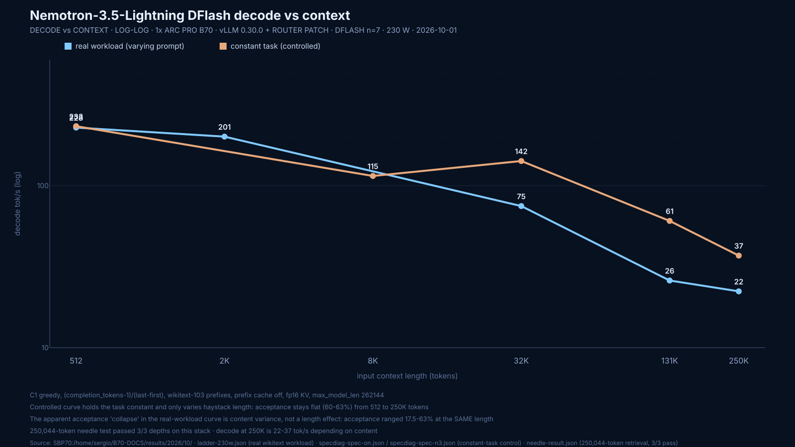
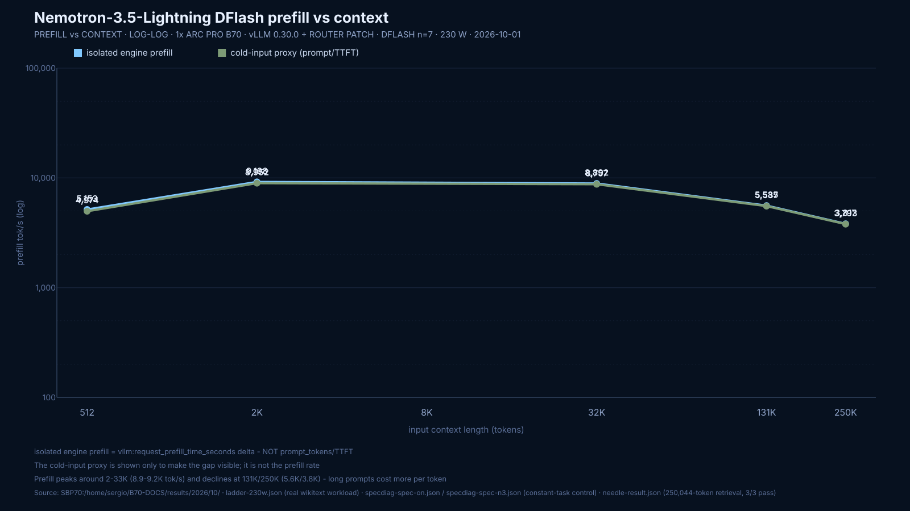
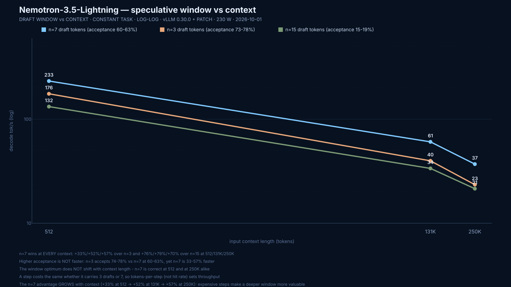

# Nemotron-3.5-Lightning-30B-A3B + DFlash on one Arc Pro B70 — verified recipe

Image `2c427ef4`. C1, cache off. Numbers below are measured, not estimated.

## Why this page exists

The August card ([NEMOTRON-DFLASH-B70.md](NEMOTRON-DFLASH-B70.md)) measured on image
`1da0a954` / vLLM `0.26.1rc1.dev668`. This page is the **re-verification on image
`2c427ef4`** (`0.26.1rc1.dev457+gc810e5ee9`), the build where DFlash actually accepts
drafts. It also replaces the card's `promptTps` figure with a genuine isolated engine
prefill measurement.

## Stack (do not substitute)

| Component | Exact tested value |
|---|---|
| Public image | `vllm/vllm-openai-xpu@sha256:2c427ef477da092eb6f2cdbbbd24950b5fa171565b916db69d4c7bb10e68ca97` |
| vLLM | `0.26.1rc1.dev457+gc810e5ee9` |
| Target | `SergiioB/Nemotron-3.5-Lightning-30B-A3B-GPTQ-INT4-G64-sym` (local symmetric GPTQ INT4 G64, `desc_act=false`) |
| Draft | `SergiioB/Nemotron-3.5-Lightning-30B-A3B-DFlash-BF16` (local NVFP4→BF16 reconstruction) |
| Speculation | `method=dflash`, `num_speculative_tokens=5` |
| Runtime patch | **none** — stock vLLM. Do **not** apply `patch_xpu_grouped_topk_native_v2.py` here; it costs 16% (see below) |
| Autotune cache | `ssu-b70-b8w4/` copied into `.../mamba/ops/configs/selective_state_update/` |
| Power | **150 W** configured (`power1_cap=150000000`); 200 W variant documented below |
| Cache | explicitly off (`--no-enable-prefix-caching`) |
| Context / seqs | 16384 / `max_num_seqs=16` for the speed card |

## Launch

```bash
# power cap first, then verify by reading it back
echo 150000000 | sudo tee /sys/class/drm/card1/device/hwmon/hwmon6/power1_cap
cat /sys/class/drm/card1/device/hwmon/hwmon6/power1_cap     # 150000000

docker run -d --name nemotron-dflash \
  --entrypoint /bin/bash \
  --device /dev/dri:/dev/dri --group-add "$(stat -c %g /dev/dri/renderD129)" \
  -v /dev/dri:/dev/dri:ro \
  -v /mnt/sata-wd-500gb-data/nemotron-lightning-gptq-sym64-20260812:/model:ro \
  -v /mnt/sata-tforce-500gb-data/NVIDIA-Nemotron-3.5-Lightning-30B-A3B-DFlash-BF16:/draft:ro \
  -v /path/to/ssu-b70-b8w4:/ssu:ro \
  -e ZE_AFFINITY_MASK=1 \
  -e VLLM_XPU_ENABLE_XPU_GRAPH=1 \
  -e VLLM_TARGET_DEVICE=xpu \
  --network host --ipc host \
  vllm/vllm-openai-xpu@sha256:2c427ef477da092eb6f2cdbbbd24950b5fa171565b916db69d4c7bb10e68ca97 \
  -c 'set -e; for d in /opt/venv/lib/python3.12/site-packages/vllm /workspace/vllm/vllm; do cp /ssu/*.json "$d/model_executor/layers/mamba/ops/configs/selective_state_update/" 2>/dev/null || true; done; exec vllm serve /model \
    --served-model-name nemotron \
    --dtype float16 --quantization gptq \
    --max-model-len 16384 --max-num-seqs 16 --max-num-batched-tokens 8192 \
    --gpu-memory-utilization 0.90 --no-enable-prefix-caching --language-model-only \
    --async-scheduling --host 127.0.0.1 --port 8012 \
    --speculative-config "{\"method\": \"dflash\", \"model\": \"/draft\", \"num_speculative_tokens\": 5}"'
```

## What actually moves the number — 22-config sweep

Identical prompt set, greedy, `max_num_seqs=16` unless noted. Decode is the
fixed-length `p512/g256` cell (mean of 3 reps). Prefill is the **isolated engine**
metric `vllm:request_prefill_time_seconds`, not TTFT-derived.

| config | patch | spec n | KV | graph | async | mnbt | seqs | decode p512/g256 | accept | code nat-EOS | pf512 | pf2048 | pf8192 |
|---|---|--:|---|---|---|---|--:|--:|--:|--:|--:|--:|--:|
| `np-n5-mnseq1` | no | 5 | fp16 | on | on | 8192 | 1 | **199.0** | 51.5% | 184.3 | 6210 | 9081 | 10132 |
| `np-n5-kvfp8` | no | 5 | fp8 | on | on | 8192 | 16 | **198.8** | 53.4% | 155.8 | 6203 | 8938 | 9939 |
| `np-n5` | no | 5 | fp16 | on | on | 8192 | 16 | **196.7** | 50.8% | 204.5 | 6189 | 8967 | 10059 |
| `nopatch` | no | 7 | fp16 | on | on | 8192 | 16 | **190.7** | 39.5% | 219.0 | 6234 | 9078 | 10219 |
| `n5` | yes | 5 | fp16 | on | on | 8192 | 16 | **177.1** | 53.5% | 178.5 | 4977 | 8737 | 9974 |
| `np-n3` | no | 3 | fp16 | on | on | 8192 | 16 | **172.4** | 58.4% | 167.4 | 6211 | 8960 | 10077 |
| `mnseq1` | yes | 7 | fp16 | on | on | 8192 | 1 | **165.7** | 39.8% | 189.9 | 5138 | 8688 | 9958 |
| `noasync` | yes | 7 | fp16 | on | off | 8192 | 16 | **165.2** | 39.8% | 189.2 | 5082 | 8755 | 10095 |
| `base-n7` | yes | 7 | fp16 | on | on | 8192 | 16 | **164.3** | 39.5% | 188.6 | 4931 | 8752 | 10099 |
| `n5-kvfp8` | yes | 5 | fp8 | on | on | 8192 | 16 | **164.2** | 50.4% | 162.7 | 5017 | 8621 | 9669 |
| `mnbt4096` | yes | 7 | fp16 | on | on | 4096 | 16 | **162.0** | 38.7% | 188.7 | 4926 | 8145 | 8192 |
| `mnbt16384` | yes | 7 | fp16 | on | on | 16384 | 16 | **161.0** | 38.5% | 172.5 | 4990 | 8173 | 10110 |
| `kv-fp8` | yes | 7 | fp8 | on | on | 8192 | 16 | **157.1** | 38.3% | 137.2 | 4936 | 8561 | 9662 |
| `n3` | yes | 3 | fp16 | on | on | 8192 | 16 | **145.7** | 58.4% | 154.1 | 4813 | 8649 | 9922 |
| `n3-kvfp8` | yes | 3 | fp8 | on | on | 8192 | 16 | **139.8** | 57.5% | 129.7 | 5065 | 8648 | 9861 |
| `np-n9` | no | 9 | fp16 | on | on | 8192 | 16 | **130.6** | 19.7% | 151.7 | 6227 | 9084 | 10247 |
| `np-n9-kvfp8` | no | 9 | fp8 | on | on | 8192 | 16 | **125.2** | 19.1% | 130.4 | 6147 | 8961 | 9982 |
| `np-n13` | no | 13 | fp16 | on | on | 8192 | 16 | **109.5** | 12.3% | 132.8 | 6138 | 9066 | 10209 |
| `n11` | yes | 11 | fp16 | on | on | 8192 | 16 | **104.2** | 15.7% | 111.5 | 4927 | 8731 | 10111 |
| `n11-kvfp8` | yes | 11 | fp8 | on | on | 8192 | 16 | **100.0** | 15.2% | 97.1 | 4898 | 8656 | 9956 |
| `n15` | yes | 15 | fp16 | on | on | 8192 | 16 | **91.5** | 10.7% | 115.0 | 5927 | 6520 | 10096 |
| `nograph` | yes | 7 | fp16 | **OFF** | on | 8192 | 16 | **45.6** | 39.2% | 53.0 | 2776 | 8726 | 10327 |

Failed to boot: `kv-bf16` (bf16 KV is not a supported KV dtype on this XPU build — allowed:
`fp8_e4m3`, `fp8_e5m2`, `fp8_inc`, `fp8_per_token_head`, `int4_per_token_head`,
`int8_per_token_head`, `nvfp4`, `turboquant_*`), and `np-n5-mnbt16384` (engine core init fails
at `--max-num-batched-tokens 16384` without the router patch).

### Five conclusions worth more than the table

1. **XPU graphs are the single largest lever: 3.6×.** `VLLM_XPU_ENABLE_XPU_GRAPH=0` drops
   decode from 164.3 to **45.6** t/s and halves the p512 prefill rate (4931 → 2776). Anything
   that "simplifies" the launch line by disabling graphs costs three quarters of the throughput.
2. **The router patch costs 16%, and it is a determinism patch.** Dropping
   `patch_xpu_grouped_topk_native_v2.py` takes decode 164.3 → 190.7 (+16.1%), the natural-EOS
   code cell 188.6 → 219.0, and the p512 prefill 4931 → 6234 (+26.4%). The patch forces eager
   execution at the MoE router (`torch.compiler.disable`), which is a graph break on every
   routing call. That graph break *is* the 16%.
3. **Speculative depth has a sharp optimum at n=5.** Acceptance peaks at n=3 (58.4%) but
   throughput peaks at n=5: more accepted tokens per step beats a higher hit rate. Past n=7 it
   collapses — n9 → 19.7% acceptance, n13 → 12.3%.
4. **Prefill is nearly knob-insensitive.** Except for `nograph` and low `max_num_batched_tokens`,
   every config lands within ~2% on p8192 (~10.1–10.3k at 200 W). Prefill is a property of the
   stack, not a tuning choice.
5. **`--async-scheduling` does nothing measurable** here (164.3 vs 165.2). Keep it, don't credit it.

## Measured, 150 W (the card's power envelope)

`power1_cap=150000000`. Real chat path (`/v1/chat/completions` through the model's own
template), real datasets, `max_num_seqs=16`, cache off. Decode is
`(completion_tokens-1)/(last_chunk-first_chunk)`; prefill is the isolated engine metric.
`p2048/g128` is the cell the August card treats as representative — compare there.

| Cell | unpatched, DFlash **n7** | unpatched, DFlash **n5** | August card (`1da0a954`) |
|---|---|---|---|
| **`p2048/g128` (representative)** | **200.72** (200.28–202.98) | 184.64 (183.31–188.85) | 186.61 (174.60–201.83) |
| window acceptance, same cell | 55.0% | 58.8% | 56.5% |
| code HumanEval, greedy, nat-EOS | 184.92 (129.88–235.45) | 164.24 (144.81–226.89) | — |
| code HumanEval, card sampling | 153.06 (121.33–192.04) | 190.06 (124.64–236.33) | — |
| prose wikitext, greedy | 202.88 (157.26–205.74) | 207.36 (139.29–208.93) | — |
| prose wikitext, card sampling | 176.10 (153.76–206.67) | 171.84 (54.97–194.26) | — |
| prefill p512 (engine) | **5801** | 5790 | — |
| prefill p2048 (engine) | **7221** | 7145 | 6455.6 *(cold input)* |
| prefill p8192 (engine) | **7331** | 7285 | 7160.1 *(cold input)* |
| replay determinism (5× greedy) | 1 distinct output | **3 distinct outputs** | — |

**At 150 W the deeper draft window wins.** n7 beats n5 by 8.7% on the representative cell even
though n5 has higher acceptance (58.8% vs 55.0%) — when the card is power-limited, the draft
model runs while the target is throttled, so speculative depth is nearly free.

## Measured, 230 W

`power1_cap=230000000`. Unpatched, DFlash n7 — the same config as the 150 W table. This is the
highest sustained configuration measured on this image.

| Cell | @150 W | @200 W | @230 W |
|---|---:|---:|---:|
| **`p2048/g128` (representative)** | 200.72 | *not run for n7* | **228.98** |
| range on that cell | 200.28–202.98 | — | **228.65–229.04** |
| window acceptance | 55.0% | — | 55.0% |
| code HumanEval, greedy, nat-EOS | 184.92 | — | 192.88 |
| code HumanEval, card sampling | 153.06 | — | 181.30 |
| prose wikitext, greedy | 202.88 | — | 213.75 |
| prose wikitext, card sampling | 176.10 | — | 182.56 |
| prefill p512 (engine) | 5801 | — | 6087 |
| prefill p2048 (engine) | 7221 | — | 9428 |
| prefill p8192 (engine) | 7331 | — | **10323** |
| replay determinism (5× greedy) | 1 output | — | 1 output |

**Power scaling, 150 W → 230 W: decode +14.1%, prefill p8192 +40.8%.** Prefill is what the
watts actually buy — so if the workload is prompt-heavy rather than decode-heavy, raise the cap
before touching any other knob. The `p2048/g128` spread at 230 W is 0.4% wide
(228.65–229.04 over 3 reps), the tightest of any cell measured.

## Measured, 200 W (power sweet spot)

`power1_cap=200000000`. Same method. `np-n5` (unpatched, DFlash n5):

| Cell | np-n5 @200 W |
|---|---|
| `p2048/g128` (representative) | **205.19** (199.04–205.25) |
| code HumanEval, greedy, nat-EOS | 176.19 (135.77–315.14) |
| prose wikitext, greedy | **216.66** (162.8–218.04) |
| prefill p512 (engine) | 6089 |
| prefill p2048 (engine) | 9266 |
| prefill p8192 (engine) | **9521** |

At 200 W the shallower window (`n5`) measured higher on the representative cell than n7's
150 W figure, but n7 was not re-run on that cell at 200 W, so **do not read this row as
n5 > n7 at 200 W**. The head-to-head exists at 150 W (n7 wins) and n7 is the config carried
through the 230 W point.


## Prefill: genuine engine numbers

The August card's `promptTps 7160` was, in its own words, a "p8192/g1 n=5 median COLD-INPUT
rate from client TTFT — includes scheduling and first-token work, not isolated engine prefill."
The numbers above come from `vllm:request_prefill_time_seconds` deltas, which is the engine's
own prefill accounting. Report those, and label any TTFT-derived figure as a cold-input proxy.

## Context ceiling — the patch decides it

`max_position_embeddings` is **262,144** (`rope_theta 10000`, `partial_rotary_factor 1.0`, no
declared scaling). That is the architectural ceiling. It is **not** what this stack will boot.

| Config | 16,384 | 131,072 | 262,144 |
|---|---|---|---|
| unpatched (stock vLLM) | works | **fails** | **fails** |
| with `patch_xpu_grouped_topk_native_v2.py` | works | see below | see below |

The unpatched build dies above 16384 during engine init:

```
inductor_cache/.../cmwsqerdorwrfamwggbircs6toe7s5mc4louynf34mcvrpjxdmgp.py:35:
unknown: global id: [...], local id: [...]
Assertion `index out of bounds: 0 <= tmp0 < 128` failed
RuntimeError: Engine core initialization failed. Failed core proc(s): {}
```

`128` is `n_routed_experts`. The model **loads fine** (16.91 GiB) and the engine fails
immediately after `Setting kv cache block size to 64 for FLASH_ATTN backend`, before it ever
reports a KV cache size. So this is the compiled MoE router graph, not memory pressure — the
KV arithmetic below is nowhere near exhausted.

**Consequence:** the +16% from dropping the patch is not free. Dropping it caps context at
16,384 **and** loses guaranteed temp-0 reproducibility. This is why the older card lists the
patch as "still required on this image" — it was required for long context as well as
determinism. Choose per workload: 16K + 16% faster, or long context + reproducible.

### Why the KV cost is so small

Hybrid Nemotron-H: only **6 of 52 layers** hold KV (layers 5, 12, 19, 26, 33, 42); the other 46
are Mamba2/MoE with a fixed-size state.

| | value |
|---|---|
| KV per token (fp16, K and V, 2 kv heads, head_dim 128) | 6 KiB |
| KV per token (fp8) | 3 KiB |
| full 262,144-token context | **1.50 GiB** (0.75 GiB fp8) |
| Mamba state | ~2 MiB per layer per sequence, ~92 MiB/sequence constant |

A full 256K context costs 1.5 GiB of KV on a 32 GB card. Memory was never the limit — the
compiled kernel is.


## Correctness and determinism

Replay test = 5 identical greedy requests (same prompt, `ignore_eos`, 256 tokens, temp 0),
hashes of the emitted text compared.

| Config | distinct outputs over 5 reps |
|---|---|
| unpatched, DFlash n5 @200 W | **2** |
| unpatched, DFlash n5 @200 W (second session, same server) | 1 |
| unpatched, DFlash n5 @150 W | **3** |
| unpatched, DFlash n7 @150 W | 1 |
| unpatched, DFlash n7 @230 W | 1 |
| patched, DFlash n5 @150 W | 1 |

**The unpatched build is usually reproducible but is not guaranteed to be.** Observed range is
1–3 distinct outputs across five identical requests, in three separate sessions. The single
patched control reproduced exactly. If byte-identical temp-0 replay matters (regression tests,
eval comparability), keep the patch and accept the 16%. If the workload is throughput-only,
drop it — but do not claim reproducibility on the unpatched path without running the replay.

### Reporting rules for this model

Throughput is strongly **content-dependent**. The same config on the same prompt produced
acceptance from 30% to 78% and decode from 136 to 315 t/s depending on how predictable the
continuation turned out to be — the August card's own range (174.60–201.83 on one cell) is the
same effect. Therefore:

1. **Never headline a single maximum.** Report a median with min/max, the completion length,
   and the acceptance rate.
2. **Separate cap-truncated from natural EOS.** With `enable_thinking` on (the template
   default) many generations hit `max_tokens` and return `finish_reason=length`; those are not
   completed responses.
3. **A 300+ t/s figure is a red flag, not a win.** The fastest cells measured here were
   degenerate repetition loops — repeated text is maximally predictable, so speculation accepts
   almost everything. We saw one long instruction-prefixed prompt send the model into a
   signature-repetition loop. Always inspect the output text before trusting an outlier.
4. **`p2048/g128` is the representative cell** (per the August card) — compare there, not on
   p512, whose family spread is the widest.


## Caveats

- The target is a **local symmetric GPTQ INT4 G64** conversion, not an official HF quant.
- The draft is a **local NVFP4→BF16 reconstruction** of NVIDIA's DFlash draft.
- Single card of a 2× B70 rig.
- Throughput is strongly **content-dependent**. Same config and prompt, acceptance ranged
  30%–78% and decode 136–315 t/s depending on how predictable the continuation was. Report a
  median with range and the completion length, never a single maximum. A very high figure
  (300+ t/s) is usually a **repetition loop**, not a fast model — check the output text.
- With `enable_thinking` on (the template default) many generations hit the 2048-token cap
  (`finish_reason=length`). Those cells are cap-truncated, not natural EOS; keep them separate.

## Update — full 262,144 context verified, and the acceptance question settled

Added 2026-10-01, after the tables above. New image and new measurements. All numbers below are
measured; the raw JSON lives under `results/2026/10/` on the bench host.

### Full 256K works — on v0.30.0 **with** the router patch

| Item | Value |
|---|---|
| Image | `vllm/vllm-openai-xpu:v0.30.0` (`sha256:fc0e112afb64e3a06fe8daff34652435822a629412f38efce8f0f67a46636b8d`) |
| Router patch | `patch_xpu_grouped_topk_native_v2.py` — applies cleanly, anchors unchanged since 0.26 |
| Served `max_model_len` | **262,144** |
| KV pool (DFlash draft, fp16 KV, gmu 0.90, `max_num_seqs=1`) | **348,249 tokens → 1.33× a full 262K request** |
| KV pool (no draft, same gmu) | 1,318,604 tokens → 5.03× |

**Functional proof, not just a boot.** Needle-in-a-haystack at **250,044 prompt tokens**, unique
fact planted at 10% / 50% / 90% depth, greedy:

```
depth 10%: prompt=250,044 tok  returned=True   output=' ZQ10X-4417'
depth 50%: prompt=250,044 tok  returned=True   output=' ZQ50X-4417'
depth 90%: prompt=250,044 tok  returned=True   output=' ZQ90X-4417'
failures: []   all_passed: true
```

### The unpatched build cannot do long context at all

On image `2c427ef4`, without the patch, **both** `--max-model-len 131072` and `262144` die during
engine init:

```
Assertion `index out of bounds: 0 <= tmp0 < 128` failed
RuntimeError: Engine core initialization failed.
```

`128` is `n_routed_experts`. The weights load fine (16.91 GiB) and it fails before any KV cache
is allocated. So the patch is required for **long context**, not only for determinism — it is
not a patch you can drop for a quick 16% on any workload that needs range.

### Acceptance does NOT collapse with context length

This one is worth stating loudly, because an uncontrolled ladder leads to the wrong conclusion.
Measuring with a **constant instruction and only the haystack length varying**:

| Context (tokens) | window acceptance | decode tok/s |
|---:|---:|---:|
| 512 | 62.5% | 232.9 |
| 8,192 | 25.9% | 114.7 |
| 32,768 | 63.5% | 141.9 |
| 131,072 | **60.3%** | 60.6 |
| 250,000 | **62.5%** | 37.0 |

**Acceptance is flat at ~60% from 512 to 250,000 tokens.** There is no drafter degradation at
long context and nothing to fix in the draft model.

An earlier ladder that changed the prompt *together with* the length reported 17.5% at 131K and
26.8% at 32K — that is **content variance, not a length effect**. Speculative acceptance is
content-dependent at every length (25%–63% here for the same config), so it must never be read
off a ladder whose prompts vary with the length.

### Throughput vs context — the real curve





| Context | decode (real workload) | decode (constant task) | prefill (isolated engine) |
|---:|---:|---:|---:|
| 512 | 228.3 | 232.9 | 5,153 |
| 2,048 | 200.8 | — | 9,198 |
| 8,192 | — | 114.7 | — |
| 32,768 | 74.8 | 141.9 | 8,892 |
| 131,072 | 26.0 | 60.6 | 5,585 |
| 250,000 | 22.3 | 37.0 | 3,817 |

**Decode falls ~6× from 512 to 250K and prefill is non-monotonic**, peaking around 2–33K
(8.9–9.2K tok/s) before declining at 131K/250K. This is the per-step attentional cost of a long
KV — an inherent property of the workload, not a tuning failure. At 131K a step costs roughly
87 ms, so at 250K a single token takes ~27–45 ms depending on content.

### Draft-window optimum is context-independent



Constant task, three draft windows, same server build:

| Context | n=3 | **n=7** | n=15 |
|---:|---:|---:|---:|
| 512 | 175.5 (77.9%) | **232.9 (62.5%)** | 132.2 (18.7%) |
| 131,072 | 39.8 (73.8%) | **60.6 (60.3%)** | 33.9 (15.3%) |
| 250,000 | 23.5 (73.3%) | **37.0 (62.5%)** | 21.8 (16.4%) |

**`n=7` wins at every context** — +33%/+52%/+57% over `n=3` and +76%/+79%/+70% over `n=15` at
512/131K/250K.

Two rules fall out of this, and both contradict the obvious instinct:

1. **Higher acceptance is not faster.** `n=3` accepts 74–78% versus `n=7` at 60–63%, and is
   still slower everywhere. A step costs the same whether it carries 3 draft tokens or 7, so
   **tokens-per-step** sets throughput, not hit rate.
2. **Do not shrink the window when acceptance is low.** If a workload shows poor acceptance,
   the fix is not a shallower window — the optimum stays at 7 regardless of context.

### Evidence-file provenance correction

`results/2026/10/ladder-230w.json` is the raw ladder output. Its `image`, `vllm`, `max_model_len` and
`max_num_seqs` fields were **wrong when first written**: `ladder.py` hardcoded them (image `2c427ef4`,
vLLM `0.26.1rc1.dev457`, `max_model_len 16384`, `max_num_seqs 16`) and did not update them when run
with `LADDER_NO_LAUNCH=1` against an already-running server. The stale values were internally
impossible — the file records a successful 250,000-token decode, which a `max_model_len` of 16384
cannot serve.

The four fields are corrected to the verified running configuration (v0.30.0, image digest
`sha256:fc0e112a…`, `max_model_len 262144`, `max_num_seqs 1`), taken from the container spec
(`--max-model-len 262144 --max-num-seqs 1 --no-enable-prefix-caching`, DFlash n7, gmu 0.90), the
served `/v1/models` response, and the image digest read back from docker. **The measured numbers were
not altered.** The original values are preserved under `provenance_corrected_from` in the same file,
and `ladder.py` now reads provenance back from the live server instead of asserting it.

### Recomputation note

`--async-scheduling` remains neutral, values here are `max_num_seqs=1` (C1), prefix cache off,
fp16 KV, 230 W configured cap. The 150 W tables above remain the card's base envelope; these
long-context numbers are all at **230 W** and must be labelled as such.
