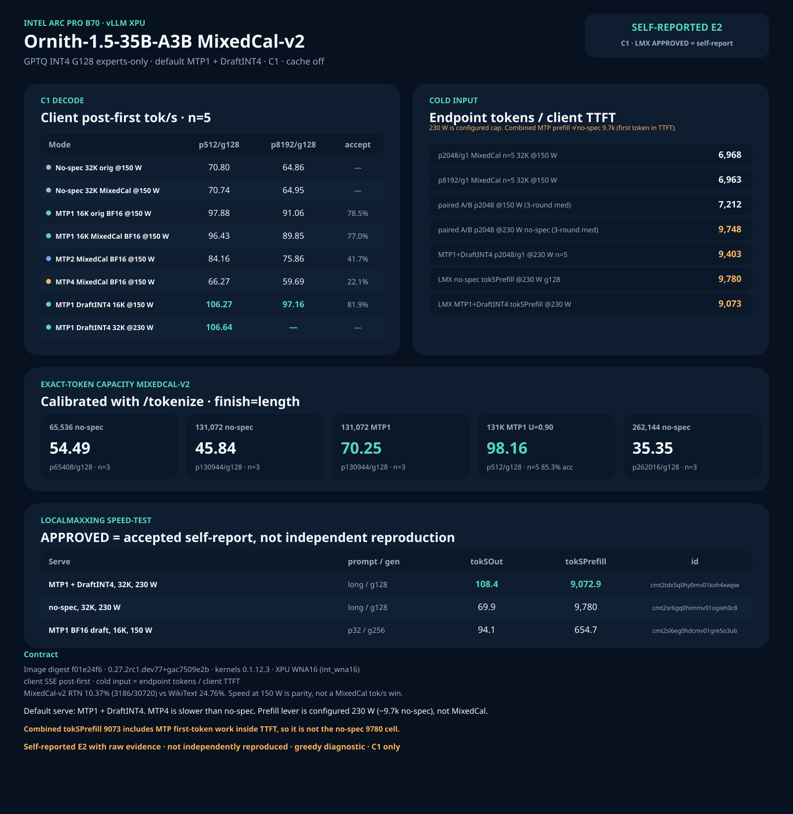

# Ornith-1.5-35B-A3B on Intel Arc Pro B70 (vLLM XPU)

Isolated C1, cache off, greedy diagnostic. Self-reported E2 with raw evidence;
not independently reproduced. Default serve is **MTP1 + DraftINT4**. Full
tables: [CLAIMS.md](CLAIMS.md).



Ornith 1.5 is a `qwen3_5_moe` hybrid GDN MoE: 40 layers, hidden 2048, 256
experts × 8 active, 30 GDN + 10 full-attn, one MTP layer (785 tensors). There
is no official GPTQ. The B70 target is a local experts-only GPTQ INT4
symmetric G128 with MTP left in BF16.

MixedCal-v2 is the published artifact: same format and tensor scope as a
WikiText-calibrated GPTQ, different calibration. Speed at 150 W is **parity**.
The conversion win is RTN fallback **10.37% vs 24.76%**, not tok/s. Method:
[MIXEDCAL-V2.md](MIXEDCAL-V2.md).

## Stack (do not substitute)

| Component | Exact tested value |
|---|---|
| Public image | `vllm/vllm-openai-xpu@sha256:f01e24f6c7ff01f1e0662234255a1372297d1dbd89d003cf13c8fad3eab1ba4f` |
| vLLM | `0.27.2rc1.dev77+gac7509e2b` |
| `vllm-xpu-kernels` | `0.1.12.3` |
| Model | [`SergiioB/Ornith-1.5-35B-A3B-GPTQ-Int4-sym-G128-MTP-BF16-MixedCal-v2`](https://huggingface.co/SergiioB/Ornith-1.5-35B-A3B-GPTQ-Int4-sym-G128-MTP-BF16-MixedCal-v2) |
| MoE backend | WNA16 (`int_wna16`) |
| Patches | DraftINT4 overlay on by default. `patch_mtp_boundary.py` required for exact max-len MTP. `patch_mtp_nightly.py` is already-in-image if `quantize_config.json` excludes `mtp`. |
| Never on C1 | `patch_gdn_mixed_split_v5.py` |
| Context / util / seqs | 16,384 (MTP speed tables) or 32,768 / 65,536 / 131,072 / 262,144 (no-spec ladder) / `gpu-memory-utilization=0.85` / `max-num-seqs=8` |
| KV | fp16 auto (only 10 full-attn layers; fp8 KV is not required) |
| Cache | `--no-enable-prefix-caching` |
| Power | configured **150 W** for the decode tables below unless a cell names **230 W** |

This is the **same image digest** as Qwen3.8-27B, not the Qwen3.6 Pi `2c427ef`
digest and not the historical `intel/vllm:0.21.0-xpu-int4moe` native-int4moe
image that produced Qwen3.6 MTP4 **204.6** tok/s. Those are a different image
generation — not Ornith numbers.

## Quick Start (3-Step Setup)

### Step 1: Pull the image
```bash
export IMAGE='vllm/vllm-openai-xpu@sha256:f01e24f6c7ff01f1e0662234255a1372297d1dbd89d003cf13c8fad3eab1ba4f'
docker pull "$IMAGE"
```

### Step 2: Download the model
```bash
export MODEL_DIR="$HOME/models/Ornith-1.5-35B-A3B-GPTQ-Int4-sym-G128-MTP-BF16-MixedCal-v2"
huggingface-cli download SergiioB/Ornith-1.5-35B-A3B-GPTQ-Int4-sym-G128-MTP-BF16-MixedCal-v2 \
  --local-dir "$MODEL_DIR"
```

### Step 3: Launch server & verify health
```bash
# Default serve: MTP1 + DraftINT4, 16K context, cache off, 150 W:
bash benchmarks/ornith15-35a3/launch-ornith-mtp1.sh "$MODEL_DIR" 16384 8000
curl -f http://127.0.0.1:8000/health
```

---

## 1. Model details & contract

Contract to verify after download:

- 6 shards, 24,454,916,052 bytes (~22.77 GiB)
- 30,720 routed-expert `qweight` tensors
- 785 `mtp.*` tensors, **zero** MTP `qweight`
- `quantize_config.json`: 4-bit, `sym=true`, `group_size=128`, `desc_act=false`

Why this GPTQ exists (WikiText vs mixed-domain, experts-only scope, RTN
24.76% → 10.37%): [MIXEDCAL-V2.md](MIXEDCAL-V2.md).

## 2. Image verification

Verify device and packages:
```bash
docker run --rm --device /dev/dri --entrypoint python "$IMAGE" -c '
from importlib.metadata import version
import torch
assert version("vllm") == "0.27.2rc1.dev77+gac7509e2b"
assert version("vllm-xpu-kernels") == "0.1.12.3"
print(torch.xpu.get_device_name(0))
'
```

## 3. Launch options (MTP1 + DraftINT4)

DraftINT4 is a **runtime** overlay: INT4 of the **draft** `lm_head` and MTP
linears only. Target verify stays at the checkpoint precision. Shards on disk
stay BF16 MTP. On this stack it is about **+10 tok/s** versus BF16 draft at
150 W (106.27 vs 96.43 at p512/g128). It is on by default (`DRAFT_INT4=1`).
`DRAFT_INT4=0` is the BF16-draft A/B.

Default flags:

```text
--quantization gptq
--dtype float16
--max-model-len 16384
--gpu-memory-utilization 0.85
--kv-cache-dtype auto
--max-num-seqs 8
--max-num-batched-tokens 8192
--block-size 64
--no-enable-prefix-caching
--language-model-only
--trust-remote-code
--speculative-config {"method":"mtp","num_speculative_tokens":1}
```

For exact 131,072-token MTP completions, set `BOUNDARY=1` so the launcher
applies `patches/patch_mtp_boundary.py` before `vllm serve`.

No-spec (for the 230 W prefill class): `MODE=no-spec`. BF16 draft:
`DRAFT_INT4=0`.

## 3b. Vision serving (full VLM)

The artifact is a `Qwen3_5MoeForConditionalGeneration` VLM: the language
model is INT4, but the 333-tensor vision tower ships **unquantized BF16
(~0.89 GB)** alongside the 785 BF16 MTP tensors (same scope in the
published MixedCal-v2 artifact and the local AutoRound twin). Serving
images is a one-flag change: **remove `--language-model-only`** and keep
everything else identical (MTP1, fp8 or auto KV, same patches).

Verified on the AutoRound twin 2026-08-23 (image `f01e24f6`, MTP1,
fp8 KV, util 0.90, 180 W):

- **Context must come down.** The tower + multimodal profiling eats
  ~0.9 GiB of the KV budget. At `--max-model-len 160000` vLLM aborts at
  startup: *"1.82 GiB KV cache is needed, which is larger than the
  available KV cache memory (1.77 GiB). estimated maximum model length is
  154176"*. At **131072** it boots with margin (~1.49 GiB needed).
  Alternatives: raise `--gpu-memory-utilization`, or keep
  `--language-model-only` for >131 K-context text work.
- **Functional smoke test** (not a benchmark): 64×64 solid-red PNG +
  "What is the dominant color of this image? One word." → answers
  `red`; the image adds ~78 prompt tokens. Text-only requests are
  unchanged.
- Vision serving leaves the decode stack (MTP1 speculation, DraftINT4
  overlay) untouched — the tower only adds weights and image preprocessing.

Vision flags = the Default flags list above, minus
`--language-model-only`, with `--max-model-len 131072`.

## 4. Measured

Timing is **client monotonic SSE**. Decode = client post-first tok/s.
Cold input = actual endpoint prompt tokens / client TTFT. Not llama-bench
pp/tg. All cells **C1**, cache off, greedy diagnostic, self-reported E2.

### No-spec 32K — n=5, 150 W, instance-median of 3 loads

Speed **parity**. MixedCal-v2 is not faster.

| Cell | WikiText GPTQ | MixedCal-v2 |
|---|---:|---:|
| p512/g128 client post-first | 70.80 | 70.74 |
| p8192/g128 client post-first | 64.86 | 64.95 |
| p2048/g1 cold input | 6935 | 6968 |
| p8192/g1 cold input | 6926 | 6963 |

### MTP1 16K — n=5, 150 W, MixedCal-v2

| Draft | p512/g128 | p8192/g128 | Acceptance |
|---|---:|---:|---|
| BF16 | 96.43 | 89.85 | 77.0% |
| DraftINT4 (default) | 106.27 | 97.16 | 81.9% |

### MTP depth — MixedCal-v2, 16K, 150 W, n=5 (BF16 draft)

| Depth | p512/g128 | p8192/g128 | Acceptance |
|---|---:|---:|---|
| MTP1 | 96.43 | 89.85 | 77.0% |
| MTP2 | 84.16 | 75.86 | 41.7% |
| MTP4 | 66.27 | 59.69 | 22.1% |

MTP4 is **slower than no-spec** (~70.7 at p512). Do not serve
`num_speculative_tokens=4` on this head.

### Long context — MixedCal-v2, 150 W

| Cell | n | client post-first | Notes |
|---|---:|---:|---|
| MTP1 131K U=0.90 p512/g128 | 5 | 98.16 | accept 85.3% |
| MTP1 131K U=0.90 p8192/g128 | 5 | 95.25 | same window |
| exact p65408/g128 no-spec | 3 | 54.49 | 65,536 serve |
| exact p130944/g128 no-spec | 3 | 45.84 | 131,072 serve |
| exact p130944/g128 MTP1 | 3 | 70.25 | boundary patch |
| exact p262016/g128 no-spec | 3 | 35.35 | 262,144 + `--kv-cache-memory 6623879680` |

The 262K cell is a C1 capacity completion, not a quality or sustained-decode
headline.

### Combined 230 W — MTP1 + DraftINT4, 32K, cache off

Same load, host harness:

| Cell | Statistic | Value |
|---|---|---|
| p512/g128 | client post-first n=5 | **106.64** (104.72–109.16) |
| p2048/g1 | cold input n=5 | **9403** (9359–9424) |

LocalMaxxing on that serve: `tokSOut` **108.4**, `tokSPrefill` **9072.9** @
2906 tokens, id `cmt2tdx5q0hy0mv01koh4xwpw` APPROVED (accepted self-report).

## 5. Why MTP1, not MTP4

Single-layer MTP head. A depth-4 probe measured per-position acceptance
**81 / 15 / 2.5 / 0.5%**. Depth-4 spends verify budget on near-zero later
positions. Depth-1 keeps the strong first position (~77–85% on MixedCal n=5)
and is the default.

This inverts Qwen3.8-27B dense (MTP4 optimal). It is **not** Qwen3.6-35B
MTP4 170.91 or the historical 204.6 cell — those are a different image
generation.

## 6. Prefill lever

Paired A/B on one warm MixedCal-v2 no-spec 32K server, cache off, three
alternating rounds, matched except **configured cap**:

| Cap | p2048/g1 round medians | p8192/g1 round medians |
|---|---|---|
| 150 W | 7271 / 7212 / 7055 | 7036 / 7050 / 7062 |
| 230 W | 9748 / 9713 / 9771 | 9647 / 9683 / 9670 |

230 W recovers the **~9.7k** cold-input class. 150 W stays **~7.1k**. The
prefill lever on this WNA16 nightly is **power cap**, not MixedCal vs
WikiText. Campaign-window draw was **~152 W** vs **~222 W**. GT clocks were
**not** pinned.

Prefill ~9.7k vs decode ~96 is expected: prefill is a wide GEMM over
thousands of prompt tokens; decode at batch 1 is memory-latency bound (plus
one MTP draft token).

## 7. Do not mix these cells

LocalMaxxing `APPROVED` means accepted into the self-reported dataset, not
independent reproduction. Three public rows look similar and are not:

| Id | What it is | `tokSOut` | `tokSPrefill` |
|---|---|---:|---:|
| `cmt2tdx5q0hy0mv01koh4xwpw` | MTP1 + DraftINT4, 32K, **230 W**, long prompt | **108.4** | **9072.9** @ 2906 tokens |
| `cmt2sr6gq0himmv01ogieh0c8` | **no-spec**, 32K, **230 W**, long prompt g128 | **69.9** | **9780** |
| `cmt2sl6eg0hdcmv01gre5o3ub` | MTP1 BF16 draft, 16K, **150 W**, p32/g256 | **94.1** | 654.7 |

69.9 vs 108.4 vs 94.1 differ in speculation, prompt length, and configured
cap — not three measurements of the same cell.

Combined `tokSPrefill` **9073** is below no-spec **9780** because MTP first-token
work is inside TTFT. Host p2048/g1 on the combined load is **9403**.

Never publish g=1 `tokSOut` **19153.8** — that is a one-token completion
divided by a sub-millisecond post-first window.

## 8. What will not launch

| Path | Status |
|---|---|
| DFlash / DFlash2 | **No Ornith hidden-2048 draft.** Keep MTP1. |
| `z-lab/Qwen3.5-35B-A3B-DFlash` | Hidden 2048 / vocab 248320 match topology. **Not measured.** Not a recipe. |
| GDN mixed-split v5 | Cn candidate only. Never on C1. |
| Qwen3.6 native-int4moe 204.6 image | Different generation. Will not appear on `f01e24f6`. |

## 9. Power

Discover the `xe` hwmon node; do not hard-code `hwmon4` on a new host.

```bash
HWMON=$(python3 - <<'PY'
import glob
xs=[h for h in glob.glob('/sys/class/hwmon/hwmon*')
    if open(h+'/name').read().strip()=='xe']
print(xs[0])
PY
)
echo 150000000 | sudo tee "$HWMON/power1_cap"
```

Restore 150 W after a 230 W prefill run. A 300 W write is rejected; the
hardware ceiling is 230 W.
