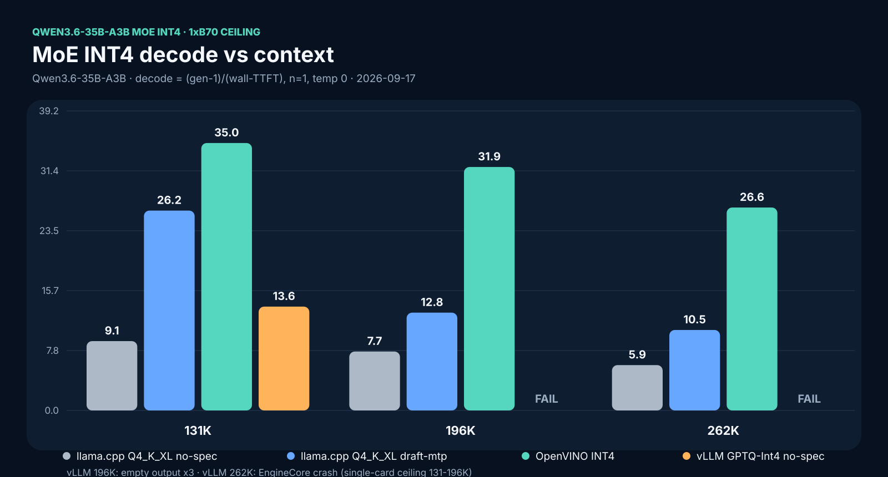
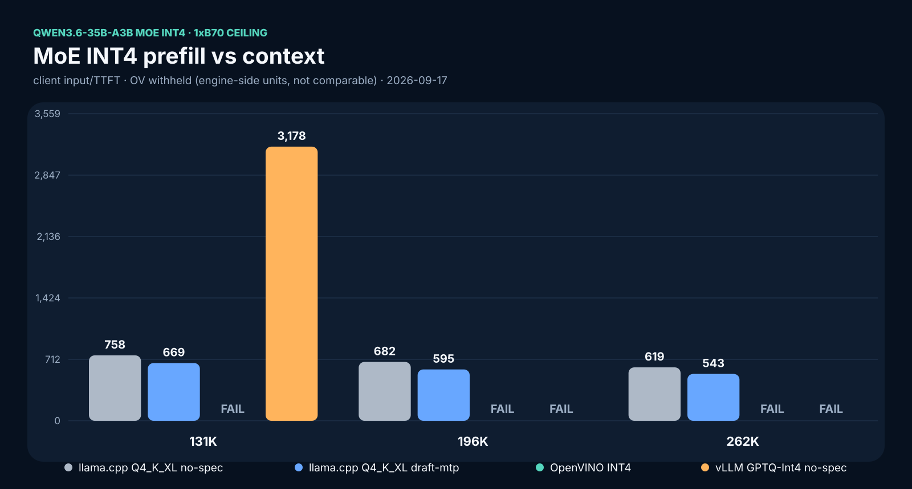

# MoE INT4/Q4 Three-Engine Ceiling — Qwen3.6-35B-A3B — 2026-09-17

One Intel Arc Pro B70 32GB. Long-context ceiling per engine at 131K / 196K / 262K
target prompt lengths. Raw runs under `/mnt/models/moe-int4-20260916/results/`
(`CEILING.json` aggregate).





## Scope

- n=1 per cell, exact-token probe, temperature 0. Decode = (completion_tokens − 1)
  / (wall − TTFT) from one streaming request. Prefill = prompt_tokens / TTFT.
- Quality gate per probe: coherent technical prose about flash attention / paged
  KV cache (head-checked). FAIL gate → no number published for that cell.
- No power columns this round (no steady-state energy sampling in the ceiling
  harness). Do not compare these decode numbers against watt-gated tables.

## Arms

| Engine | Artifact | Config |
|---|---|---|
| llama.cpp SYCL, no-spec | `Qwen3.6-35B-A3B-UD-Q4_K_XL.gguf` (22.4 GB) | `-fa on`, KV `q8_0/q8_0`, ctx = probe length |
| llama.cpp SYCL, draft-mtp | same base + `mtp-Qwen3.6-35B-A3B-Q8_0.gguf` head (1.99 GB, bartowski) | `--spec-type draft-mtp`, KV `q8_0/q8_0`, ctx = probe length |
| OpenVINO GenAI (Python 2026.5) | `OpenVINO/Qwen3.6-35B-A3B-int4-ov` (Hub official, ~19 GB) | `VLMPipeline`, GPU.1, KV u8 on main |
| vLLM XPU, no-spec + ptr wrap | `Qwen3.6-35B-A3B-MTP-Preserved-GPTQ-Int4` (~21 GB) | golden image `2c427ef477da`, `max-model-len` = probe length, util 0.90 |

llama binary: `build-sycl-latest-qw38/bin/llama-server` (2026-08-26).
vLLM patches in order: `patch_mtp_nightly.py`, `patch_mtp_boundary.py`,
`patch_mtp_ptr_wrap.py`.

## Results (decode t/s | prefill t/s)

| Engine | 131K | 196K | 262K |
|---|---|---|---|
| llama no-MTP | 9.08 \| 758 | 7.72 \| 682 | 5.94 \| 619 |
| llama draft-mtp | 26.18 \| 669 | 12.81 \| 595 | 10.54 \| 543 |
| OpenVINO INT4 | 35.03 \| — | 31.89 \| — | 26.58 \| — |
| vLLM GPTQ-Int4 | 13.60 \| 3178 | FAIL (empty, 1 token) ×3 | FAIL (EngineCore 500) |

OV prefill cells are engine-side timings, not client TTFT-matched, so they are
withheld (—) rather than mixed into a client-timed column. vLLM 131K prefill
3178 t/s is client input/TTFT.

## Findings

1. OpenVINO INT4 is the decode leader at every length: 35.0 → 31.9 → 26.6 t/s,
   3–4× over llama no-MTP, and holds quality at 262K.
2. llama draft-mtp beats no-MTP 1.7–2.9× (26.2 vs 9.1 at 131K; 12.8 vs 7.7 at
   196K; 10.5 vs 5.9 at 262K). Draft acceptance at 196K was 0.47, mean len
   2.31 — the Q8 head on a Q4 base accepts poorly but still pays off.
3. Exact-ctx rule (new, confirmed 2/2): launching llama-server with
   `-c` far above the probe length broke MTP long probes (196K quality FAIL,
   server dead by 262K). Relaunching with `-c` = probe length passed both.
   Size the context to the probe; oversized allocation is not free for MTP.
4. vLLM single-card ceiling for this GPTQ sits between 131K and 196K:
   196K fails even with `max-model-len 196608` exactly (fast empty failure,
   1.7 s wall), 262K kills EngineCore. The 131K cell (13.6 decode,
   3178 prefill) stands. MTP4 long-context on vLLM was not retested here —
   the golden MTP4 recipe covers 131K (170.9 t/s p512/g128 class).
5. Failure log honesty: the first ceiling_master vLLM lane died on a bad image
   reference (`f01e24f6c7ff:latest`, local digest mistaken for a repo tag).
   Fixed to the golden digest; the two reruns after the fix are real
   measurement failures, not harness bugs.

## Reproduce

```bash
# llama MTP, exact ctx (the working pattern)
~/llama.cpp/build-sycl-latest-qw38/bin/llama-server \
  -m Qwen3.6-35B-A3B-UD-Q4_K_XL.gguf -ngl 99 --device SYCL0 \
  -c 196608 -fa on --cache-type-k q8_0 --cache-type-v q8_0 \
  --spec-type draft-mtp --spec-draft-model mtp-Qwen3.6-35B-A3B-Q8_0.gguf \
  --port 8080 --host 127.0.0.1
```

Lane scripts: `ceiling_master.sh` (original, vLLM tail broken — kept for the
record), `rerun_fix.sh` (vLLM 196/262 + llama-MTP 196), `phase2.sh`
(vLLM exact-196 + llama-MTP 262). Logs: `ceiling.log`, `rerun-fix.log`,
`phase2.log`.

## Open

- n=1 per cell: medians of 5 needed before any headline leaves the lab.
- Power/thermal columns missing; recapture with steady-state energy sampling.
- vLLM MTP4 at 131K+ long context (golden covers short-prompt MTP4 only).
- OV prefill in client-timed units for a fair prefill column.

## Regime note (2026-09-17 — read before comparing with dense tables)

These decode numbers look low next to the cookbook's dense headlines (MoE MTP4
~170 t/s, dense ~50-69 t/s) because they measure a different regime, not a
slower model. Headline tables use short prompts (p512/g128): tiny KV, cheap
attention, speculation at full effect. This page measures decode with 131K–262K
of context already loaded: every generated token attends over the full KV,
so decode turns KV-bandwidth/compute bound and drops (llama Q4_K_XL: ~64 t/s
short-prompt vs 9.1 t/s context-loaded — same weights, same card).

Rule (extends the class-match rule): a decode number without its loaded-context
length is unusable. Short-prompt decode and context-loaded decode must never
share one ranking. MoE's active-param advantage also shrinks under huge KV
because the bottleneck shifts from weight-read to KV-read; the hybrid
linear-attention layers (10/40 full-attn on this model) are what keep the
ceiling high instead — context fit is the MoE win here, not loaded decode.

## Vendor reference: Intel technology guide 928489 (2026-09-15)

Intel published an official reference architecture for B70 inference two days
before this run: OpenStack PCI passthrough → guest K8s → llm-d 0.9.0 +
vLLM 0.26.0, validated on Llama 3.1 8B BF16 (functional validation, no perf
numbers — nothing to reconcile against). What it confirms and changes:

- Our pinned vLLM (0.26.1rc1 XPU, V2 runner, Flash Attention backend) tracks
  Intel's validated serving path. No stack change needed.
- Intel's validated envelope stops at 8B BF16. This 35B-MoE ceiling work is
  outside their published envelope — cite the guide as the floor, not a limit.
- Adopted from the guide: TTFT/TPOT terminology, explicit GiB-vs-GB labeling
  (Intel quotes decimal, vLLM reports binary), and their methodology line as
  cookbook policy: no performance claim without finalized methodology,
  workload, and full configuration disclosure.
- Gap noted, not started: K8s/DRA deployment path for B70 serving.
