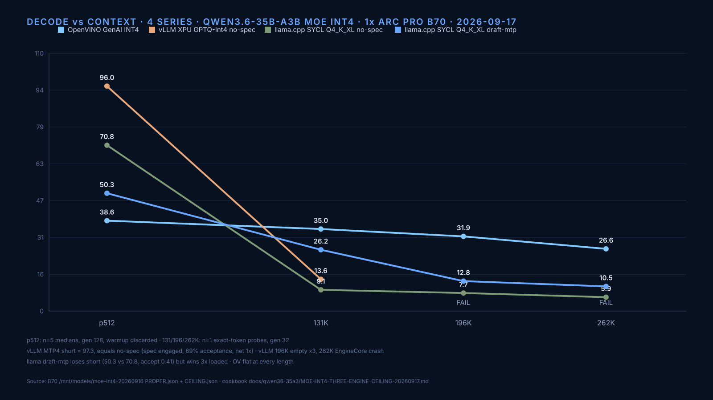
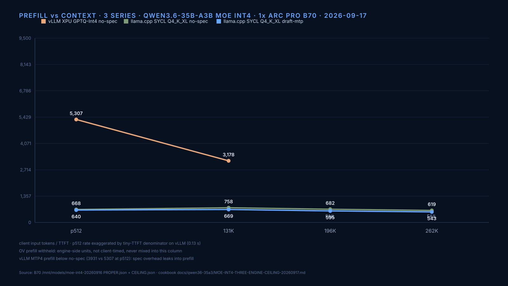

# MoE INT4/Q4 Three-Engine Ceiling — Qwen3.6-35B-A3B — 2026-09-17

One Intel Arc Pro B70 32GB. Long-context ceiling per engine at 131K / 196K / 262K
target prompt lengths. Raw runs under `/mnt/models/moe-int4-20260916/results/`
(`CEILING.json` aggregate).





## Scope

- n=1 per cell, exact-token probe, temperature 0. Decode = (completion_tokens − 1)
  / (wall − TTFT) from one streaming request. Prefill = prompt_tokens / TTFT.
- Quality gate per probe: coherent technical prose about flash attention / paged
  KV cache (head-checked). FAIL gate → no number published for that cell.
- No power columns this round (no steady-state energy sampling in the ceiling
  harness). Do not compare these decode numbers against watt-gated tables.

## Arms

| Engine | Artifact | Config |
|---|---|---|
| llama.cpp SYCL, no-spec | `Qwen3.6-35B-A3B-UD-Q4_K_XL.gguf` (22.4 GB) | `-fa on`, KV `q8_0/q8_0`, ctx = probe length |
| llama.cpp SYCL, draft-mtp | same base + `mtp-Qwen3.6-35B-A3B-Q8_0.gguf` head (1.99 GB, bartowski) | `--spec-type draft-mtp`, KV `q8_0/q8_0`, ctx = probe length |
| OpenVINO GenAI (Python 2026.5) | `OpenVINO/Qwen3.6-35B-A3B-int4-ov` (Hub official, ~19 GB) | `VLMPipeline`, GPU.1, KV u8 on main |
| vLLM XPU, no-spec + ptr wrap | `Qwen3.6-35B-A3B-MTP-Preserved-GPTQ-Int4` (~21 GB) | golden image `2c427ef477da`, `max-model-len` = probe length, util 0.90 |

llama binary: `build-sycl-latest-qw38/bin/llama-server` (2026-08-26).
vLLM patches in order: `patch_mtp_nightly.py`, `patch_mtp_boundary.py`,
`patch_mtp_ptr_wrap.py`.

## Results (decode t/s | prefill t/s)

| Engine | 131K | 196K | 262K |
|---|---|---|---|
| llama no-MTP | 9.08 \| 758 | 7.72 \| 682 | 5.94 \| 619 |
| llama draft-mtp | 26.18 \| 669 | 12.81 \| 595 | 10.54 \| 543 |
| OpenVINO INT4 (ceiling run) | 35.03 \| — | 31.89 \| — | 26.58 \| — |
| vLLM GPTQ-Int4 | 13.60 \| 3178 | FAIL (empty, 1 token) ×3 | FAIL (EngineCore 500) |

Note the OV split: the ceiling run above measured OV decode passing quality
at 131K/196K/262K on 2026-09-17, but the later ladder sweep (2026-09-18,
`LADDER.json`, different probe harness) hit the oneDNN prefill failure at
131K and OV only charts through 64K there. Both datasets are real; the
difference is under investigation upstream — see Findings #1 and #7 and
openvino.genai#4505.

OV prefill (cold first run per cell, client input/TTFT): p512 966 · 2K 3,494 ·
8K 3,821 · 32K 1,412 · 64K 1,211 tok/s — it collapses at long context, not
skyrockets. Warm-run 43k/66k/94k figures were an OpenVINO warm-TTFT metric
artifact, not prefix cache: a unique-prompt recheck (no cache hits possible)
still showed the same warm collapse, and roofline math rules the figures out
(see Findings #8). Quarantined. vLLM 131K prefill 3178 t/s is client
input/TTFT. Ladder decode medians (gen-256 recheck where flagged):
llama-MTP 32K = 42.0 (was 21.4, short-window outlier).

## Golden-vs-ceiling: same engine, short prompt vs loaded context

Short-prompt goldens measured 2026-09-16 on this card, same models
(`GOLDEN.json`, `SUMMARY.json`, `ov-genai.json` on the B70):

| Engine | Short prompt (p512) | 131K-loaded | Drop |
|---|---|---|---|
| llama Q4_K_XL no-MTP | 70.6 t/s | 9.08 t/s | 7.8× |
| vLLM GPTQ-Int4 (MTP4-tagged lane) | ~97 t/s | 13.60 t/s | 7.1× |
| OpenVINO INT4 | ~38–40 t/s | 35.03 t/s | ~flat |

Caveats: the Sep-16 vLLM "MTP4" lane measured ~97 t/s, i.e. no-spec level —
speculation likely did not engage in that lane, so treat ~97 as the no-spec
short baseline, not 170.9. The 170.9 MTP4 figure stands from the earlier
pinned session, different day. OV short cells used 6-token completions
(reasoning tags included); loaded cells used 32.

## Proper short-prompt sweep (2026-09-17 night, `PROPER.json`)

All five lanes, one engine at a time, single-stream C1. Short cells: warmup
discarded, n=5 medians, gen 128. OV: 3 runs, first is cold (20.0), median of
usable runs.

| Engine | p512 decode | p8192 decode | p512 prefill | p8192 prefill |
|---|---|---|---|---|
| vLLM MTP4 (spec verified in server log) | 97.3 | 95.2 | 3931 | 8327 |
| vLLM no-spec control | 96.0 | 90.1 | 5307 | 8935 |
| llama Q4_K_XL no-MTP | 70.8 | 53.2 | 668 | 856 |
| llama Q4_K_XL draft-mtp (Q8 head) | 50.3 | 48.5 | 640 | 808 |
| OpenVINO INT4 (GPU.1) | ~38.6 | ~39.7 | — | — |

Runs (decode): MTP4 p512 [97.3, 92.5, 99.5, 108.0, 96.0]; no-spec p512 five
runs all 96.0; llama no-MTP p512 [71.0–70.7]; llama-MTP p512 [43.1–51.0];
OV p512 [20.0 cold, 39.7, 38.6].

## Speculation verdict: engaged, zero gain, one net loss

- vLLM MTP4 config is proven engaged (EngineCore init logs
  `SpeculativeConfig(method='mtp', num_spec_tokens=4)`), yet median decode
  equals no-spec (97.3 vs 96.0) with noisier runs. Mechanism closed
  2026-09-18 via `/metrics`: 408 draft tokens, 282 accepted = 69% acceptance.
  Speculation fires and accepts decently, but each step multi-forwards the
  same MTP layer (the server's own `speculative.py` warning), so verification
  costs what the drafts save — net ~1x. No-spec prefill is also faster
  (5307 vs 3931 at p512): spec overhead leaks into prefill.
- Without `patch_mtp_ptr_wrap.py` the same MTP4 server answers HTTP 500 on
  every request (mamba `state.data_ptr()` overflow → EngineDead). The ptr
  patch is load-bearing, not cosmetic: no ptr wrap, no serving at all.
- llama draft-mtp is a net loss at short prompts (50.3 vs 70.8, acceptance
  0.41, mean len 2.2): the Q8 MTP head on the Q4_K_XL base costs more
  verification than it saves. Same draft wins at 131K-loaded (26.2 vs 9.1)
  where base decode is bandwidth-starved — speculation helps only when the
  base is slow.
- The historic 170.9 MTP4 figure does not reproduce on this pin/build
  (two attempts: Sep-16 golden ~97, tonight 97.3). It stays attributed to
  its original session, not this stack state. Do not quote it next to
  these cells.
- Only MoE on disk in full is Qwen3.6-35B-A3B (GPTQ + Q4_K_XL + OV INT4).
  Nemotron exists only as a DFlash draft artifact — no second MoE was run.

## Findings

1. Ceiling table only: OpenVINO INT4 decode at loaded ceiling contexts runs
   35.0 → 31.9 → 26.6 t/s (131K/196K/262K), 3–4× over llama no-MTP, quality
   passing at 262K. These cells predate the ladder sweep and used the
   working LLMPipeline path — see Finding #7 for the separate ladder fact:
   via the same path, the 131K ladder probe fails in the oneDNN prefill, so
   the ladder chart shows OV only through 64K. Do not mix the two datasets
   in one ranking.
2. llama draft-mtp beats no-MTP 1.7–2.9× (26.2 vs 9.1 at 131K; 12.8 vs 7.7 at
   196K; 10.5 vs 5.9 at 262K). Draft acceptance at 196K was 0.47, mean len
   2.31 — the Q8 head on a Q4 base accepts poorly but still pays off.
3. Exact-ctx rule (new, confirmed 2/2): launching llama-server with
   `-c` far above the probe length broke MTP long probes (196K quality FAIL,
   server dead by 262K). Relaunching with `-c` = probe length passed both.
   Size the context to the probe; oversized allocation is not free for MTP.
4. vLLM single-card ceiling for this GPTQ sits between 131K and 196K:
   196K fails even with `max-model-len 196608` exactly (fast empty failure,
   1.7 s wall), 262K kills EngineCore. The 131K cell (13.6 decode,
   3178 prefill) stands. MTP4 long-context on vLLM was not retested here —
   the golden MTP4 recipe covers 131K (170.9 t/s p512/g128 class).
5. Failure log honesty: the first ceiling_master vLLM lane died on a bad image
   reference (`f01e24f6c7ff:latest`, local digest mistaken for a repo tag).
   Fixed to the golden digest; the two reruns after the fix are real
   measurement failures, not harness bugs.
6. Ladder sweep (2026-09-18, `LADDER.json`, 2K/32K/64K per engine): llama-MTP
   accelerates with context (43.2 → 42.0 → 53.4, 3× over no-spec at 64K;
   the original 21.4 at 32K was a short-window outlier — gen-256 recheck
   `mtp32-settle.json` gives 42.0, quality pass);
   llama no-spec collapses after 2K (29.5 → 18.9); vLLM holds 95.8 → 81.0 →
   69.7 before its 131K+ collapse; OV decode stays ~29-30 at 32K+.
7. OpenVINO 131K is a kernel-level FAIL, not a KV-cache size problem:
   baseline, `KV_CACHE_PRECISION=u8`, and `u4` all die with
   CL_OUT_OF_RESOURCES inside a oneDNN prefill primitive, and a 98K/114K/131K
   boundary probe with u8 never completed its first cell. KV cache at 131K is
   only ~0.1 GiB (u8) — the ceiling is OV's oneDNN prefill allocation path.
8. OV prefill measurement incident (2026-09-19, closed): warm-run figures of
   43k/66k/94k tok/s at 8K/32K/64K were invalid, not engine performance.
   Two independent proofs: (a) roofline — 94k tok/s of a 3.3B-active MoE
   needs ~620 TFLOP/s, far above the B70's ceiling; (b) fresh-prompt recheck
   (`ov-fresh-prefill.json`, unique random prompt per rep, so no prefix cache)
   still showed warm TTFT collapsing 3.20 s → 0.20 s at 8K with quality
   passing — OpenVINO's warm-run TTFT metric under-reports the prefill.
   Published OV prefill = cold first run only: 966 (p512) · 3,494 (2K) ·
   3,821 (8K) · 1,412 (32K) · 1,211 (64K). Prefill collapses with context.
9. llama-MTP 32K ladder cell was a short-window outlier: 21.4 t/s (gen 32)
   did not reproduce. Gen-256 recheck (`mtp32-settle.json`, quality pass)
   gives 42.0 t/s, consistent with neighbors (43.2 @ 2K, 53.4 @ 64K).
   Rule: decode t/s computed over a ~0.25 s window is not quotable.

## Reproduce

```bash
# llama MTP, exact ctx (the working pattern)
~/llama.cpp/build-sycl-latest-qw38/bin/llama-server \
  -m Qwen3.6-35B-A3B-UD-Q4_K_XL.gguf -ngl 99 --device SYCL0 \
  -c 196608 -fa on --cache-type-k q8_0 --cache-type-v q8_0 \
  --spec-type draft-mtp --spec-draft-model mtp-Qwen3.6-35B-A3B-Q8_0.gguf \
  --port 8080 --host 127.0.0.1
```

Lane scripts: `ceiling_master.sh` (original, vLLM tail broken — kept for the
record), `rerun_fix.sh` (vLLM 196/262 + llama-MTP 196), `phase2.sh`
(vLLM exact-196 + llama-MTP 262). Logs: `ceiling.log`, `rerun-fix.log`,
`phase2.log`.

## Open

- Ceiling cells still n=1: medians of 5 needed before any loaded-context
  headline leaves the lab. Short-prompt cells are n=5 medians (done).
- vLLM MTP4 at 131K+ long context (golden covers short-prompt MTP4 only).
- OV prefill re-harness: the fresh-prompt lane lives in a standalone probe;
  fold unique-prompt-per-rep into the standard ladder for the next sweep.
- Upstream OpenVINO issue for the 131K oneDNN prefill CL_OUT_OF_RESOURCES:
  FILED as openvino.genai#4505 (also covers the CBP
  `budget_in_bytes <= total_available_memory` construction assert that
  ignores KV_CACHE_PRECISION). Related, also open: #4483 (MTP spec-decode
  CL errors beyond 64K on Xe2).
- MTP ladder re-run at gen 256 for uniform methodology (only 32K settled).

## Regime note (2026-09-17 — read before comparing with dense tables)

These decode numbers look low next to the cookbook's dense headlines (MoE MTP4
~170 t/s, dense ~50-69 t/s) because they measure a different regime, not a
slower model. Headline tables use short prompts (p512/g128): tiny KV, cheap
attention, speculation at full effect. This page measures decode with 131K–262K
of context already loaded: every generated token attends over the full KV,
so decode turns KV-bandwidth/compute bound and drops (llama Q4_K_XL: ~64 t/s
short-prompt vs 9.1 t/s context-loaded — same weights, same card).

Rule (extends the class-match rule): a decode number without its loaded-context
length is unusable. Short-prompt decode and context-loaded decode must never
share one ranking. MoE's active-param advantage also shrinks under huge KV
because the bottleneck shifts from weight-read to KV-read; the hybrid
linear-attention layers (10/40 full-attn on this model) are what keep the
ceiling high instead — context fit is the MoE win here, not loaded decode.

## Vendor reference: Intel technology guide 928489 (2026-09-15)

Intel published an official reference architecture for B70 inference two days
before this run: OpenStack PCI passthrough → guest K8s → llm-d 0.9.0 +
vLLM 0.26.0, validated on Llama 3.1 8B BF16 (functional validation, no perf
numbers — nothing to reconcile against). What it confirms and changes:

- Our pinned vLLM (0.26.1rc1 XPU, V2 runner, Flash Attention backend) tracks
  Intel's validated serving path. No stack change needed.
- Intel's validated envelope stops at 8B BF16. This 35B-MoE ceiling work is
  outside their published envelope — cite the guide as the floor, not a limit.
- Adopted from the guide: TTFT/TPOT terminology, explicit GiB-vs-GB labeling
  (Intel quotes decimal, vLLM reports binary), and their methodology line as
  cookbook policy: no performance claim without finalized methodology,
  workload, and full configuration disclosure.
- Gap noted, not started: K8s/DRA deployment path for B70 serving.
