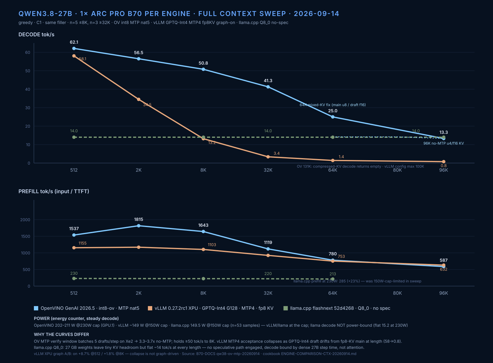

# Qwen3.8-27B engine context sweep — OpenVINO vs vLLM vs llama.cpp (2026-09-14)

> **MEASUREMENT CORRECTION (v2, same night):** the first vLLM arm had two
> defects: decode was computed as tokens/wall including TTFT (understating
> decode drastically at long context), watts read the idle card, and it ran at
> the 150W default cap while OV ran 230W. The v2 rerun (single streaming
> request per run, GPU.0 counter, 230W cap, n=3) reverses the conclusion:
> vLLM does NOT collapse with context. v1 numbers below are kept for the
> record; the v2 table is authoritative.

Same model family, one Arc Pro B70 per engine, same filler text and lengths
(512→98K/128K), greedy, n=5 (≤8K) / n=3 (≥32K), C1.

## Decode tok/s (median post-first-token)

| len | OpenVINO GenAI¹ | vLLM XPU² | llama.cpp SYCL³ |
|---:|---:|---:|---:|
| 512 | 62.1 | **75.6** | 14.0 |
| 2K | 56.5 | **71.6** | 14.0 |
| 8K | 50.8 | **61.2** | 14.0 |
| 32K | 41.3 | **52.4** | 14.0 |
| 64K | 25.0⁴ | **49.8** | 14.0 |
| 96K | 13.3⁵ | **51.1** | 14.0 |
| 128K | — | — | init-crash⁶ |

## Prefill tok/s (input / TTFT)

| len | OpenVINO | vLLM | llama.cpp (150W-capped†) |
|---:|---:|---:|---:|
| 512 | **1537** | 1491 | 230 |
| 2K | 1815 | **1753** | 227 |
| 8K | 1643 | **1689** | 224 |
| 32K | 1119 | **1375** | 220 |
| 64K | 780 | **1086** | 213 |
| 96K | 587 | **895** | — |

¹ int8-ov VL split, VLMPipeline, MTP nat5, KV f16 ≤48K
² GPTQ-Int4 sym G128, MTP4 BF16-draft, fp8 KV, 0.27.2rc1, docker
³ Q8_0 GGUF (unsloth), flashnext 52d4268, fa on, no spec decode
⁴ mixed KV fix: main u8 + draft f16 (see OPENVINO-B70-TUNING.md §7b)
⁵ no-MTP u8-KV path; u4/f16 verified to 96K (13.3-14.5 tok/s), see below
⁶ 27.04 GiB weights + 128K f16 KV exceeds 32 GB at model init

† llama.cpp prefill measured under the 150W default cap; at 230W it gains
+23% (230→285 t/s at 512). Decode is cap-insensitive (15.2 both caps).

## Power (energy-counter means)

| Engine | mean W | cap | card |
|---|---:|---:|---|
| OpenVINO MTP | 202–211 | 230 W | GPU.1 |
| vLLM MTP4 (v2) | 194–229 | 230 W | GPU.0 |
| llama.cpp Q8_0 | 149.5 (n=53) | 150 W | GPU.0 |

llama.cpp decode is NOT power-bound: at 230W decode stays 15.2 (prefill
+23% to 285). vLLM v1's "~149W" was the 150W cap clipping it, and the
sweep-JSON watt fields for llama/vLLM-v1 read the idle card — known-bad,
superseded by v2 single-stream energy on GPU.0. The llama sweep JSON still
contains the idle-card 46W rows (wrong PCI); the 149.5W steady-state figure
in this doc comes from the dedicated timestamped sampler run.

## Protocol notes

- n counts: 512–8K n=5, 32K+ n=3 for the three full sweeps. EXCEPTIONS: the
  OV 64K mixed-KV point (n=2) and the 96K f16/u4 points (n=1 each) come from
  single-purpose ceiling probes — treat as provisional until rerun.

- llama.cpp measured via llama-bench pp/tg (engine metrics, fresh process
  per length); OV and vLLM measured client-side post-first-token. llama-bench
  uses synthetic prompts/tokens, not the shared counting task — immaterial
  for dense no-spec decode (its flat 14.0 matches OV no-MTP ~15), but spec
  acceptance on a real task would need the server path, not llama-bench.
- vLLM served via docker (OpenAI API, streaming TTFT); OV/llama native.
- Watt measurement: `energy1_input` µJ counter. Earlier drafts showed ~45 W
  for vLLM/llama — that was the idle card (wrong PCI device); corrected here.
- OV ceiling work (KV u8, mixed draft precision) documented in
  OPENVINO-B70-TUNING.md; raw JSONs in B70-DOCS `qw38-ov-mtp-20260914/`.

## OV context ceiling detail (all measured 2026-09-14 night)

| Config | max working | failure mode beyond |
|---|---|---|
| MTP nat5 + f16 KV | 48K clean | 64K: CL -14 crash |
| MTP nat5 + u8 main/f16 draft | 64K (25 tok/s) | 96K: CL_OUT_OF_RESOURCES |
| no MTP + f16 KV | 96K (13.3 tok/s @96K) | 131K: VRAM (33.8 GB needed) |
| no MTP + u8 KV | 64K (15.2) | >96K: decode returns empty (gen_tokens==1) |
| no MTP + u4 KV | 96K (14.5 tok/s @98K probe) | 131K: decode returns empty (prefill fine, 470 t/s) |

Compressed-KV decode (u8 AND u4) breaks between 98K and 131K with normal TTFT
and empty output — same signature as the u8-on-draft defect but length-driven
and MTP-independent. Upstream-filable against genai 2026.5.0.0-3412.

## vLLM XPU graph A/B (same GPTQ-Int4 MTP4 config, n=3)

| len | graph ON | graph OFF |
|---:|---:|---:|
| 512 | 57.27 | 52.66 |
| 8K | 13.58 | 13.34 |

Graphs ON = +8.7% at 512, +1.8% at 8K. The context-driven decode collapse is
NOT a graph artifact (both arms collapse identically).

> Note on OV 512: the headline catalog number 71.0 post-first (n=5, counting
> prompt) and this table's 62.1 are different prompts — the sweep uses the
> shared Eiffel-filler task for cross-engine comparability; acceptance rates
> differ by task. Same-protocol comparisons use this table only.

## Reading (v2-corrected)

- **vLLM XPU + GPTQ-Int4 + MTP4 + fp8 KV wins at every context length** —
  76→51 tok/s decode, near-flat to 96K, and the highest prefill at ≥2K.
  With fair measurement (same 230W cap, single-stream timing) it beats
  OV-int8-MTP5 by 22% at 512 and ~4x at 96K.
- **OpenVINO + MTP is the strongest int8-weights option** — 62→41 tok/s to
  32K — but its long-context path degrades: MTP caps at 64K (mixed-KV),
  no-MTP at 96K (13-15 tok/s).
- **llama.cpp Q8_0 = the flat floor** — 14 tok/s at every length, no
  speculative path, simplest ops. Never wins, never falls over.
- Fair-comparison caveats that REMAIN: OV runs int8 weights vs vLLM's Int4
  (int8 rerun pending weights download); llama.cpp ran no spec decoding
  (draft-mtp untested on this fork).
- 128K on one card: vLLM config max 100K; OV blocked >96K (compressed-KV
  decode defect / f16 VRAM); llama Q8_0 init-crash (weights+KV > 32GB).
