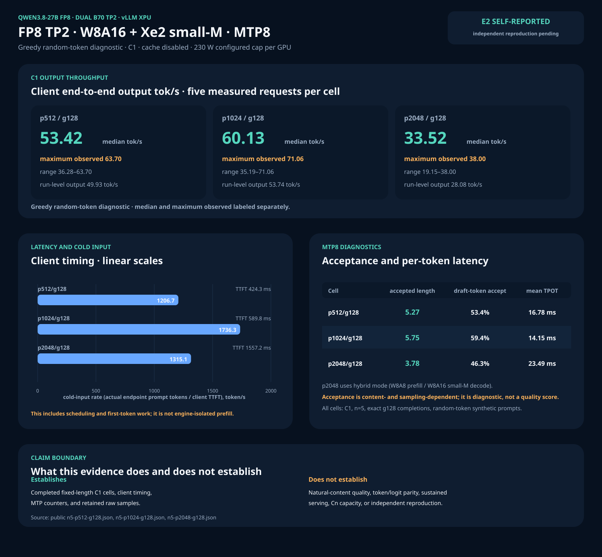
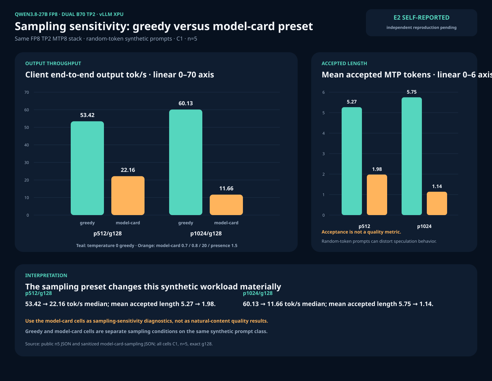
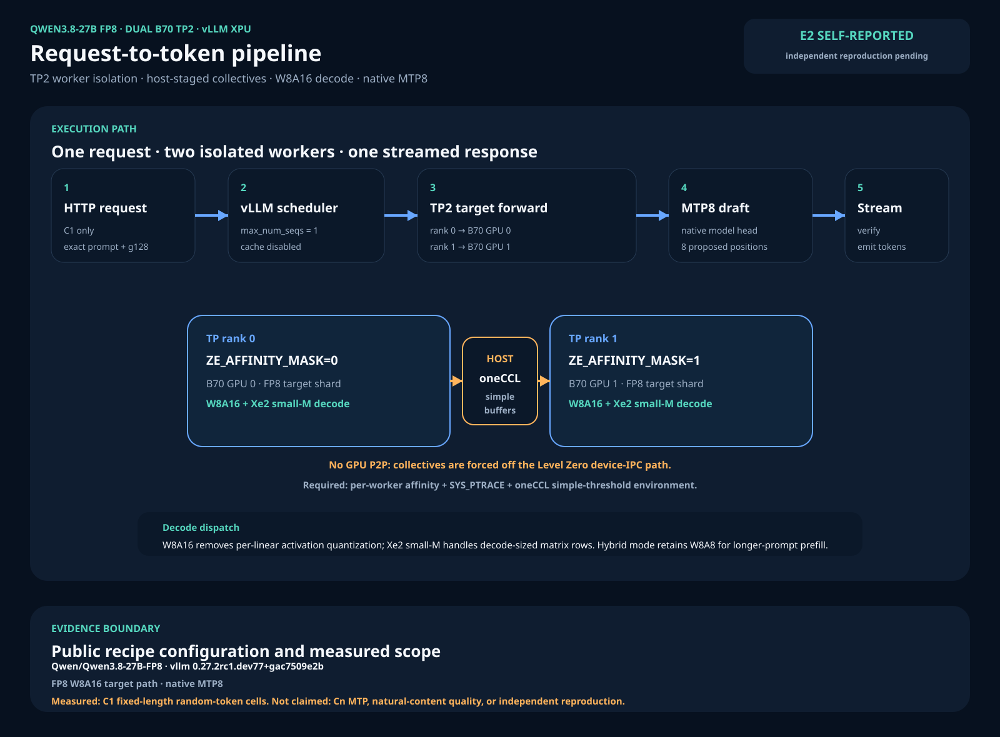

# Qwen3.8-27B FP8 — Dual B70 TP2, W8A16 + Xe2 small-M kernel, MTP8

Status: **official-lab self-report, E2** — raw public evidence is retained; the
recipe has not been independently reproduced. The measured system used two
Intel Arc Pro B70 cards (32 GB each), vLLM XPU tensor parallelism, spawn-time
per-worker Level Zero affinity, `SYS_PTRACE`, and a configured 230 W cap per
card. Measured card draw is reported only where the public evidence records it.

[Qwen3.8 family hub](README.md) · [dual-B70 topology and oneCCL setup](../DUAL-B70-TP2.md) · [image/patch matrix](../IMAGE-AND-PATCH-MATRIX.md)

## Executive overview

This page is the authority for the Qwen3.8 FP8 model artifact, immutable image,
kernel build, serve contract, benchmark values, power records, and public
evidence. The generic [dual-B70 infrastructure guide](../DUAL-B70-TP2.md) is the
separate authority for spawn-time worker affinity, Docker permissions, oneCCL
algorithm selection, topology, and collective verification.

This model route combines:

1. the immutable `f01e24f6…` vLLM XPU image generation;
2. `Qwen/Qwen3.8-27B-FP8` split over two B70 cards with TP2;
3. the generic dual-B70 affinity/oneCCL infrastructure contract;
4. the FP8 W8A16 reroute and Xe2 small-M kernel for decode-sized matrix rows,
   with native MTP8 speculation.

The strongest greedy random-token diagnostic cell is **60.13 token/s median at
p1024/g128, C1, n=5**, with **71.06 token/s maximum observed**. That is not a
representative serving claim. With the Qwen model-card non-thinking sampling
preset on matched random-token synthetic prompts, the same cell measured
**11.66 token/s median, n=5** as mean accepted speculative length fell from
5.75 to 1.14. These sampling cells are diagnostics, not natural-content quality
evaluations.

The public evidence establishes completed fixed-length C1 requests, client
latency/throughput, speculation counters, and measured energy for named cells.
It does **not** establish Cn MTP serving, sustained throughput, token/logit
parity, task quality, or independent reproduction.







The three SVGs are generated directly from the public JSON evidence:

```bash
python3 benchmarks/render-qwen38-fp8-tp2-svgs.py
python3 benchmarks/render-qwen38-fp8-tp2-svgs.py --check
```

## 1. Result card: greedy diagnostic, C1, five fresh samples

| Cell | Median client end-to-end output tok/s | Maximum observed | Minimum | Run-level output tok/s | Mean TPOT | Cold-input rate (input/TTFT) | Measured average card draw GPU0/GPU1 |
|---|---:|---:|---:|---:|---:|---:|---:|
| p512/g128 | **53.42** | 63.70 | 36.28 | 49.93 | 16.78 ms | 1206.7 token/s | 97.6 / 103.6 W |
| p1024/g128 | **60.13** | 71.06 | 35.19 | 53.74 | 14.15 ms | 1736.2 token/s | 109.5 / 118.9 W |
| p2048/g128, hybrid k=6 | **33.52** | 38.00 | 19.15 | 28.08 | 23.49 ms | 1315.1 token/s | 135.1 / 147.2 W |

All rows are random-token synthetic prompts, temperature 0, C1, exact g128,
one discarded same-shape warmup, and five measured requests. The per-request
field is client end-to-end output throughput. The run-level field is total
completed output tokens divided by the benchmark interval. They are distinct
metrics and should not be substituted for one another.

Cold-input rate is actual endpoint prompt tokens divided by client TTFT. It
includes scheduling and first-token work and is not engine-isolated prefill.
The TTFT decomposition inferred across p512→p1024 is approximately 259 ms fixed
overhead plus a marginal rate of approximately 3094 token/s; treat that as a
local two-point decomposition, not a general prefill claim.

## 2. Sampling sensitivity: matched random-token diagnostics

The greedy cells above maximize deterministic speculation on this synthetic
prompt class. The matched model-card non-thinking preset is temperature 0.7,
`top_p=0.8`, `top_k=20`, and presence penalty 1.5.

| Cell | Greedy median client end-to-end output tok/s | Model-card median | Greedy mean accepted length | Model-card mean accepted length | Model-card measured average card draw GPU0/GPU1 |
|---|---:|---:|---:|---:|---:|
| p512/g128 | 53.42 | **22.16** | 5.27 | 1.98 | 99.3 / 111.3 W |
| p1024/g128 | 60.13 | **11.66** | 5.75 | 1.14 | 128.8 / 154.2 W |

Each arm has n=5 completed exact-g128 requests. The model-card p512 samples are
15.26, 33.60, 22.16, 36.80, and 17.15 token/s; the p1024 samples are 11.56,
11.61, 11.66, 28.21, and 11.73 token/s. The dispersion and acceptance collapse
are part of the result, not exclusions.

Do not read this table as a quality ranking. Random-token prompts can distort
speculative acceptance, and the separate Pi quality phase was stopped and
voided. No completed natural-content quality or reference-parity result is
claimed.

## 3. Stack: recipe of record

### Immutable runtime and model

- Image: `vllm/vllm-openai-xpu@sha256:f01e24f6c7ff01f1e0662234255a1372297d1dbd89d003cf13c8fad3eab1ba4f`
- Observed packages: vLLM `0.27.2rc1.dev77+gac7509e2b`,
  `vllm-xpu-kernels 0.1.12.3`, torch 2.11.
- Target: `Qwen/Qwen3.8-27B-FP8`.
- Parallelism: TP2 / PP1; run the container with `--workdir /` so `import vllm`
  resolves the patched install.

### Serve contract

```text
--quantization fp8
--dtype bfloat16
--tensor-parallel-size 2
--max-model-len 9216
--max-num-seqs 1
--async-scheduling
--block-size 64
--mamba-ssm-cache-dtype float16
--max-num-batched-tokens 4096
--gpu-memory-utilization 0.90
--no-enable-prefix-caching
--language-model-only
--speculative-config '{"method":"mtp","num_speculative_tokens":8}'
```

Before applying this model-specific stack, implement the complete
[dual-B70 infrastructure contract](../DUAL-B70-TP2.md): spawn-time worker
affinity, Docker `--ipc=host --cap-add SYS_PTRACE`, the four oneCCL
simple-threshold variables, compile-only multi-GPU execution, and collective
verification. That guide is authoritative for the topology mechanics; this page
is authoritative for the Qwen3.8 FP8 flags and evidence.

### Kernel build and runtime patches

Build `vllm-xpu-kernels` from source at the generation matching the image
(0.1.12.3), then apply:

1. `patches/vllm-xpu-kernels/apply_smallm_patch.py` — adds the Xe2 block-FP8
   small-M operation for M ≤ 40; set `VXK_SRC` to the source checkout.
2. `patches/vllm-xpu-kernels/fix_smallm_placement.py` — fixes source placement
   before building the wheel/package.

Mount the resulting `vllm_xpu_kernels` package over the container's installed
package. At container startup apply:

1. `patches/vllm-xpu-kernels/patch_fp8_stack.py` — FP8 W8A16 reroute with
   `apply_input_quant=False`, M ≤ 40 dispatch to `xe2_block_fp8_small_m`, and
   `B70_FP8_FORCE_W8A8` fallback.
2. `patches/vllm-xpu-kernels/patch_fp8_hybrid.py` when using
   `B70_FP8_MODE=hybrid` — W8A8 for prefill/large-M and W8A16 small-M for
   decode. The p2048 cell used this operational mitigation.
3. Apply the generic `patches/patch_vllm_worker_affinity.py` and oneCCL/Docker
   contract exactly as specified by
   [DUAL-B70-TP2.md](../DUAL-B70-TP2.md).

The GPTQ draft-INT4 patches are not part of this FP8 route. The shared matrix is
[IMAGE-AND-PATCH-MATRIX.md](../IMAGE-AND-PATCH-MATRIX.md).

## 4. Execution model

A request enters one vLLM scheduler with `max_num_seqs=1`. The TP worker patch
starts rank 0 with only GPU 0 visible and rank 1 with only GPU 1 visible. oneCCL
uses simple/tmp-buffer algorithms staged through host memory because the two
CPU-attached cards have no GPU P2P path. Each rank evaluates its FP8 target
shard; decode-sized rows use W8A16 and the Xe2 small-M operation. Native MTP8
proposes tokens, the target verifies them, and accepted tokens are streamed to
the client.

This topology occupies both cards for one engine. It is not the default
independent-two-server product configuration, and no 2× scaling claim is made.

## 5. Power and telemetry

The campaign restored 150 W at idle, then set a **230 W configured cap per
card**. Configured cap is not measured consumption. The table reports average
card draw from `energy1_input` deltas over each recorded cell interval, with
hwmon nodes resolved live. The model-card sampling JSON records the same method
and raw interval length for its two cells.

No claim is made that the 230 W cap caused a throughput gain; there is no matched
power-cap A/B in this public card.

## 6. Known limitations and stop rules

- Speculative acceptance is content-, sampling-, and numeric-path-dependent.
  Greedy random-token acceptance must not be generalized to normal serving.
- Long-prompt W8A16 prefill can collapse acceptance beyond roughly the measured
  1536-token region. Hybrid mode mitigates this operationally by using W8A8
  prefill numerics; it is not an engine-side correctness fix.
- Concurrent MTP on one server is blocked upstream on this image family by GDN
  spec/non-spec mixing. All published FP8 rows are C1.
- The p1024 greedy median exceeding p512 is associated with higher measured
  acceptance on these cells; it is not an output-length-independent scaling
  claim.
- The 71.06 token/s p1024 value is one maximum observed sample, not a median or
  sustained result.
- Completed fixed-length output is a shape/correctness smoke gate only. No
  token-exact, logit/KL, task-quality, or independent-reproduction claim exists.

## 7. Platform receipt

LocalMaxxing accepted self-reported submission `cmtg4erjj001xqr01jhqw81dt`:
**31.1 token/s median client post-first output**, 189.93 ms median TTFT,
p74/g256, C1, n=3. The request used server-default temperature 1.0 because the
platform payload schema did not carry a temperature field. `APPROVED` means
accepted into the platform's self-reported dataset, not independently
reproduced or verified. An older contended 28.6 token/s row is superseded by
this serialized-idle submission.

This platform metric is client post-first throughput and must not be mixed with
the client end-to-end output metric in the n=5 tables.

## 8. Public evidence

- Greedy raw benchmark JSON, parsed summaries, and cell power records:
  [`results/qwen38-27-fp8-tp2-k8-n5/bench/`](../../results/qwen38-27-fp8-tp2-k8-n5/bench/)
- Model-card p512/g128 summary:
  [`model-card-sampling-p512-g128.json`](../../results/qwen38-27-fp8-tp2-k8-n5/bench/model-card-sampling-p512-g128.json)
- Model-card p1024/g128 summary:
  [`model-card-sampling-p1024-g128.json`](../../results/qwen38-27-fp8-tp2-k8-n5/bench/model-card-sampling-p1024-g128.json)
- Sanitized LocalMaxxing receipt:
  [`localmaxxing-approved-receipt.json`](../../results/qwen38-27-fp8-tp2-k8-n5/localmaxxing-approved-receipt.json)
- Public catalog authority:
  [`data/benchmarks.v1.json`](../../data/benchmarks.v1.json)

The renderer reads these public files directly. The SVGs therefore remain
reproducible without copying their values into a second numeric source.
