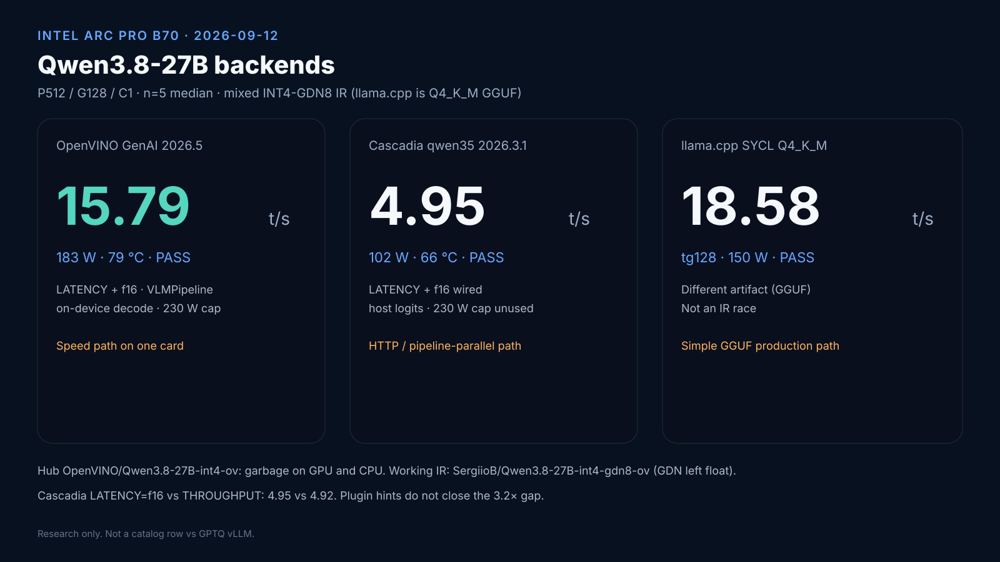

# Qwen3.8-27B — OpenVINO GenAI and Cascadia (research)

Not a production catalog row. Architecture:
[OpenVINO and Cascadia](../architecture/openvino-and-cascadia.md).
Do not mix with GPTQ vLLM on [QWEN38-VLLM-XPU.md](QWEN38-VLLM-XPU.md).

Working IR: [`SergiioB/Qwen3.8-27B-int4-gdn8-ov`](https://huggingface.co/SergiioB/Qwen3.8-27B-int4-gdn8-ov)
(mixed INT4, GatedDeltaNet left float). Hub
`OpenVINO/Qwen3.8-27B-int4-ov` is still incoherent on GPU and CPU —
[openvino.genai#4467](https://github.com/openvinotoolkit/openvino.genai/issues/4467).

Full write-up + SVG boards:
[OPENVINO-CASCADIA-REPORT.md](OPENVINO-CASCADIA-REPORT.md).



## Cascadia on this family

Cascadia is a **Rust serving wrapper**, not a second GPU kernel stack.
For Qwen3.8 dense the only engine that loads is `qwen35` (IR-surgery
1-stage shard). `ov-genai` SIGSEGVs on this VLM IR (stock 0.2.3 = OpenVINO
2026.2; a 2026.3.1 rebuild still dies in `Tokenizer::setup_tokenizer`).

`qwen35` is greedy, batch=1. Every decode step:

1. Host embeds token ids → f32 `[1,1,hidden]` into the GPU
2. Stage IR runs (OpenVINO `compile_model`, not `VLMPipeline.generate`)
3. Host copies f32 logits (vocab 248320) and argmax in Rust

That loop is why package power sits at ~102 W even with a 230 W cap.
Python `VLMPipeline` keeps decode on-device and draws ~183 W.

### Flags that now reach `qwen35`

Upstream 0.2.3 **ignored** `--ov-*` on this engine (fixed plugin config).
A local rebuild forwards them. Defaults on GPU if unset:

```text
--engine qwen35 --device GPU.0
--ov-performance-mode LATENCY
--ov-inference-precision f16
--ov-cache-dir <dir>
```

`--ov-inference-precision f32` / `--ov-execution-mode ACCURACY` still break
the MoE fused gemm on Arc. Dense 3.8 accepts f16.

Measured P512/G128 n=5 median at 230 W, same INT4-GDN8 1-stage shard:

| Compile | median tok/s | package W | Tmax |
|---|---|---|---|
| empty PluginConfig (0.2.3 as shipped) | 4.95 | 102 | 66 °C |
| LATENCY + f16 (local rebuild) | **4.95** | 102 | 66 °C |

No tok/s change. The Xe2 f16 hint was already not the ceiling. Closing
the gap needs on-device argmax / `ov-genai` on OpenVINO 2026.5, not more
plugin strings.

Shard once (`cascadia shard --num-stages 1`). Then:

```bash
cascadia worker --rank 0 --total 1 --engine qwen35 --device GPU.0 \
  --model ./qwen38-int4-gdn8-1s --api 127.0.0.1:8000 \
  --ov-performance-mode LATENCY --ov-inference-precision f16
```

## N5 OpenVINO GenAI (best params)

`VLMPipeline` on GPU.0, `LATENCY` + `f16` + `DYNAMIC_QUANTIZATION_GROUP_SIZE=0`,
`generation_config=` by keyword, greedy, HF ai2d image.

**230 W cap** — package ~182–186 W, Tmax 79–82 °C

| P | G | n | median wall tok/s | quality |
|---|---|---|---|---|
| 128 | 128 | 5 | 15.14 | PASS |
| **512** | **128** | **5** | **15.79** | PASS |
| 1024 | 128 | 5 | 15.25 | PASS |
| 512 | 64 | 5 | 12.45 | PASS |
| 512 | 256 | 5 | 20.52 | PASS |

150 W cap, same P512/G128: 14.65 tok/s at 150 W / 73 °C. Dense 27B scales
with the cap (~8%). Headline shape: **P512/G128 C1 n=5 median**.

G64 vs G256 is TTFT amortization, not a faster kernel.

## Head-to-head (same IR, 230 W, P512/G128 n=5)

| Engine | tok/s | W | Tmax | Notes |
|---|---|---|---|---|
| OpenVINO GenAI 2026.5 | **15.79** | 183 | 79 °C | fused VLM, on-device decode |
| Cascadia `qwen35` 2026.3.1 | 4.95 | 102 | 66 °C | surgery + host logits |
| llama.cpp SYCL Q4_K_M | 18.58 tg128 | 150 W run | — | different artifact |

Use Cascadia when you need OpenAI HTTP + multi-box pipeline parallel.
Use Python GenAI when you want tok/s on one B70.
