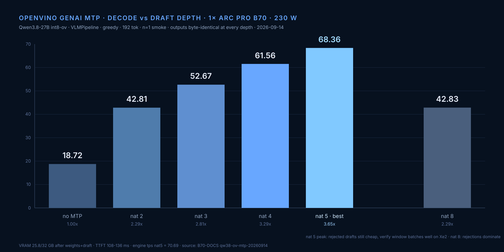

# Qwen3.8-27B INT8 OpenVINO MTP — 3.29x decode on one B70 (2026-09-14)

Follow-up to [OPENVINO-CASCADIA-REPORT.md](OPENVINO-CASCADIA-REPORT.md).
Same artifact (`OpenVINO/Qwen3.8-27B-int8-ov`), GenAI **2026.5.0.0-3412** nightly,
one B70 (GPU.1), 230 W cap, greedy, ChatML rendered manually, n=1 smoke ladder.
Reproduces the external ~61 tok/s "latest image" claim exactly.



## Numbers

| Config | wall tok/s | engine tps | TTFT ms | speedup |
|---|---:|---:|---:|---:|
| no MTP (VLMPipeline) | 18.72 | 18.83 | 112 | 1.00x |
| MTP depth 2 | 42.81 | 43.66 | 109 | 2.29x |
| MTP depth 3 | 52.67 | 54.01 | 108 | 2.81x |
| MTP depth 4 | 61.56 | 64.03 | 136 | 3.29x |

- Output text byte-identical across all depths and vs no-MTP (greedy parity holds).
- Prose prompt (explain speculative decoding), MTP3: 36.43 vs 18.68 base (1.95x).
  Counting tasks accept drafted tokens better than prose — pick depth by workload.
- 384-token request: 54.0 tok/s (EOS at 234 tokens).
- VRAM after load: 25.8 / 32 GB (weights + draft). Load ~57-61 s, cache warm after first.
- Raw JSON: `results/qwen38-ov-mtp-20260914/` on the lab host (probe5/probe6).

## The five blockers and their fixes

1. **Wrong pipeline class.** The Hub int8-ov export is
   `Qwen3_5ForConditionalGeneration` — a VL split export. The language graph
   takes `inputs_embeds` only (no `input_ids` port), so `LLMPipeline.generate()`
   dies with `Port for tensor name input_ids was not found`.
   Fix: `og.VLMPipeline(model_dir, 'GPU.1')`. Text-only prompts work fine.
2. **Minja chat-template bug.** Nightly 2026.5 cannot compile this model's
   template (`Unknown type for 'is' operator ... enable_thinking is undefined`).
   Fix: render ChatML yourself and set `apply_chat_template=False`.
3. **MTP silently needs two switches.** `GenerationConfig.num_assistant_tokens > 0`
   (mtp_strategy.cpp:28) **and** `SchedulerConfig.enable_prefix_caching = false`
   — the linear-attention verifier rejects prefix caching (pipeline_impl.cpp:388).
   VLMPipeline defaults prefix caching on, so MTP fails until you pass a scheduler
   config that turns it off.
4. **Do not set `cache_size` yourself.** With 25.8 GB of weights resident the
   KV budget check dies at load (cache_orchestrator.hpp:868). Defaults fit.
5. **Python 3.14 forkserver** re-imports your script as `__mp_main__`; open with
   `if __name__ != '__main__': raise SystemExit(0)` or the child reruns the probe.

## Working snippet

```python
import openvino as ov, openvino_genai as og
sc = og.SchedulerConfig(); sc.max_num_seqs = 1; sc.enable_prefix_caching = False
draft = og.draft_model(MODEL_DIR, 'GPU.1')          # bundled openvino_mtp_model.xml
pipe = og.VLMPipeline(MODEL_DIR, 'GPU.1', draft_model=draft, scheduler_config=sc)
cfg = og.GenerationConfig()
cfg.apply_chat_template = False                       # render ChatML yourself
cfg.num_assistant_tokens = 4                          # MTP depth
```

## num_assistant_tokens sweep (same night, probe8)

| nat | wall tok/s | note |
|---:|---:|---|
| 3 | 52.59 | |
| 4 | 61.56 | |
| **5** | **68.36** | **3.65x — best** |
| 8 | 42.83 | rejected drafts dominate |

Outputs byte-identical at nat 3/4/5.

**n=5 confirmation (P512/G128 cell, 128 gen tokens):** count median 67.91 wall /
71.01 post-first tok/s, TTFT 96 ms; prose median 34.34 / 35.04, TTFT 104 ms.
Variance ±0.4 tok/s. Raw: B70-DOCS `qw38-ov-mtp-20260914/nat5-n5.json`. The `num_assistant_tokens_schedule`
constant/heuristic/dynamic triad no longer exists in 2026.5 nightly — MTP is
static-count only (`assistant_confidence_threshold` is rejected for MTP).
`ATTENTION_BACKEND` is not a valid pipeline property (Option not found); the
audit says non-Gemma4 MTP wants PA on GPU, default backend already reaches 68.

## Cross-GPU draft: driver crash (do not retry as-is)

`og.draft_model(MODEL, 'GPU.0')` + `VLMPipeline(MODEL, 'GPU.1', draft_model=...)`
aborts the OpenCL runtime (`enqueue_svm.h:308`) before the first generate.
Not a config error — the compute-runtime level dies. Both GPUs survived,
caps restored manually. Worth an upstream issue; not a local tuning lane.

## Engine comparison, 1× B70, same P/G protocol

- vLLM Qwen3.8-27B Draft INT4: 106.7 tok/s (client post-first-token tps, n=5) — still the single-card leader, but INT4 weights + draft sampling, not parity-greedy
- vLLM Qwen3.6-27B MTP4: 69.3 tok/s (n=5)
- OpenVINO GenAI INT8 MTP nat5: 68.36 tok/s wall / 70.69 engine (n=1 smoke; n=5 pending) — byte-identical greedy output, heaviest weights of the three
- llama.cpp Flash-Next (2× B70): 33.25 tok/s native decode

Read: OpenVINO with native MTP now matches vLLM's dense-27 MTP4 on INT8 weights,
with exact greedy parity — and 3.65x its own no-MTP baseline.

## Context ceiling (computed from config, not yet measured)

Hybrid attention: 16 full-attention + 48 GatedDeltaNet linear layers of 64.
Full-attn KV = 16 layers × 2 × 4 kv-heads × 256 dim × 2 B = 64 KiB/token.
Post-load free VRAM 8.0 GiB -> ~129K tokens headroom; ~100K with a safe
workspace reserve, single card, INT8 weights. Linear state is fixed
~72 MiB/sequence (48 layers × 48 v-heads × 128×128 × 2 B) — concurrency cost,
not context cost. Model max_position_embeddings = 262,144 (256K); reaching it
on one card needs KV INT8 or the INT4 weights.

## Long-context behavior (2026-09-14, 1× B70, int8-ov)

| len | prefill tps | decode tps | config |
|---:|---:|---:|---|
| 512 | 1537 | 62.1 | MTP nat5, f16 KV |
| 2K | 1815 | 56.5 | MTP nat5, f16 KV |
| 8K | 1643 | 50.8 | MTP nat5, f16 KV |
| 32K | 1119 (f16) / 1117 (u8) | 41.3 / 41.8 | MTP nat5 |
| 48K | 916 | 30.2 | MTP nat5, f16 KV (last clean MTP length) |
| 64K | 780 | 25.0 (main u8, draft f16 — the fix) · 15.2 no-MTP | u8 main KV |
| 96K | 587 | (u8, no-MTP path only) | |
| 128K | 465 | (u8, no-MTP path only) | TTFT 278 s |

KV u8 halves cache with zero cost ≤32K; f16 KV + MTP dies at 64K (CL -14); u8 on BOTH breaks MTP decode >32K — keep the draft at f16 (main=u8 works: 25 tok/s @64K);
u8 + MTP prefills but decode breaks >32K. Full guide: OPENVINO-B70-TUNING.md.

## Next targets

1. ~~Export an MTP draft unit for INT4-GDN8~~ — DONE 2026-09-15: the Hub
   `OpenVINO/Qwen3.8-27B-int4-ov` `openvino_mtp_model.{xml,bin}` (263 MB) grafts
   into the GDN8 dir and loads as `draft_model`. Result: decode 22.4 → 79.5 t/s
   @512 (+3.55×), 64K survives (29.1, no-draft crashed), ceiling 98K (GPU event
   error). Validate with `validate_mtp_graft.py` / `ctx_sweep_ov_int4_mtp5.py`.
2. llama.cpp reference: single-head MTP, n_max=3 default, top_k=10 draft sampling,
   ~0.93 acceptance / ~3.2 tok per step on this family — nat5 beating it suggests
   the OpenVINO verifier window batches better on Xe2.
