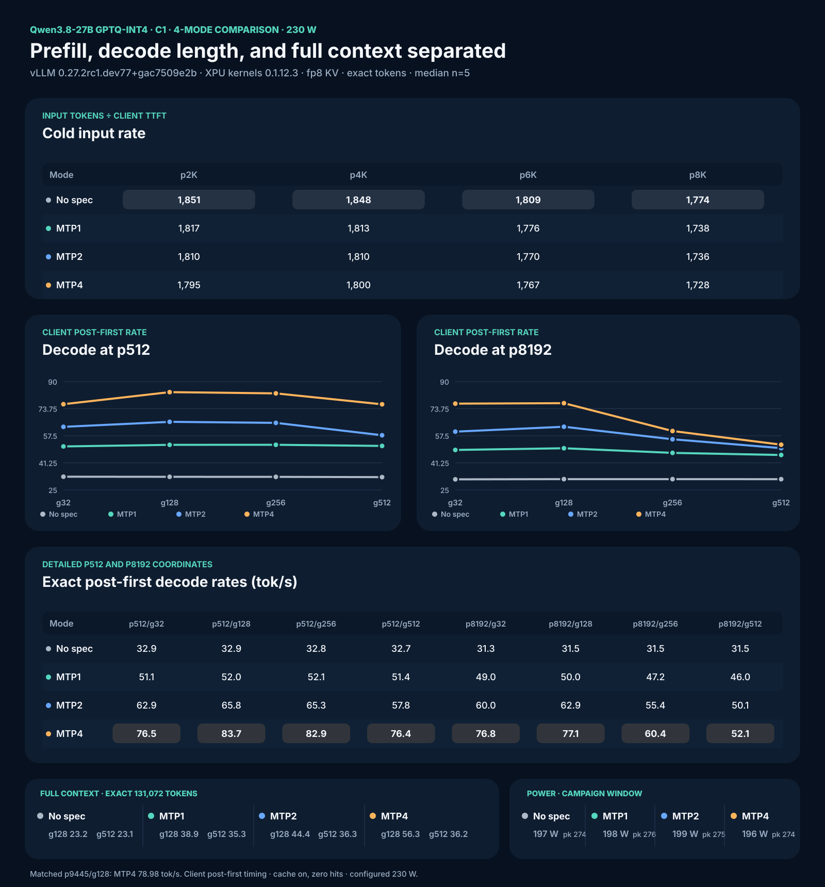
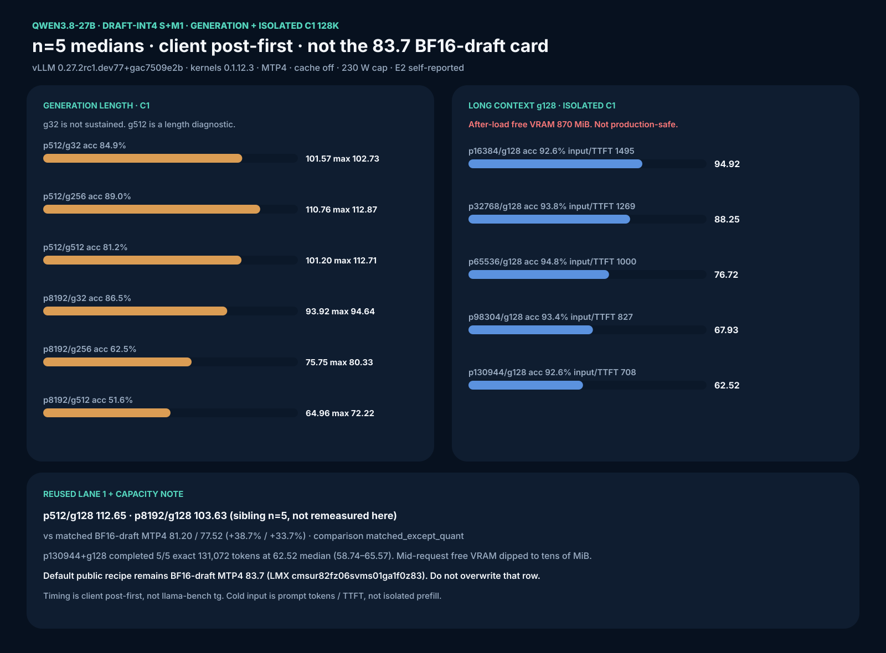
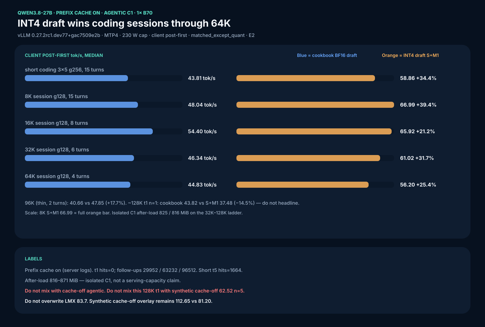

# Qwen3.8-27B vLLM XPU 4-Mode Recipe

This page is the **single-B70 GPTQ-INT4 route**. For route selection, including
the separate dual-B70 FP8 W8A16 TP2 research recipe, start at the
[Qwen3.8 family hub](README.md). Do not mix the FP8 kernel patches or FP8
benchmark values into this GPTQ recipe.

> **Windows 11 host?** Same image digest, 100K ctx, display-safe GPU budget.
> Kit **2026.08.19** ships draft-INT4 S+M1 with prefix cache **on** for real
> sessions. Already on 18 August? Rebuild, do not re-download:
> [WINDOWS-STANDALONE.md](WINDOWS-STANDALONE.md).



The 4-mode dashboard is the **BF16-draft** Run 40 card (MTP4 p512/g128 **83.7**).
The optional draft-INT4 overlay is a separate matched n=5 card:


Generation length + isolated-C1 128K on that same S+M1 arm (not a serving
headline; 870 MiB free after load):



Prefix-on agentic A/B (separate campaign, cache on, isolated C1):



## Quick Start (3-Step Setup)

### Step 1: Pull the image & verify environment
```bash
export IMAGE='vllm/vllm-openai-xpu@sha256:f01e24f6c7ff01f1e0662234255a1372297d1dbd89d003cf13c8fad3eab1ba4f'
docker pull "$IMAGE"
```

### Step 2: Download the model
```bash
export MODEL_DIR="$HOME/models/Qwen3.8-27B-GPTQ-Int4-sym-G128-MTP-BF16"
huggingface-cli download SergiioB/Qwen3.8-27B-GPTQ-Int4-sym-G128-MTP-BF16 \
  --revision 9d189a60e4c0ad7f9f47cd94bfa393ca10b3924e \
  --local-dir "$MODEL_DIR"
```

### Step 3: Launch server & verify health
```bash
RENDER_GID="$(stat -c '%g' /dev/dri/render* | sort -u | sed -n '1p')"
docker rm -f qw38speed >/dev/null 2>&1 || true
docker run -d --name qw38speed -p 8000:8000 --device /dev/dri --group-add "$RENDER_GID" \
  -v /dev/dri:/dev/dri:ro -v "$MODEL_DIR:/model:ro" \
  -v "$PWD/patches/patch_mtp_nightly.py:/patch_mtp.py:ro" \
  -v "$PWD/patches/patch_mtp_boundary.py:/patch_boundary.py:ro" \
  -e VLLM_TARGET_DEVICE=xpu -e ZE_FLAT_DEVICE_HIERARCHY=COMPOSITE -e ZE_AFFINITY_MASK=0 \
  -e B70_MTP_BF16_DRAFT=1 -e VLLM_XPU_ENABLE_XPU_GRAPH=1 \
  -e PYTORCH_ALLOC_CONF=expandable_segments:True \
  --entrypoint bash "$IMAGE" -lc \
  'set -e; python /patch_mtp.py; python /patch_boundary.py; exec vllm serve /model --quantization gptq --dtype float16 --max-model-len 100000 --gpu-memory-utilization 0.88 --kv-cache-dtype fp8 --port 8000 --max-num-seqs 1 --max-num-batched-tokens 8192 --no-enable-prefix-caching --served-model-name qwen38 --language-model-only --speculative-config "{\"method\":\"mtp\",\"num_speculative_tokens\":4}"'

curl -f http://127.0.0.1:8000/health
```

> [!NOTE]
> **Context & Headroom:** 100,000 tokens (`--max-model-len 100000`, `U=0.88`) provides ~1.5–2.0 GiB free VRAM headroom. If running full 131,072 context, keep `--gpu-memory-utilization 0.88` (leaves ~870 MiB free after load for isolated C1 runs).

> [!TIP]
> **Compile-time OOM on a second card (or fresh compile):** if engine init dies with
> `UR_RESULT_ERROR_OUT_OF_RESOURCES` during `_compile_to_module`, parallel inductor
> compile workers exhausted the Level Zero context. Add
> `-e TORCHINDUCTOR_COMPILE_THREADS=1` to the `docker run` line (verified 2026-09-14;
> cold start ~3–4 min single-threaded). MTP **depth 4 is confirmed optimal** on one
> B70 — depth 6 measured 10–20% slower at both decode anchors because acceptance
> collapses past draft position 4; see
> [MTP-DEPTH-DFLASH2-KNORM-20260914.md](MTP-DEPTH-DFLASH2-KNORM-20260914.md).

---

## 1. Model download from Hugging Face
Download the exact preserved-MTP artifact using the Hugging Face CLI. The model repository contains 16 files totaling ~18.2 GiB. We pin to the `9d189a60` revision to ensure exact replication.

```bash
huggingface-cli download SergiioB/Qwen3.8-27B-GPTQ-Int4-sym-G128-MTP-BF16 \
  --revision 9d189a60e4c0ad7f9f47cd94bfa393ca10b3924e \
  --local-dir /qw38-gptq-out/Qwen3.8-27B-GPTQ-Int4-sym-G128-MTP-BF16
```

Verify the artifact integrity and correct exclusion of the `mtp.*` tensors from quantization (they must remain BF16):
```bash
sha256sum /qw38-gptq-out/Qwen3.8-27B-GPTQ-Int4-sym-G128-MTP-BF16/*.safetensors
cat /qw38-gptq-out/Qwen3.8-27B-GPTQ-Int4-sym-G128-MTP-BF16/quantize_config.json
```
The config must show `gptq` with 4-bit, sym=true, group_size=128, desc_act=false, and dynamically excluded `mtp.*` tensors.

## 2. Why GPTQ-Int4?
Intel's XMX engines are integer-first hardware. GPTQ-Int4 is the demonstrated optimal fast path for vLLM XPU on the B70, utilizing the `XPUwNa16LinearKernel`. Other formats fall short on this stack:
- **NVFP4:** Proprietary to NVIDIA, unsupported on Intel silicon.
- **FP8 block:** Currently lacks an optimized XPU scaling kernel in vLLM.
- **GGUF:** The converter strips the required MTP head, breaking speculative decoding.
- **AWQ / compressed-tensors:** Not proven or fully optimized on this exact stack.

This exact `sym G128 desc_act=false` contract with 400 quantized weight tensors and 15 preserved BF16 MTP tensors was quantized directly on the B70 XPU using `gptqmodel` 7.3.2 to ensure native compatibility.

## 3. Image and package verification
Pull the pinned immutable container image:
```bash
export IMAGE='vllm/vllm-openai-xpu@sha256:f01e24f6c7ff01f1e0662234255a1372297d1dbd89d003cf13c8fad3eab1ba4f'
docker pull "$IMAGE"
```

Verify the exact package versions and device detection inside the container:
```bash
docker run --rm --device /dev/dri --entrypoint python "$IMAGE" -c '
from importlib.metadata import version
import torch
assert version("vllm") == "0.27.2rc1.dev77+gac7509e2b"
assert version("vllm-xpu-kernels") == "0.1.12.3"
print(torch.xpu.get_device_name(0))
'
```
It must print `Intel Arc Pro B70`.

## 4. Patches
Required, in this order (both in `patches/`):
1. `patch_mtp_nightly.py` (SHA-256: `4d7a02c4ea10ca7c00dc89ad927fa3dafa747dbf0553d2adf24e30a3c53e9c14`): Enables the BF16 draft build gate by reading `B70_MTP_BF16_DRAFT=1`.
2. `patch_mtp_boundary.py` (SHA-256: `41d2f74e5fef1f074b76b5a90dd1016de437228431802cfb1fa7bd7ce4cc9b50`): Correctly handles the partial final speculative group at the exact 131,072-token boundary.

Optional, after those two, still Qwen-only (never Nemotron grouped-topk / SSU):
3. `patch_gdn_mixed_split_v5.py` — mixed spec + non-spec `gdn_attention` compact+scatter. Cn correctness; C1 speed-flat.
4. `patch_draft_lmhead_int4.py` then `patch_draft_mtp_int4.py` with `B70_DRAFT_LMHEAD_INT4=1` and `B70_DRAFT_MTP_INT4=1` — draft-side INT4 RTN. MTP speed overlay. Quality still gated.

Copy-paste launch lines including the optional overlays: [FULL-SETUP-COMMANDS.md §11](../FULL-SETUP-COMMANDS.md).

## 5. Power cap
Resolve your `xe` hwmon path (PCI 0000:0b:00.0) and set the 230 W configured cap:
```bash
# Example path, confirm via /sys/class/hwmon/hwmon*/name == 'xe'
echo 230000000 | sudo tee /sys/class/hwmon/hwmon4/power1_cap
```
*Note: A 300 W write is rejected by the driver; readback stays at the 230 W hardware ceiling. There is no clock control on the `xe` driver (no gt_min/gt_max). Under a 230 W cap load, the PMU reports actual frequencies of 3,400 MHz against requested 2,400 MHz.* Restore to 150 W after benchmark completion.

## 6. Launch commands (isolated reference modes)
Run the server for each mode sequentially.

### no-spec
```bash
docker run -d --name qw38speed -p 8000:8000 --device /dev/dri --group-add $(stat -c '%g' /dev/dri/render* | sort -u | head -1) \
  -v /dev/dri:/dev/dri:ro -v /qw38-gptq-out/Qwen3.8-27B-GPTQ-Int4-sym-G128-MTP-BF16:/model:ro \
  -v patches/patch_mtp_nightly.py:/patch_mtp.py:ro -v patches/patch_mtp_boundary.py:/patch_boundary.py:ro \
  -e VLLM_TARGET_DEVICE=xpu -e ZE_FLAT_DEVICE_HIERARCHY=COMPOSITE -e ZE_AFFINITY_MASK=0 \
  -e B70_MTP_BF16_DRAFT=1 -e VLLM_XPU_ENABLE_XPU_GRAPH=1 -e PYTORCH_ALLOC_CONF=expandable_segments:True \
  --entrypoint bash "$IMAGE" -lc \
  "set -e; python /patch_mtp.py; python /patch_boundary.py; exec vllm serve /model --quantization gptq --dtype float16 --max-model-len 131072 --gpu-memory-utilization 0.90 --kv-cache-dtype fp8 --port 8000 --max-num-seqs 64 --max-num-batched-tokens 8192 --no-enable-prefix-caching --served-model-name qwen38 --language-model-only"
```

### MTP1 / MTP2 / MTP4
For MTP runs, drop `--gpu-memory-utilization` to `0.88` to fit draft buffers, and append the speculative config. For example, MTP4:
```bash
docker run -d --name qw38speed -p 8000:8000 --device /dev/dri --group-add $(stat -c '%g' /dev/dri/render* | sort -u | head -1) \
  -v /dev/dri:/dev/dri:ro -v /qw38-gptq-out/Qwen3.8-27B-GPTQ-Int4-sym-G128-MTP-BF16:/model:ro \
  -v patches/patch_mtp_nightly.py:/patch_mtp.py:ro -v patches/patch_mtp_boundary.py:/patch_boundary.py:ro \
  -e VLLM_TARGET_DEVICE=xpu -e ZE_FLAT_DEVICE_HIERARCHY=COMPOSITE -e ZE_AFFINITY_MASK=0 \
  -e B70_MTP_BF16_DRAFT=1 -e VLLM_XPU_ENABLE_XPU_GRAPH=1 -e PYTORCH_ALLOC_CONF=expandable_segments:True \
  --entrypoint bash "$IMAGE" -lc \
  "set -e; python /patch_mtp.py; python /patch_boundary.py; exec vllm serve /model --quantization gptq --dtype float16 --max-model-len 131072 --gpu-memory-utilization 0.88 --kv-cache-dtype fp8 --port 8000 --max-num-seqs 64 --max-num-batched-tokens 8192 --no-enable-prefix-caching --served-model-name qwen38 --language-model-only --speculative-config '{\"method\":\"mtp\",\"num_speculative_tokens\":4}'"
```

## 6b. Vision serving (full VLM)

The artifact is a `Qwen3_5ForConditionalGeneration` VLM: INT4 language
model, but the 333-tensor vision tower ships **unquantized F16
(~0.92 GB)** next to the BF16 MTP heads. Serving images is a one-flag
change: **remove `--language-model-only`**.

Verified 2026-08-23 (image `f01e24f6`, MTP4, fp8 KV, util 0.92,
131072 ctx): boots and answers a 64×64 red-PNG smoke test with `Red`
(+78 prompt tokens vs text-only). Budget ~1 GB extra VRAM for the
tower; if you need that VRAM back for KV, lower util or context instead
of re-adding the flag.

> [!WARNING]
> **The image-processor configs must exist in the model dir.** The
> published repo ships `preprocessor_config.json`,
> `processor_config.json` and `video_preprocessor_config.json` (present
> at the pinned `9d189a60` revision). Local re-conversions / re-packs
> can drop them — vLLM then dies at startup with
> `OSError: Can't load image processor for '/model'`. Fix: copy the
> three JSONs from the BF16 source checkpoint (or re-download from the
> repo). Text-only serving does not need them.

## 7. Results
*Stack: vLLM 0.27.2rc1.dev77+gac7509e2b, XPU kernels 0.1.12.3, fp8 KV, scheduler 8192, context 131072, 230 W configured cap, cache disabled (zero hits), C1, client monotonic timing. All medians n=5 unless noted.*

### Cold input rate (input tokens / client TTFT, tok/s)
| Mode | p2048/g1 | p4096/g1 | p6144/g1 | p8192/g1 |
|---|---:|---:|---:|---:|
| no-spec | 1851 | 1848 | 1809 | 1774 |
| mtp1 | 1817 | 1813 | 1776 | 1738 |
| mtp2 | 1810 | 1810 | 1770 | 1736 |
| mtp4 | 1795 | 1800 | 1767 | 1728 |

### Decode at p512 (client post-first tok/s)
| Mode | g32 | g128 | g256 | g512 |
|---|---:|---:|---:|---:|
| no-spec | 32.9 | 32.9 | 32.8 | 32.7 |
| mtp1 | 51.1 | 52.0 | 52.1 | 51.4 |
| mtp2 | 62.9 | 65.8 | 65.3 | 57.8 |
| mtp4 | 76.5 | 83.7 | 82.9 | 76.4 |

### Decode at p8192 (client post-first tok/s)
| Mode | g32 | g128 | g256 | g512 |
|---|---:|---:|---:|---:|
| no-spec | 31.3 | 31.5 | 31.5 | 31.5 |
| mtp1 | 49.0 | 50.0 | 47.2 | 46.0 |
| mtp2 | 60.0 | 62.9 | 55.4 | 50.1 |
| mtp4 | 76.8 | 77.1 | 60.4 | 52.1 |

*Note: The mtp4 p8192/g32 cell contains one corrupted rep5 (41587.9 tok/s SSE burst); the median 76.8 is unaffected and valid, but the cell mean must not be published.*

### Control + full-context
| Mode | p9445/g128 | p130944/g128 (n=1) | p130560/g512 (n=1) |
|---|---:|---:|---:|
| no-spec | 31.4 | 23.2 | 23.1 |
| mtp1 | 49.9 | 38.9 | 35.3 |
| mtp2 | 62.3 | 44.4 | 36.3 |
| mtp4 | 79.0 | 56.3 | 36.2 |

### MTP acceptance per mode (accepted/proposed, %)
| Mode | p512/g128 | p8192/g128 | p130944/g128 |
|---|---:|---:|---:|
| mtp1 | 100.0 | 99.7 | 100.0 |
| mtp2 | 99.3 | 97.7 | 96.5 |
| mtp4 | 95.0 | 93.7 | 96.2 |

### Power (campaign-window, includes warmups)
| Mode | mean W | max 0.5s interval-avg W |
|---|---:|---:|
| no-spec | 197 | 274 |
| mtp1 | 198 | 276 |
| mtp2 | 199 | 275 |
| mtp4 | 196 | 274 |

## 8. Benchmark harness reproduction
Reproduce the 4-mode characterization with unique entropy-first prefixes, zero cache-hit delta, exact rendered tokens, same-shape warmups, C1 only, and client monotonic timing:

```bash
python3 benchmarks/b70-realworld-context-harness.py
```

The shared matrix runner is `benchmarks/b70-pi-prefill-decode-matrix.sh`.

## 9. LocalMaxxing Submission
LocalMaxxing `APPROVED` means accepted self-report, not independent verification.

- **BF16-draft MTP4 (cookbook default):** id `cmsur82fz06svms01ga1f0z83`. Payload `submissions/vllm-qwen38-mtp4-gptq-int4.json`. `tokSOut` **83.7** = client post-first p512/g128 median n=5; `tokSPrefill` **1774** = no-spec p8192/g1 input/TTFT. Do not overwrite this row with the draft-INT4 overlay.
- **Draft-INT4 S+M1 overlay (optional):** id `cmszpqy000e8fms014ty6i5x3` APPROVED. Payload `submissions/vllm-qwen38-mtp4-draft-int4.json`. `tokSOut` **112.65** = same p512/g128 cell, n=5 median, vs matched BF16-draft arm **81.20** on 2026-08-18. `tokSPrefill` **1696** = MTP4 p8192/g1 on that arm (flat vs 1691). Speed-only; accept 94.4% vs 95.9%. **C1 single-card only - unsafe with `--tensor-parallel-size 2` (issue #9).**

## 10. Running the pi coding agent on this model
See [PI-AGENT-BACKEND.md](PI-AGENT-BACKEND.md) — vLLM flags for tool calling
(`--enable-auto-tool-choice --tool-call-parser qwen3_xml`), the pi
`models.json` provider entry, and verified agent usage.

Sampling parameters are set per thinking mode by the extension
(`patches/pi/qwen38-vllm-thinking.ts`) exactly as recommended on the official
Qwen3.8-27B model card — thinking `temperature=1.0, top_p=0.95, top_k=20,
presence_penalty=0.0`; non-thinking `temperature=0.7, top_p=0.80, top_k=20,
presence_penalty=1.5`; `repetition_penalty=1.0` both modes.

## 11. Concurrent serving (mixed-split v5 + optional draft INT4)

**Why a patch is required.** Unpatched `gdn_attention` on this XPU stack
refuses mixed spec-decode + non-spec tokens in one invocation
(`vllm-xpu-kernels#510`). C1 never hits that path; two-plus in-flight
requests with mixed long-prefill + decode can kill EngineCore. Apply
**`patches/patch_gdn_mixed_split_v5.py`** after the two MTP patches
(compact each group via `index_select`, `token_indx = arange`, idle side
`None`, `index_copy_` on `core_attn_out` and `z`). Do **not** apply the
original full-buffer + global-`token_indx` split on kernels `0.1.12.3`
(global mixed indices are OOB). Optional
`patches/patch_mtp_ptr_wrap.py` is int64-only.

**Setup for concurrent serving** — same launch line as §Launch (MTP4,
fp8 KV, `--max-num-seqs 64`, `--max-num-batched-tokens 8192`), plus the v5
patch (and the draft-INT4 overlay if you want the speed keep), plus
`--enable-prefix-caching`:
[FULL-SETUP-COMMANDS.md §11](../FULL-SETUP-COMMANDS.md). Copy-paste launch
lines for every overlay combination live there; concurrency is a client
property, no extra server flag beyond `--max-num-seqs`.

**Measured (2026-08-19, single B70, image `f01e24f6`, MTP4, v5 + draft-INT4
S+M1, prefix cache on, 230 W cap, measured draw 221–229 W, 82–83 °C
package, all requests temperature 0 / greedy).** Two separate tables — do
not merge them:

**Sampling note (measured 2026-08-19, same stack/day).** The
Qwen3.8-27B model card's own recommended presets barely cost anything at
C1 and ~15% at C5 — use them for serving and say which one you used:

| Cell (C1 unless noted) | Greedy (temp 0) | Recommended non-thinking (0.7 / 0.80 / 20 / presence 1.5) | Recommended thinking (1.0 / 0.95 / 20) |
|---|---:|---:|---:|
| p512/g128 median | 106.7 (accept ~93%) | **102.61** (95.7–106.7, accept 91.8%) | 99.32 (81.9–107.8, accept 82.7%) |
| C5 realistic Σ-streams | 127.4 | **107.8** (21.6/user, accept 34–41%) | — |

Records at the recommended presets: C1 `cmt051y730eiims01prf8laxc`,
C5 `cmt051ytx0eilms01fdxrujeh`. Desktop launcher with the presets wired in:
`~/Desktop/b70-launcher.sh` (also `--generation-config auto`). Greedy stays
for determinism/replay diagnostics only.

*Controlled Cn campaign — 2026-08-19, three metrics per cell, definitions:*

- **Per-stream** = median of each request's own generation rate (what one user feels).
- **Σ streams** = concurrency × per-stream median (total useful throughput; never overstates).
- **Turn-completion wall** = all tokens ÷ whole wave wall including the prefill phase (how fast a full round of answers lands).

| Cell | Per-stream tok/s | Σ streams tok/s | Turn-completion wall tok/s | TTFT p50 | MTP accept | OK |
|---|---|---:|---:|---:|---:|---|
| 5 coding sessions, ~8K start, 3 turns, g512 — **v2, real completions in history** | **25.5** (t1 33.1 / t2 25.6 / t3 22.9) | **127.4** (t1 165.5 / t2 127.9 / t3 114.2) | 49.4 | 22.6–25.0 s | 43–56% | 60/60 |
| 5 sessions ~6K/g128 (v1, stubbed history) | 17.1 | 85.6 | 30.1 | 16.5 s | 53.8% | 45/45 |
| C10 p2048/g256 | 31.0 | 309.5 | 105.8 | 7.5 s | 46.4% | 30/30 |
| C16 p2048/g256 | 25.0 | 400.5 | 106.8 | 17.0 s | 46.8% | 48/48 |
| C32 p512/g128 | 28.2 | 903.0 | 160.5 | 12.0 s | 55.8% | 96/96 |
| Mixed: 1× p32768/g128 + 4× p512/g128 | 8.4 | 41.9 | 21.0 | 15.5 s | 58.8% | 10/10 |

**Why C5 Σ (127) is only ~1.2× C1 (106.7) with big sessions — three measured
causes:** (1) MTP acceptance collapses from ~94% (C1) to 43–56% at C5 with
resident 8–13K contexts, so speculation stops multiplying; (2) five resident
contexts multiply KV reads per generated token; (3) **prefix reuse largely
fails at C5 on this build**: with real completions kept in history, turn 2
lands **0 cache hits** and turn 3 only ~38% of shared tokens (19,968 of
~53K), while the same session shape at C1 hits 91% (Run 44: t2 TTFT 5.1 s).
Result: every turn re-prefills ~45–53K tokens and TTFT stays 22–25 s. Root
cause not isolated (suspect the MTP + prefix-cache + concurrency interplay
on this XPU build); treat warm-session TTFT at Cn as an open issue, not a
solved feature. Short-prompt C5 (lmx harness, 203.8) avoids all three
effects and is a separate record.

Reading it right: the "realistic C5" row means **each of the 5 users generates
at ~28 tok/s (Σ ≈ 138 total)**, and a full round of 512-token answers lands
in ~47 s because the wave spends 25–40 s prefilling ~45 K session tokens
first. The wall number is prefill-dominated, not a decode ceiling — never
quote it next to short-prompt aggregates. Do **not** compute a decode-phase
aggregate from `max(e2e) − max(ttft)` windows: with staggered scheduling that
metric overstates badly (it reads 749 at C16 and 1786 at C32 here); the
Σ-streams column is the honest total.

The mixed row is the v5 validation cell: 10/10 alive where the unpatched
stack dies (same-image C1 check earlier: 81.37 vs 81.20 tok/s — v5 is
C1 speed-flat).

*LocalMaxxing harness (their short-prompt remote eval, 256 output tokens,
3 iterations, same server; self-reported APPROVED records):*

| Concurrency | tokSOut | TTFT | What it is | Record |
|---|---:|---:|---|---|
| C1 (calibrated Pi prompts, n=5, same server as C5 v2) | **106.7** | 335 ms | current-stack C1 (103.2–111.3, accept 89–96%) | `cmt03mj040eh8ms01trjvhm75` |
| C1 same, earlier same-day run | 100.2 | 369 ms | run-to-run check | `cmt01ygp40eg9ms016odaz6kc` |
| C1 lmx harness short prompts | 56.8 | 171 ms | lmx prompt set | `cmt00hzaf0efams01r6rw5j14` |
| **C5 realistic 8K coding sessions, v2 real history, Σ per-stream** | **127.4** | 22.9 s | 5 real users, per-user 25.5, per-turn Σ 165/128/114 | `cmt03mjo60ehbms0117c5i745` |
| C5 realistic v1 (stubbed history — superseded) | 138.3 | 22.4 s | superseded by v2 | `cmt023kzf0egfms01rxx5jhv7` |
| C5 lmx harness short prompts | **203.8** | 414 ms | short-prompt aggregate | `cmt00hzwf0effms014mdyizca` |
| C16 lmx harness | 200.6 | 8.1 s | short-prompt aggregate | `cmt00i05k0efims01vz3u1kl5` |
| C32 lmx harness | **224.2** | 15.4 s | short-prompt aggregate | `cmt00i0eb0eflms012anb0yau` |

Reproduce with `lmx speed-test run vllm --mode remote --base-url
http://127.0.0.1:8000 --hf-id SergiioB/Qwen3.8-27B-GPTQ-Int4-sym-G128-MTP-BF16
--served-model qwen38 --quantization GPTQ-Int4 --hardware b70-hardware.json
--max-tokens 256 --warmup 1 --iterations 3 --concurrency <N> --out c<N>.json`.

**Labels.** Cn aggregate is *not* single-stream (the C1 rows 83.7 / 112.65
are separate records; per-stream share at C16–C32 is ~25–31 tok/s). MTP
acceptance drops from ~94% (C1) to 46–56% under concurrency — expected;
throughput still scales. After-load free VRAM on this config is ~0.6–0.9 GiB
(research-class reserve at max-model-len 131072; a dedicated concurrent
serving box should lower `--max-model-len` and keep ≥3 GiB free). Sub-1 GiB
reserve + C32 completed 96/96 with no preemption failures here, but this is
a measured research point, not a serving-capacity guarantee.

## 12. Draft INT4 S+M1 (optional Qwen3.8 MTP4 speed keep)

See [DRAFT-INT4-S-M1.md](DRAFT-INT4-S-M1.md). Runtime RTN INT4 of the
**draft** LM head and five MTP linears. Target body and verify head stay
GPTQ-INT4 / BF16. Env: `B70_DRAFT_LMHEAD_INT4=1` and
`B70_DRAFT_MTP_INT4=1` (patches default off; set both for this keep).
Pair with v5 mixed-split if you also need mixed spec + prefill.

Same-image n=5 vs cookbook BF16 draft (`f01e24f6`, MTP4, cache off,
MBT 8192, C1, 230 W configured cap, client post-first):

| Cell | Cookbook BF16 draft | Draft INT4 S+M1 | Δ |
|---|---:|---:|---:|
| p512/g128 median n=5 | 81.20 tok/s (78.76–81.97) | **112.65** (111.58–117.73) | **+38.7%** |
| p8192/g128 median n=5 | 77.52 | **103.63** (99.10–107.70) | **+33.7%** |
| p8192/g1 cold input | 1691.1 | 1696.0 | +0.3% (flat) |
| short agentic 3×5 g256 (**cache off**) | 43.27 | **57.45** | **+32.8%** |
| MTP accept p512/g128 | 510/532 = 95.86% | 510/540 = 94.44% | −1.4 pp |
| measured median W p512/g128 | 195.2 | 205.0 | — |

Long-context C1 agentic (g128, 0 crashes, **cache off**): 8K median **68.73 vs 50.06
(+37%)**; 16K **70.86 vs 56.29 (+26%)**. 32K was isolated C1 with
~245 MiB free — **+5% only, not a serving headline**. Keep this table
separate from the prefix-on campaign below.

Temperature-0 15-task A/B (2026-08-19): **12/15 both arms**, 15/15 greedy
replay, **zero C-only regressions**. Shared fails are a safety refusal
(needle) and two `max_tokens` truncations with identical SHA. Keep the
overlay optional. Do **not** headline +51%. The Run 40 83.7 card is the
BF16-draft default; 112.65 is the overlay.

Same-arm generation + isolated C1 128K (2026-08-19, n=5, cache off,
230 W cap, client post-first). After-load free VRAM **870 MiB** —
isolated C1 only, not preferred-perf, not a serving headline.
Dashboard: [b70-qwen38-draft-int4-ctx-gen.svg](../assets/b70-qwen38-draft-int4-ctx-gen.svg).
Full table: [DRAFT-INT4-S-M1.md](DRAFT-INT4-S-M1.md).

| Cell | median | max | accept | n |
|---|---:|---:|---:|--:|
| p512/g32 | 101.57 | 102.73 | 84.9% | 5 |
| p512/g256 | 110.76 | 112.87 | 89.0% | 5 |
| p512/g512 | 101.20 | 112.71 | 81.2% | 5 |
| p8192/g32 | 93.92 | 94.64 | 86.5% | 5 |
| p8192/g256 | 75.75 | 80.33 | 62.5% | 5 |
| p8192/g512 | 64.96 | 72.22 | 51.6% | 5 |
| p16384/g128 | 94.92 | 95.41 | 92.6% | 5 |
| p32768/g128 | 88.25 | 91.59 | 93.8% | 5 |
| p65536/g128 | 76.72 | 79.79 | 94.8% | 5 |
| p98304/g128 | 67.93 | 70.50 | 93.4% | 5 |
| p130944/g128 isolated C1 | 62.52 | 65.57 | 92.6% | 5 |

p130944+g128 completed 131,072 tokens 5/5. g32 is not sustained. Do not
mix these client rates with the Run 40 83.7 / n=1 56.3 BF16-draft rows.

### Prefix-on agentic (2026-08-19, Run 43)

Separate campaign from the cache-off agentic rows above. Same image, MTP4,
C1, configured **230 W**, client post-first. Server logs
`enable_prefix_caching: True`. After-load **865 / 871 MiB** → isolated C1
only. Comparison: `matched_except_quant` (INT4 draft vs BF16 draft). Do
**not** subtract these from cache-off agentic, and do **not** overwrite
the 83.7 LMX row.

Client post-first tok/s, median, C1, prefix cache on, 230 W cap configured:

| Cell | Cookbook BF16 draft | Draft INT4 S+M1 | Δ |
|---|---:|---:|---:|
| short coding 3×5 g256 (3 sessions, 15 turns) | 43.81 | **58.86** | **+34.4%** |
| 8K start g128 (3 sessions, 15 turns) | 48.04 | **66.99** | **+39.4%** |
| 16K start g128 (2 sessions, 8 turns) | 54.40 | **65.92** | **+21.2%** |

Short t1 cache-hit delta = 0; t5 = 1664 tokens/session. Long t2+ hits
4992–18304. Prefix cache did **not** make decode faster than the cache-off
agentic campaign. Speed only; quality KEEP 12/15 is from the prior suite.

Raw: `B70-DOCS/results/qwen38-agentic-cacheon-20260819T093858Z/`. SVG:
[b70-qwen38-draft-int4-agentic-cacheon.svg](../assets/b70-qwen38-draft-int4-agentic-cacheon.svg).

### Prefix-on agentic 32K→128K (2026-08-19, Run 44)

Same image / MTP4 / 230 W / prefix on / C1. After-load **825 / 816 MiB**.
Client post-first, g128. Comparison `matched_except_quant`. 96K is thin.
128K is one cold t1 — S+M1 is **slower** there. Isolated C1, not serving.

| Cell | Cookbook BF16 draft | Draft INT4 S+M1 | Δ | n |
|---|---:|---:|---:|---|
| 32K start g128 | 46.34 | **61.02** | **+31.7%** | 2 sessions, 6 turns |
| 64K start g128 | 44.83 | **56.20** | **+25.4%** | 2 sessions, 4 turns |
| 96K start g128 | 40.66 | **47.85** | **+17.7%** | 1 session, 2 turns (thin) |
| ~128K t1 only | **43.82** | 37.48 | **−14.5%** | 1 session, 1 turn |

t2+ cache hits 29952 / 63232 / 96512. 128K hits=0. Do not mix with Run 42
synthetic cache-off **62.52**. Raw:
`B70-DOCS/results/qwen38-agentic-128k-20260819T102259Z/`.

## 13. DFlash 2 — research overlay, not a recipe

[`incoai/Qwen3.8-27B-DFlash2`](https://huggingface.co/incoai/Qwen3.8-27B-DFlash2)
(Apache-2.0, ~3.85 GB, `architectures: ["DFlash2DraftModel"]`) is a **new**
block-diffusion drafter ([blog](https://inco.ai/blog/dflash2/)). Official
serve line is vLLM `method: dflash` + `num_speculative_tokens: 7` on
**vLLM PR #52816** (`DFlash2Qwen3ForCausalLM` + Triton `DFlash2Speculator`).
That PR is **open** and CUDA-oriented. This champion image only registers
DFlash **v1** (`DFlashDraftModel`). Relabeling the checkpoint as v1 is an
architecture mismatch — do not do it.

Measured 2026-08-19 on `f01e24f6` + GPTQ target + official DFlash2 draft
(`results/qwen38-dflash2-smoke-20260819T071612Z/`, C1, cache off, 230 W
cap, `n=7`):

| Step | Result |
|---|---|
| Unpatched image | `SpeculativeConfig`: `DFlash2DraftModel` not supported |
| Registry-only overlay | loads as v1 `DFlashQwen3Model` — no `candidate_selector` |
| Overlay + `model_cls` / V2-runner hooks, no v5 | weights load; warmup dies on XPU `causal_conv1d` mixed spec/prefill |
| Overlay + v5 mixed-split | `/health` 200, greedy `pong` ok, 4645 MiB free |
| Spec window | **Accepted 0 / Drafted 574 = 0.0%** (all 7 positions 0) |
| One-shot p512-ish g128 | client post-first **19.18 tok/s** (`n=1`, not a median) |

That 19 tok/s is worse than no-spec on this target. Drafting happened;
verification accepted nothing.

Afternoon 2026-08-19 mixed-dtype + causal-fallback overlay later proved
the chain: **68/434 (15.7%)** accepted on one greedy g128
(`results/qwen38-dflash2-fix12-20260819T144711Z/`, 17.40 tok/s n=1). A
torch SDPA non-causal shim also accepted **42/616 (6.8%)** at 12.53 tok/s
n=1 (`…-fix13-…`). Labeled n=5 on the causal-fallback overlay
(`results/qwen38-dflash2-n5-20260819T151054Z/`, C1, cache off, 16K,
greedy, endpoint **p476/g128**, n=5): median client post-first
**22.41 tok/s** (19.87–23.09), acceptance **24.7%** (406/1645), zero
prefix-cache hits, measured per-request ~127 W at 230 W cap. That
24.7% is the **wrong causal mask** for block diffusion, not a DFlash2
ceiling. A float32 math non-causal shim with context attached
(`results/qwen38-dflash2-fix14-20260819T152418Z/`, n=3) dropped to
**13.15 tok/s / 8.2%** — remaining bugs are conv/RMS scale and
packing, not “raise n”. **Keep MTP4 as the serving spec.** Not a Lane 1 card
and not a cookbook apply-list item. Never apply Nemotron DFlash patches
to this family. Writeup: `B70-DOCS/research/qwen38-dflash2-smoke-20260819.md`.

### 13.1 Root cause found (2026-09-14): stacked K-norm XPU kernel bug — still not ready

The zero-acceptance mystery now has a mechanism: upstream **vLLM PR #56431**
(open; kernel fix in vllm-xpu-kernels#579, also open) — the XPU `rms_norm`
kernel applies **layer 0's K-norm weight to every draft layer** of the stacked
`[layers, head_dim]` weight, corrupting draft context K. Porting the per-layer
fallback onto the pinned image roughly **doubled acceptance** (accepted length
≈0.71–0.85 → ≈1.62–2.26 greedy, coherent output on all test classes) — a real
recovery, but **still below matched MTP4 (≈3.3–4.0) and short of the adoption
gate**; a second defect (all-NaN selector walks deep in the draft, upstream
issue #54928) remains. Verdict unchanged: **keep MTP4**; retry DFlash2 only on
an official image containing both #56431 and vxk#579 plus a selector-NaN fix.

Three new operational traps if you experiment anyway (full details:
[MTP-DEPTH-DFLASH2-KNORM-20260914.md](MTP-DEPTH-DFLASH2-KNORM-20260914.md)):

1. the DFlash2 draft path **cannot torch.compile** on this image — run
   `--enforce-eager`;
2. eager still needs `--max-num-seqs 1` (`causal_conv1d does not support
   spec-decode and non-spec tokens in the same invocation` at seqs 8) plus
   `--async-scheduling --block-size 64 --mamba-ssm-cache-dtype float16`;
3. run the container with `--workdir /` — otherwise draft-model registry
   inspection resolves the image's `/workspace/vllm` checkout instead of your
   patched site-packages and fails with a confusing `ModuleNotFoundError`.

