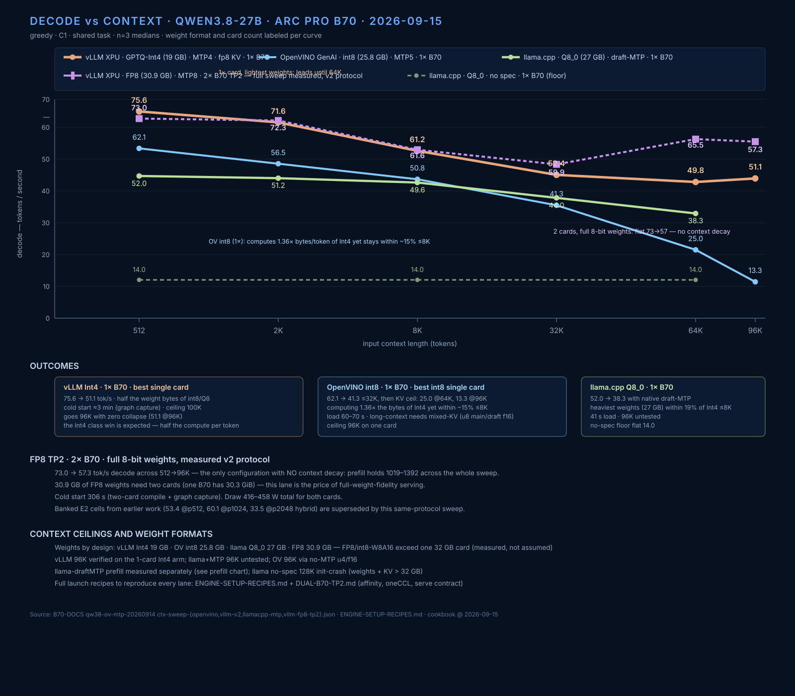
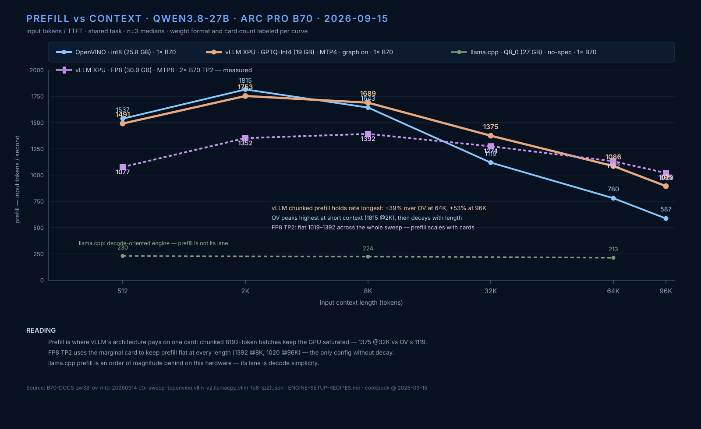
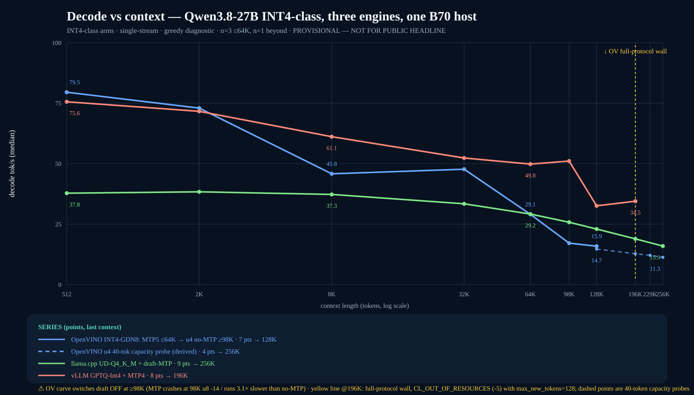
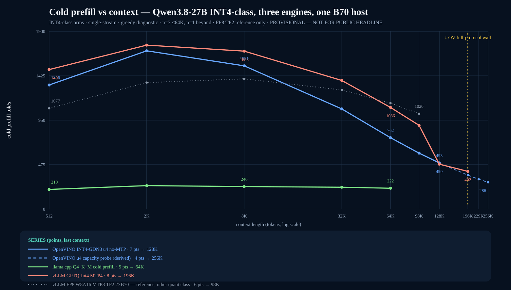

# Qwen3.8-27B engine context sweep — OpenVINO vs vLLM vs llama.cpp (2026-09-14)

**TL;DR — INT4-class ranking (2026-09-15, single-stream greedy, one B70 per
engine):** OpenVINO INT4-GDN8 + grafted MTP5 draft leads short context at
**79.5 tok/s @512** (73.0 @2K); vLLM GPTQ-Int4 + MTP4 is the serving leader
and decays slowest (**75.6 @512, 61.1 @8K, 45.7 @98K, 34.5 @196K**);
llama.cpp UD-Q4_K_M + draft is the only engine serving the full **256K**
(37.8 @512 → 16.0 @256K). OpenVINO's verified full-protocol envelope is
**≤163,840** (131,072 and 163,840 full protocols PASS, 2026-09-21);
**≥196,608 is upstream-blocked** (`CL_OUT_OF_RESOURCES`, per-generation
growth — one long generation passes at 196608, the second fails at 44 MiB
free; upstream [openvino.genai#4483](https://github.com/openvinotoolkit/openvino.genai/issues/4483)).
Those ≥196K rows below are 40-token capacity probes, not serving cells.

> **MEASUREMENT CORRECTION (v2, same night):** the first vLLM arm had two
> defects: decode was computed as tokens/wall including TTFT (understating
> decode drastically at long context), watts read the idle card, and it ran at
> the 150W default cap while OV ran 230W. The v2 rerun (single streaming
> request per run, GPU.0 counter, 230W cap, n=3) reverses the conclusion:
> vLLM does NOT collapse with context. v1 numbers below are kept for the
> record; the v2 table is authoritative.

Same model family, one Arc Pro B70 per engine, same filler text and lengths
(512→98K/128K), greedy, n=5 (≤8K) / n=3 (≥32K), C1.

## Decode tok/s (median post-first-token)

| len | OpenVINO GenAI¹ | vLLM XPU² | llama.cpp SYCL³ |
|---:|---:|---:|---:|
| 512 | 62.1 | **75.6** | 14.0 |
| 2K | 56.5 | **71.6** | 14.0 |
| 8K | 50.8 | **61.2** | 14.0 |
| 32K | 41.3 | **52.4** | 14.0 |
| 64K | 25.0⁴ | **49.8** | 14.0 |
| 96K | 13.3⁵ | **51.1** | 14.0 |
| 128K | — | — | init-crash⁶ |

## Prefill tok/s (input / TTFT)

| len | OpenVINO | vLLM | llama.cpp (150W-capped†) |
|---:|---:|---:|---:|
| 512 | **1537** | 1491 | 230 |
| 2K | 1815 | **1753** | 227 |
| 8K | 1643 | **1689** | 224 |
| 32K | 1119 | **1375** | 220 |
| 64K | 780 | **1086** | 213 |
| 96K | 587 | **895** | — |

¹ int8-ov VL split, VLMPipeline, MTP nat5, KV f16 ≤48K
² GPTQ-Int4 sym G128, MTP4 BF16-draft, fp8 KV, 0.27.2rc1, docker
³ Q8_0 GGUF (unsloth), flashnext 52d4268, fa on, no spec decode
⁴ mixed KV fix: main u8 + draft f16 (see OPENVINO-B70-TUNING.md §7b)
⁵ no-MTP u8-KV path; u4/f16 verified to 96K (13.3-14.5 tok/s), see below
⁶ 27.04 GiB weights + 128K f16 KV exceeds 32 GB at model init

† llama.cpp prefill measured under the 150W default cap; at 230W it gains
+23% (230→285 t/s at 512). Decode is cap-insensitive (15.2 both caps).

## Power (energy-counter means)

| Engine | mean W | cap | card |
|---|---:|---:|---|
| OpenVINO MTP | 202–211 | 230 W | GPU.1 |
| vLLM MTP4 (v2) | 194–229 | 230 W | GPU.0 |
| llama.cpp Q8_0 | 149.5 (n=53) | 150 W | GPU.0 |

llama.cpp decode is NOT power-bound: at 230W cap decode stays 15.2 (prefill
+23% to 285). vLLM v1's "~149W" was the 150W cap clipping it, and the
sweep-JSON watt fields for llama/vLLM-v1 read the idle card — known-bad,
superseded by v2 single-stream energy on GPU.0. The llama sweep JSON still
contains the idle-card 46W rows (wrong PCI); the 149.5W steady-state figure
in this doc comes from the dedicated timestamped sampler run.

## Protocol notes

- n counts: 512–8K n=5, 32K+ n=3 for the three full sweeps. EXCEPTIONS: the
  OV 64K mixed-KV point (n=2) and the 96K f16/u4 points (n=1 each) come from
  single-purpose ceiling probes — treat as provisional until rerun.

- llama.cpp measured via llama-bench pp/tg (engine metrics, fresh process
  per length); OV and vLLM measured client-side post-first-token. llama-bench
  uses synthetic prompts/tokens, not the shared counting task — immaterial
  for dense no-spec decode (its flat 14.0 matches OV no-MTP ~15), but spec
  acceptance on a real task would need the server path, not llama-bench.
- vLLM served via docker (OpenAI API, streaming TTFT); OV/llama native.
- Watt measurement: `energy1_input` µJ counter. Earlier drafts showed ~45 W
  for vLLM/llama — that was the idle card (wrong PCI device); corrected here.
- OV ceiling work (KV u8, mixed draft precision) documented in
  OPENVINO-B70-TUNING.md; raw JSONs in B70-DOCS `qw38-ov-mtp-20260914/`.

## OV context ceiling detail (all measured 2026-09-14 night)

| Config | max working | failure mode beyond |
|---|---|---|
| MTP nat5 + f16 KV | 48K clean | 64K: CL -14 crash |
| MTP nat5 + u8 main/f16 draft | 64K (25 tok/s) | 96K: CL_OUT_OF_RESOURCES |
| no MTP + f16 KV | 96K (13.3 tok/s @96K) | 131K: VRAM (33.8 GB needed) |
| no MTP + u8 KV | 64K (15.2) | >96K: decode returns empty (gen_tokens==1) |
| no MTP + u4 KV | 96K (14.5 tok/s @98K probe) | 131K: decode returns empty (prefill fine, 470 t/s) |

Compressed-KV decode (u8 AND u4) breaks between 98K and 131K with normal TTFT
and empty output — same signature as the u8-on-draft defect but length-driven
and MTP-independent. Upstream-filable against genai 2026.5.0.0-3412.

## vLLM XPU graph A/B (same GPTQ-Int4 MTP4 config, n=3)

| len | graph ON | graph OFF |
|---:|---:|---:|
| 512 | 57.27 | 52.66 |
| 8K | 13.58 | 13.34 |

Graphs ON = +8.7% at 512, +1.8% at 8K. The context-driven decode collapse is
NOT a graph artifact (both arms collapse identically).

> Note on OV 512: the headline catalog number 71.0 post-first (n=5, counting
> prompt) and this table's 62.1 are different prompts — the sweep uses the
> shared Eiffel-filler task for cross-engine comparability; acceptance rates
> differ by task. Same-protocol comparisons use this table only.

## llama.cpp + draft-MTP (the untested lever, now measured)

Same Q8_0 GGUF has native MTP tensors; `llama-server --spec-type draft-mtp`.
230W cap, GPU.0, same filler task, single streaming request, n=3:

| len | decode tok/s | vs no-spec 14.0 | watts |
|---:|---:|---:|---:|
| 512 | 52.0 | 3.7x | ~103 |
| 2K | 51.2 | 3.7x | 101.7 |
| 8K | 49.6 | 3.5x | 102.3 |
| 32K | 44.0 | 3.1x | 100.4 |
| 64K | 38.3 | 2.7x | 98.8 |

Prefill column INVALID in this run: server prompt-cache served the repeated
filler (TTFT 232-700 ms = cache hits, "prefill" up to 88K t/s). Decode is
clean — every run generates 128 fresh tokens. Cold-prefill measurement
needs cache_bos/prompt eviction between runs (follow-up).

**Updated ranking (decode, corrected protocol):**
- 512: vLLM 75.6 > llama-MTP 52.0 > OV 62.1 → vLLM leads
- 2K: vLLM 71.6 > OV 56.5 > llama-MTP 51.2
- 8K: vLLM 61.2 > OV 50.8 > llama-MTP 49.6
- 32K: vLLM 52.4 > llama-MTP 44.0 > OV 41.3
- 64K: vLLM 49.8 > llama-MTP 38.3 > OV 25.0
- 96K: vLLM 51.1 > llama-MTP (untested) > OV 13.3

vLLM still leads at every length, but llama.cpp+MTP closes most of the gap
and beats OV from 32K up — the "flat 14" picture was a config choice, not
an engine limit.

Exact per-engine setup commands, cold-start times, and graph-capture notes:
[ENGINE-SETUP-RECIPES.md](ENGINE-SETUP-RECIPES.md).

## vLLM FP8 TP2 (2× B70) — full measured sweep (2026-09-15)

Same v2 protocol as the single-card arms (shared filler task, n=3,
single streaming request). Weights `Qwen/Qwen3.8-27B-FP8` (30.9 GB, MTP8,
tensor-parallel 2, worker-affinity + oneCCL contract from DUAL-B70-TP2.md).
Cold start 306 s (two-card compile + graph capture). Draw 416–458 W total.

| len | decode tok/s | prefill tok/s | ttft ms |
|---:|---:|---:|---:|
| 512 | **73.0** | 1077 | 525 |
| 2K | **72.3** | 1352 | 1571 |
| 8K | **61.6** | 1392 | 5943 |
| 32K | **59.9** | 1274 | 25806 |
| 64K | **65.5** | 1132 | 57926 |
| 96K | **57.3** | 1020 | 96506 |

FP8 TP2 is the only configuration with NO context decay: decode holds 73→57
across 512→96K and prefill stays 1019–1392. The 64K decode (65.5) exceeds
8K (61.6) — MTP8 acceptance variance, n=3.

Earlier banked E2 cells (53.42/60.13/33.52 hybrid, synthetic prompts,
max-model-len 9216) are superseded by this same-protocol sweep for ranking
purposes; the E2 cells remain in [FP8-TP2-W8A16.md](FP8-TP2-W8A16.md) as the
original capability evidence.

Why TP2 and not single-card FP8: FP8 weights are 30.9 GB vs 30.3 GiB usable —
weights alone exceed one B70. Same for int8-W8A16 (31.6 GB, load dies at
init: measured, `vllm-int8-attempt.json`). Single-card classes that fit:
Int4 (19 GB) / int8-ov (25.8 GB) / Q8_0 (27 GB).

## PREFILL summary (single-card arms, v2 protocol)

| len | OpenVINO int8 | vLLM GPTQ-Int4 | llama.cpp Q8_0 (150W-capped†) | FP8 TP2 ref (2×B70) |
|---:|---:|---:|---:|---:|
| 512 | **1537** | 1491 | 230 | 1207 |
| 2K | 1815 | 1753 | 227 | 1315 (hybrid k=6) |
| 8K | 1643 | **1689** | 224 | — |
| 32K | 1119 | **1375** | 220 | — |
| 64K | 780 | **1086** | 213 | — |
| 96K | 587 | **895** | — | — |

† llama.cpp prefill under the 150W default cap; +23% at 230W (230→285 t/s
@512). llama+draft-MTP prefill INVALID in that run (server prompt-cache hits).
TP2 prefill cells are synthetic-prompt cold-input rates, not the filler task.

vLLM holds prefill best as context grows (chunked prefill, 8192 batches);
OV wins ≤2K; llama.cpp is decode-optimized, not prefill.

## Reading (final, all lanes measured 2026-09-15)

Weight formats and card counts are the axis that explains the curves; decode
leadership tracks weight bytes more than engine quality.

- **vLLM Int4 (19 GB, 1× B70)** — 76→51 tok/s, near-flat to 96K. Wins the
  single-card ranking because it computes ~half the weight bytes of the int8
  arms; that is expected physics, not an engine verdict.
- **OpenVINO int8 (25.8 GB, 1× B70)** — 62→41 tok/s ≤32K then KV-ceiling:
  25.0 @64K (mixed-KV fix: main u8 / draft f16), 13.3 @96K (no-MTP u4/f16).
  Strongest int8-weights kernels: computing 1.36× the bytes of Int4 yet
  within ~15% of it ≤8K.
- **llama.cpp Q8_0 + native draft-MTP (27 GB, 1× B70)** — 52→38 tok/s,
  2.7–3.7x its own no-spec 14.0 floor. Heaviest single-card weights, still
  within 19% of Int4 ≤8K. The "flat 14" was a config choice: the MTP tensors
  ship inside the same GGUF.
- **vLLM FP8 TP2 (30.9 GB, 2× B70)** — 73→57 tok/s flat with zero context
  decay (only configuration), prefill holds 1019–1392 everywhere. The price
  of full-weight-fidelity serving: needs a second card (30.9 GB > 30.3 GiB).
- Fair-comparison caveats that REMAIN: llama+MTP prefill unmeasured (server
  prompt-cache, follow-up); llama+MTP 96K untested; OV 64K/96K are n=1–2
  ceiling probes; FP8 TP2 64K decode (65.5) beats its 8K (61.6) on MTP8
  acceptance variance (n=3).
- 128K–163,840 on one card: only llama Q4 holds the verified full-protocol
  envelope to 163,840. vLLM config max 100K; OV full-protocol verified to
  163,840 and upstream-blocked at ≥196,608 (per-generation growth, #4483);
  llama Q8_0 init-crash (weights+KV > 32GB); FP8 weights physically exceed
  one card.

## INT4-class matrix (2026-09-15) — same weight class, 8-bit KV

One card each, same v2 protocol (single stream, median post-first-token),
8-bit KV on all arms (vLLM fp8 / llama q8_0 / OV u8). The honest same-class
comparison: every engine runs an Int4/Q4 artifact.

| Context | vLLM GPTQ-Int4 (19 GB) | llama UD-Q4_K_M+MTP (16.5 GB) | OV INT4-GDN8 + MTP5 (21 GB) |
|---|---:|---:|---:|
| 512 | 75.6 | 37.8 | **79.5** |
| 2K | 71.6 | 38.4 | 73.0 |
| 8K | 61.2 | 37.3 | 45.8 |
| 32K | 52.4 | 33.4 | 47.7 |
| 64K | 49.8 | 29.2 | 29.1 (no-draft crashed here) |
| 98K | 45.7 | 25.8 | ~4.7 (MTP collapses; 196K u4 = 40-tok probe only) |
| 128K | 32.6 | 23.0 | 14.7 (no-MTP u4, 40-tok probe) |
| 196K | 34.5 | 18.9 | 12.8 (no-MTP u4, 40-tok probe) |
| 224K | — | — | 12.1 (no-MTP u4, 40-tok probe) |
| 256K | not in KV budget | 15.9 | 11.3 (no-MTP u4) — **40-tok capacity probe only; full-protocol requests fail** `CL_OUT_OF_RESOURCES` (upstream [openvino.genai#4483](https://github.com/openvinotoolkit/openvino.genai/issues/4483)) |

Prefill (input tok/s, cold):

| Context | vLLM GPTQ-Int4 | OV INT4-GDN8 + MTP5 | llama Q4 (cold, no cache) |
|---|---:|---:|---:|
| 512 | 1491 | 1267 | 210 |
| 2K | 1753 | 1592 | 250 |
| 8K | 1688 | 1472 | 240 |
| 32K | 1375 | 1083 | 233 |
| 64K | 1086 | 775 | 222 |

Key measured facts:
- **MTP head graft closed the OV gap**: OV INT4-GDN8 went from 22.4 (no draft)
  to 79.5 @512 (+3.55×) with the Hub `OpenVINO/Qwen3.8-27B-int4-ov`
  `openvino_mtp_model.*` grafted into the GDN8 dir. Output correctness verified
  (numeric sequence intact). Without an MTP head OV cannot compete in this class.
- **OV long-context ceiling, honestly split by protocol**: with u4 KV +
  `cache_size=0`, full-protocol requests (128-token output, warmup + measured)
  are verified to **131,072 and 163,840** (2026-09-21) and fail at ≥196,608
  with `CL_OUT_OF_RESOURCES` — a per-generation growth bug (one long
  generation passes at 196608; the second 64-token generation fails at
  44 MiB free / 16 MiB largest block), not a capacity ceiling — filed upstream as
  [openvino.genai#4483](https://github.com/openvinotoolkit/openvino.genai/issues/4483).
  The 196K/224K/256K rows above are **40-token capacity probes** (11.3 t/s,
  28.8 GB at 256K) — proof the KV fits at rest, not a serving cell. u8 KV
  crashes earlier (-14 at 98K with MTP). The old 64K wall was cache
  preallocation, not the card.
- llama Q4 is the only engine that holds the full 256K on one card under the
  full protocol (37.8 → 15.9, 2.4× decay) at ~155 W.
- vLLM's single-card KV budget caps at ≈204K: 256K needs 9.33 GiB KV vs 7.47
  GiB free after 19 GB weights at util 0.94 (measured error message).
- llama Q4 prefill is flat 210-250 t/s measured COLD (--no-cache-prompt); the
  earlier 28K-113K sweep TTFTs were prompt-cache hits and are excluded.
- Raw: `ctx-sweep-{llamacpp-q4km-mtp,ov-int4-gdn8,ov-int4-gdn8-mtp5,vllm-v2}.json`,
  `vllm-int4-262k-probe.json`, `llama-q4km-cold-prefill.json`,
  `mtp-graft-validate.json` in `results/2026/09/qw38-ov-mtp-20260914/`.
