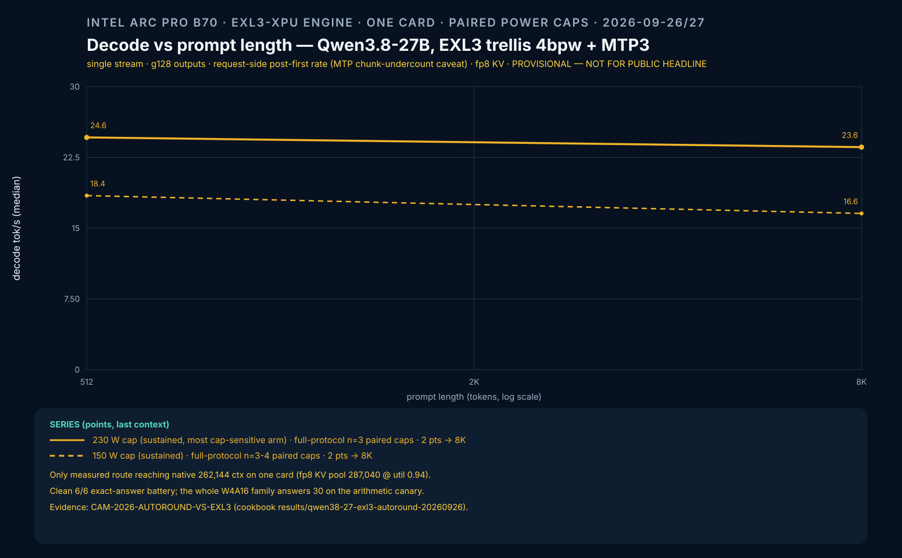
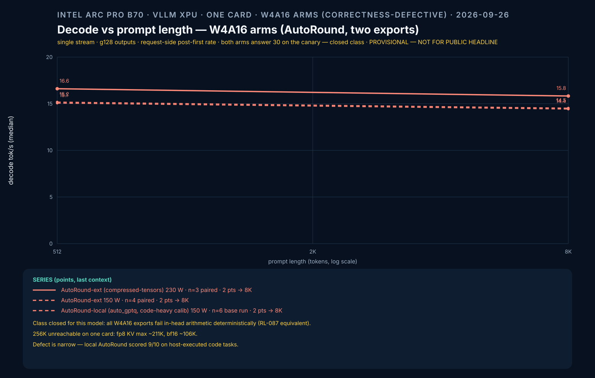

# Qwen3.8-27B on one B70 via EXL3 (exl3xpu engine)

> Route record — measured on the re-measure campaign `CAM-2026-AUTOROUND-VS-EXL3`
> (2026-09-26/27, official-lab self-report). This is the **primary single-card
> serving route** for Qwen3.8-27B on this host family. It supersedes the removed
> GPTQ-INT4 artifact; the W4A16/GPTQ class is closed for this model (see
> *Verdict* below).

## What it is

[exl3xpu](https://github.com/0xSero/exl3xpu) — a vLLM XPU fork carrying
turboderp's ExLlamaV3 **trellis** quantization (`EXL3`) with native ESIMD
kernels on Battlemage, plus `qwen3_5_mtp` speculative decoding (native MTP3).
It is NOT the mainline vLLM image — treat it as its own engine.

- Image (pinned): `ghcr.io/0xsero/exl3xpu@sha256:21412bdd7535e9c653eeb3d099dce3bc79a83d440def2cd9556111c79c870fa8`
  — vLLM `0.26.1.dev0+g568afb3a1` inside, ~32 GB.
- Weights (pinned): `turboderp/Qwen3.8-27B-exl3` rev `113cf7ab` — 4.00 bpw,
  ~15.7 GiB, MTP3 tensors, fp8 KV, native 262,144 context, vision tower.
- Hardware: 1× Intel Arc Pro B70 (32 GiB). Tested on 2×B70 host using card 0.

## Measured (one B70, 2026-09-26/27)

| Axis | Result |
|---|---|
| Exact-answer battery (greedy, thinking off) | **6/6 clean** — `sum(i*i for i in range(4))` = 14 twice, 9×7−3 = 60 |
| Host-executed task battery (5 bugfix + 5 codegen, cache ON) | 8/10 |
| Decode, sustained chunk-rate median n=3 | p512/g128: 18.4 @150 W → 24.6 @230 W · p8192/g128: 16.6 → 23.6 |
| Cap sensitivity | **+33–42 % at 230 W (paired medians)** — most power-limited arm measured |
| Context on ONE card | **full native 262,144** (fp8 KV pool 287,040 @ util 0.94); 131,098-token completion proven |
| Prefix cache (10,546-token shared prefix, n=5) | 8.11 s cold → ~1.5 s cached = **5.4×** |
| Effective decode bandwidth | ~240 GB/s @150 W → ~355 GB/s @230 W |





Numbers you must not mix: the decode figures are MTP chunk-rates (accepted
steps — they undercount generated tokens); compare within the campaign's
own arms only. The upstream ~400 GB/s full-decode figure and the 91 % lm_head
microbench are different cells on the author's stack.

**Why it wins despite lower bandwidth:** OpenVINO int4 streams ~414 GB/s at
150 W — closer to the 608 GB/s roofline — but EXL3 is the only measured route
that is simultaneously correct (clean battery), fits 256K on one card, keeps
the smallest resident footprint (15.7 GiB → ~76K more fp8-KV tokens than
equal-fp8 AutoRound), and scales hardest with the power cap.

## Serving recipe

```bash
# isolated daemon (the image is ~32 GB; keep it off your main dockerd's
# root disk). One-time:
sudo systemd-run --unit=b70-exl3-dockerd --description='isolated EXL3 dockerd' \
  dockerd -H unix:///run/b70-exl3-docker.sock \
  --data-root /mnt/b70-exl3-docker \
  --bridge b70-exl3-br0 --iptables

export DOCKER_HOST=unix:///run/b70-exl3-docker.sock
docker pull ghcr.io/0xsero/exl3xpu@sha256:21412bdd7535e9c653eeb3d099dce3bc79a83d440def2cd9556111c79c870fa8

docker run -d --name b70-exl3 -p 8100:8100 \
  --device /dev/dri --group-add $(stat -c '%g' /dev/dri/renderD128) \
  -v /dev/dri/by-path:/dev/dri/by-path:ro \
  -v <models_dir>/b70-exl3-qwen38-4bpw:/mnt/exl3model:ro \
  -e ZE_FLAT_DEVICE_HIERARCHY=COMPOSITE \
  ghcr.io/0xsero/exl3xpu@sha256:21412bdd7535e9c653eeb3d099dce3bc79a83d440def2cd9556111c79c870fa8 \
  models/qwen3.8-27b-exl3-4.00bpw --gpu 0 --model-path /mnt/exl3model \
  --set vllm.gpu_memory_utilization=0.90 --set vllm.max_model_len=65536
```

Startup ≈ 6–7 min (JIT + graph capture). `GET :8100/v1/models` is the health
probe. OpenAI-compatible chat completions.

Traps already priced in:

- **Isolated daemon is mandatory on a small root disk** — a 32 GB image pull
  under the containerd snapshotter writes to `/var/lib/containerd`; force
  overlay2 (`"features":{"containerd-snapshotter":false}` in daemon.json) or a
  big-disk `--data-root`.
- **`serve.py` takes a config positional** — `models/<id>` + `--set k=v`
  overrides. Bare vLLM flags are rejected.
- **gmu 0.965 OOMs on a dirty card** — 0.90 is the safe default; 0.94 on a
  clean card for capacity probes.
- **fp8 is the only KV dtype** — bf16 KV is rejected at capture warmup.
- **Prefix caching is ON by default** — do not benchmark cold cells without
  the entropy-guard protocol.

## The closed alternative (verdict, not recipe)

The W4A16/GPTQ family (symmetric int4 g128) is **closed for this model**:
GPTQModel, AutoRound→compressed-tensors, and local AutoRound→auto_gptq all
return `30` on the arithmetic canary while the BF16 base answers 14 via TP2
control. They are also the slowest arms (~15–16.5 chunk-rate) and cannot fit
256K (fp8 max ~211K). Narrow defect: in-head numeric evaluation only — the
local AutoRound still scored 9/10 on host-executed code tasks.

## Alternate route

OpenVINO int4-ov ([OPENVINO-CASCADIA-REPORT.md](OPENVINO-CASCADIA-REPORT.md)) —
clean correctness, best steady-150 W decode (~28.5 tok/s at the practical
bandwidth roofline), but MTP draft is off ≥98K and the thinking-mode
generation budget handicaps long structured outputs (4/10 on the exec battery).

## Evidence

Campaign: `results/qwen38-27-exl3-autoround-20260926/summary.json`
(per-arm table, incident log). Task battery, cache probe, cap-pair and KV
probes are in the private lab repo `B70-DOCS
results/2026/09/autoround-vs-exl3-20260926/` (RESULTS.md is the full matrix).
