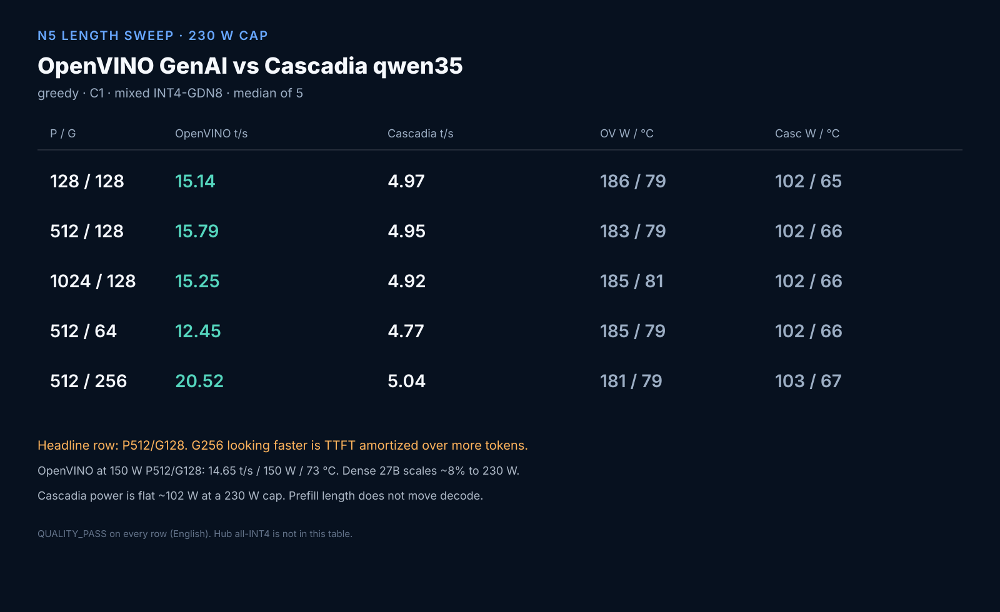
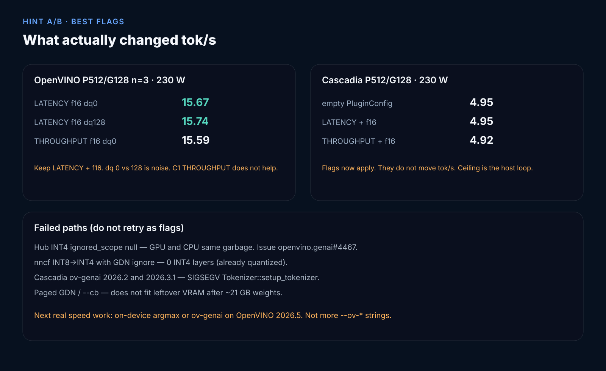

# Qwen3.8-27B OpenVINO vs Cascadia — full report (2026-09-12)

> **SUPERSEDED NUMBERS (2026-09-15):** the 15.79 t/s rows below are the
> pre-MTP-graft baseline. With the grafted MTP5 draft head, OpenVino runs
> 79 t/s @512 (single-card short-ctx champion) and a composite curve to
> 128K — see [ENGINE-COMPARISON-CTX](ENGINE-COMPARISON-CTX-20260914.md).
> Cascadia numbers stand as measured.

Research, not a catalog ranking. Working IR:
[`SergiioB/Qwen3.8-27B-int4-gdn8-ov`](https://huggingface.co/SergiioB/Qwen3.8-27B-int4-gdn8-ov).
Hub `OpenVINO/Qwen3.8-27B-int4-ov` is still broken
([openvino.genai#4467](https://github.com/openvinotoolkit/openvino.genai/issues/4467)).

## How the campaign went

1. **Official INT4** loads on GenAI 2026.5. Greedy output is punctuation
   on GPU.0 and the **same string on CPU** (251 s). Dummy image → token 0.
   `ignored_scope: null` quantized GatedDeltaNet. Not a plugin bug.
2. **Flags on that IR** (fresh JIT, dyn-quant 0/128, official image kwargs)
   did not fix it.
3. **INT8 Hub IR** QUALITY_PASS. Python 13.09 tok/s (150 W, n=128). Superseded 2026-09-14 by MTP decode: 18.72 tok/s no-MTP → 61.56 at MTP4 (230 W) — see [OPENVINO-MTP.md](OPENVINO-MTP.md).
   Cascadia `qwen35` 4.56 tok/s. `ov-genai` SIGSEGV (2026.2 and 2026.3.1).
4. **Disk** for a BF16 re-export: dropped DeepSeek Q8, Qwen3.6-35B,
   Nemotron GPTQ, leftover 3.6-27B, vxk-build, qw38-fp8. ComfyUI kept.
5. **Mixed INT4**: BF16 download 52 GB → FP16 IR on `/mnt/models2`
   (Transformers **5.2.0**; 5.4.0 refuses the exporter) →
   `IgnoredScope(patterns=[".*linear_attn.*"])` → 73% INT4 / 22% float GDN,
   language 21 GB → `convert_tokenizer`. QUALITY_PASS.
6. **N5 at 150 W then 230 W.** Dense 27B OpenVINO scales ~8% with the cap.
   Cascadia does not (stuck ~102 W).
7. **Wired `--ov-*` into `qwen35`** (stock 0.2.3 ignored them). LATENCY+f16
   vs empty config: **4.95 = 4.95**. THROUGHPUT: 4.92.

## Best flags (measured)

OpenVINO GenAI 2026.5 `VLMPipeline` GPU.0, 230 W cap:

- `PERFORMANCE_HINT=LATENCY`
- `INFERENCE_PRECISION=f16`
- `DYNAMIC_QUANTIZATION_GROUP_SIZE=0` or `128` (15.67 vs 15.74, noise)
- `generation_config=` **keyword**
- THROUGHPUT at C1: 15.59, slightly worse

Cascadia `qwen35` (local rebuild vs OpenVINO 2026.3.1):

- `--ov-performance-mode LATENCY --ov-inference-precision f16`
- `--ov-cache-dir` on
- `--prefix-cache-gb 1` (15 GiB did not help decode)
- THROUGHPUT: 4.92 vs LATENCY 4.95

## Head-to-head

Same mixed INT4 IR except llama.cpp (GGUF).

| Backend | Artifact | Best decode | Package W | Tmax | Quality |
|---|---|---|---|---|---|
| OpenVINO GenAI 2026.5 | INT4-GDN8 VLM | **15.79** P512/G128 n=5 | 183 | 79 °C | PASS |
| Cascadia qwen35 | 1-stage surgery of that IR | **4.95** same row | 102 | 66 °C | PASS |
| llama.cpp SYCL | Q4_K_M GGUF | **18.58** tg128 | 150 W run | — | PASS |

OpenVINO is **3.2×** Cascadia on the same weights. llama.cpp is a
different quant path.

## Strong / weak

**OpenVINO GenAI**

- Strong: fused on-device decode, uses the 230 W cap, vision IR, official
  Python API, mixed INT4 is coherent.
- Weak: Hub all-INT4 is a trap; FastDraft IR missing; paged GDN does not
  fit; positional `generate(cfg)` is treated as images; Minja
  `enable_thinking` template; no OpenAI HTTP unless you wrap it.

**Cascadia**

- Strong: one binary, OpenAI HTTP, shard/pipeline-parallel, `doctor`,
  prefix cache, IR surgery without re-quant.
- Weak: `ov-genai` cannot load this VLM; `qwen35` is greedy batch=1 with
  host f32 logits (~102 W); stock 0.2.3 dropped `--ov-*`; linked 2026.3.1
  vs Python 2026.5; will not match GenAI tok/s without on-device argmax.

## Takeaways

1. Do not download Hub INT4 for Qwen3.8-27B. Use INT8 or the mixed GDN8 IR.
2. One B70 speed: Python GenAI (or llama.cpp GGUF / GPTQ vLLM). Cascadia
   is the HTTP/multi-box product.
3. Plugin strings are exhausted. Next speed work is engine shape, not flags.
4. Report P512/G128 n=5 median. Do not headline G256 wall tok/s.
