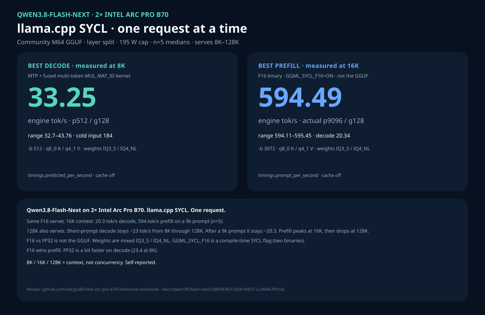
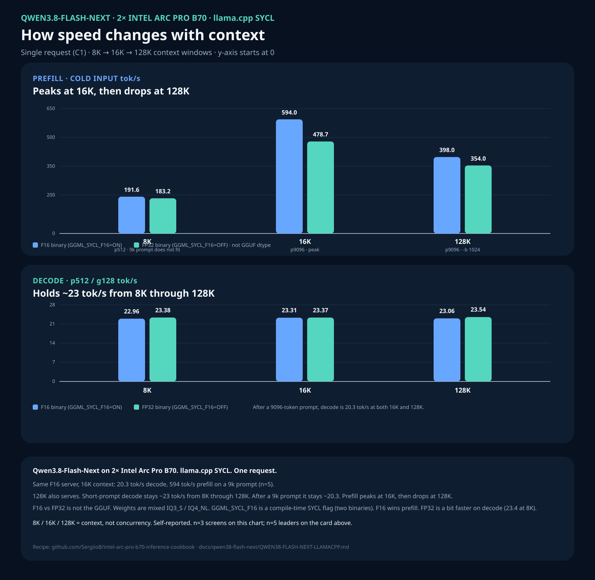
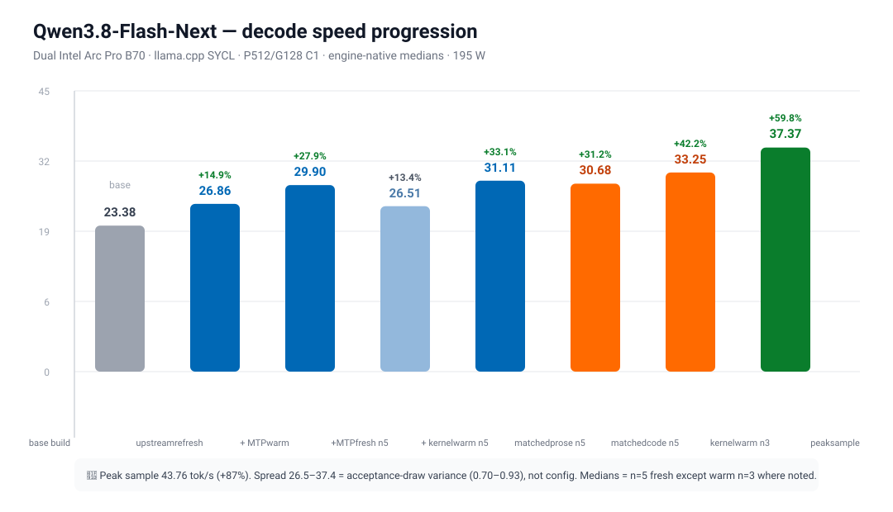
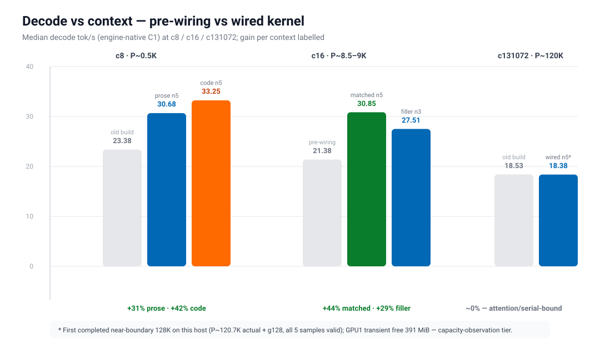
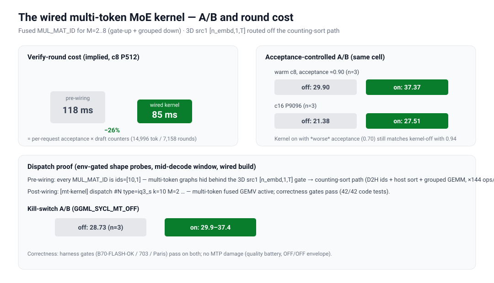
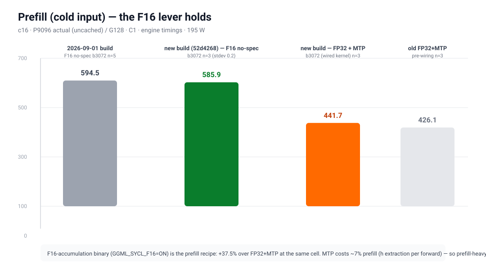

# Qwen3.8-Flash-Next on two Arc Pro B70s

llama.cpp SYCL, one request at a time (`-np 1`). 8K / 16K / 128K on this page
are **context windows**, not concurrency. The same patched tree serves all
three. The n=5 leader cells happen to be 8K decode and 16K prefill — that is
not a 16K cap.

This is a different model from [Qwen3.8-27B](../qwen38-27b/README.md). The
numbers are llama.cpp engine timings, not vLLM client rates.

> **2026-09-11 update — MTP + fused multi-token MoE kernel.** The recipe below
> (no-spec, pinned build `9723942`) still works and is the fallback. The new
> leader route is upstream main `52d4268` + a qwen4exp MTP port + a local fused
> multi-token `MUL_MAT_ID` kernel: **33.25 tok/s** decode (P512/G128 C1, code
> task, n=5 median; prose 30.68) vs **23.38** on the old build (+42%), **585.9
> tok/s** prefill (F16 path), and the **first completed near-boundary 128K**
> (P~120.7K, 18.38 tok/s, n=5). See "MTP + kernel update" section. The main
> GGUF still carries no MTP tensors — the draft is a separate head GGUF.





## MTP + kernel update (2026-09-11)



Same serving contract as below (C1, n=5 fresh-server medians unless noted,
t=1.0 / top_p 0.95 / top_k 20, ignore_eos, exact token counts, zero cache
reuse, 195 W, PLE pre-warmed). Matched natural-prompt cells (prose/code
tasks), not filler.

| Build | Cell | Decode | vs old build 23.38 |
|---|---|---:|---:|
| pinned `9723942` (recipe below) | 8K p512/g128 | 23.38 | base |
| upstream `52d4268`, no-spec | 8K p512/g128 | 26.86 (n=3) | +15% |
| `52d4268` + MTP tuned, warm | 8K p512/g128 | 29.90 (n=3) | +28% |
| + **wired multi-token kernel**, warm | 8K p512/g128 | **37.37** (n=3, peak 43.76) | **+60%** |
| + wired kernel, matched **prose** | 8K p512/g128 | **30.68** (n=5) | +31% |
| + wired kernel, matched **code** | 8K p512/g128 | **33.25** (n=5) | **+42%** |



| Context / input | Pre-wiring | Wired | Gain |
|---|---:|---:|---:|
| c8, P~0.5K code | 23.38 (old build) | 33.25 | +42% |
| c16, P~8.5K prose | 21.38 | **30.85** (n=5) | +44% |
| c131072, P~120.7K near-boundary | 18.53 (old build) | **18.38** (n=5, first completed 120K) | ~0% (attention/serial-bound) |

Prefill unchanged-best on the F16 binary: **585.9 tok/s** cold input
(P9096/G128/C1, n=3; old build was 594.49 n=5 — same class).



**Why it is faster:** upstream MTP verify runs every routed MoE op as
`ids=[10,1]` even for multi-row verify batches — the 3D `src1 [n_embd,1,T]`
form hid behind the `ne12 == 1` gate and fell to the counting-sort path
(D2H expert ids + host sort + grouped GEMM, ~144 ops/round). The local patch
fuses those into one multi-token GEMV: verify-round cost **118 → ~85 ms**,
measured by per-request acceptance/counters; env kill-switch
`GGML_SYCL_MT_OFF=1` reproduces the pre-wiring numbers. Quality battery:
42/42 code tests, output divergence inside the spec-OFF envelope.



### MTP recipe delta (on top of the flags below)

- Tree: upstream main `52d42686560a9e8f441f9b9780c8890c37d2802d` (the pinned
  `9723942` patches are superseded — the fused IQ3_S/IQ4_NL MMVQ is upstream).
- Patches, in this order, from the cookbook checkout:

```bash
git checkout 52d42686560a9e8f441f9b9780c8890c37d2802d
git apply patches/llamacpp-sycl/qwen4exp-mtp-draft-head.patch
git apply patches/llamacpp-sycl/sycl-fused-mmvq-mt.patch
```

  Copy the two files next to the llama.cpp tree, or pass the cookbook path
  to `git apply`. Do not apply `flashnext-arch-overlay.patch` or
  `sycl-fused-mmvq-and-gpu-group.patch` on this pin.

| File | SHA-256 |
|---|---|
| `qwen4exp-mtp-draft-head.patch` | `86fccb037a98605079b2b0178cc21d910341f9a0b060e5b534da499a0a2c1222` |
| `sycl-fused-mmvq-mt.patch` | `126632bbf5ec5fe16401254d262dacba1a4b6728756400ba65010faa1c30516e` |

  First file: qwen4exp MTP draft-head (adapted from
  [dzannotti's patch](https://huggingface.co/dzannotti/Qwen3.8-Flash-Next-MTP-GGUF):
  MTP-only tensor walk, `graph_mtp`, `DECODER_MTP` routing, `t_h_nextn`
  handover, two drift fixes for post-b10612 upstream).
  Second file: fused multi-token MoE kernel (`mul_mat_vec_q_moe_mt` +
  `ggml_sycl_mul_mat_vec_q_id_mt`, M=2..8, gate-up + grouped down forms).
  Wrapper accepts 3D `src1 [n_embd,1,T]` and `[n_embd,k,T]`.
  `GGML_SYCL_MT_OFF=1` falls back to the counting-sort path (MTP accept
  stays high, tok/s drops below no-spec). Full inventory:
  [`results/qwen38-flash-next-mtp-kernel-v1/summary.json`](../../results/qwen38-flash-next-mtp-kernel-v1/summary.json).
- Draft head:
  [`dzannotti/Qwen3.8-Flash-Next-MTP-GGUF`](https://huggingface.co/dzannotti/Qwen3.8-Flash-Next-MTP-GGUF)
  `Q4_K_M` (2.44 GiB, SHA-256 `1f2a6991…f4c02`), served with
  `-md <draft.gguf> -ngld 999 --spec-type draft-mtp --spec-draft-n-max 3
  --spec-draft-p-min 0.75 --spec-draft-backend-sampling --spec-draft-device SYCL1`.
- **`LLAMA_ATTN_ROT_DISABLE=1` is mandatory** with quantized KV on qwen4exp
  (load/decode crash otherwise, upstream issue #21038).
- Sampling defaults follow the HF card's **thinking** mode (reasoning on):
  `--temp 1.0 --top-p 0.95 --top-k 20 --min-p 0.0` — these are baked into the
  desktop launcher and match every measured cell on this page.
- Decode binary: FP32 (`GGML_SYCL_F16=OFF`). Prefill binary: F16, no spec.
- 128K with MTP needs `-b/-ub 1024` and fits only as a capacity observation
  (GPU1 transient free 391 MiB at demand time; all 5 samples valid).

Catalog records:
[`qwen38-flash-next-mtp-kernel-decode-v1`](../BENCHMARK-CATALOG.md),
`-prefill-v1`, `-c128-nearboundary-v1`. LocalMaxxing: matched decode record
`cmtwyygmq0ah0ps01vvutjf7u` (APPROVED).

## What we measured

Self-reported, n=5 after one discarded warmup. Sampling: temperature 1.0,
`top_p=0.95`, `top_k=20`, `ignore_eos`, exactly 128 output tokens, cache off.

| Build | Context | Prompt / output | Decode | Cold input |
|---|---|---|---:|---:|
| FP32 (`GGML_SYCL_F16=OFF`) | 8K | p512 / g128 | **23.38** tok/s (23.22–23.73) | 183.98 |
| F16 (`GGML_SYCL_F16=ON`) | 16K | actual p9096 / g128 | 20.34 tok/s | **594.49** (594.11–595.45) |

`GGML_SYCL_F16` is a compile-time SYCL flag, not the weight dtype. Build one binary per server. F16 wins prefill; FP32 is a bit faster on decode. The F16 16K server is also the 20.3 tok/s decode / 594 tok/s prefill pair.

Average card draw on those cells was about 97–99 W (GPU 0) and 108 W (GPU 1)
against a 195 W cap. With the 88 GiB model resident, GPU 1 package sat near
62 °C at idle.

Smoke on every measured server: `B70-FLASH-OK`, `37*19=703`, `Paris`.

Raw JSON: [results/qwen38-flash-next-dual-b70-c1/](../../results/qwen38-flash-next-dual-b70-c1/).

## Prerequisites

| Need | What we used |
|---|---|
| GPUs | **Two** Intel Arc Pro B70 32 GB (64 GB combined). Layer split, no GPU P2P. One card cannot hold this GGUF. |
| VRAM | ~32,656 MiB visible per card. Empty-card `visible_avail` ~31 GiB on **both** cards before load. |
| Host RAM | **32 GB is enough** with mmap. Do **not** `--mlock` or `--no-mmap` — the file is 88 GiB. The ~36 GiB N-gram table (shard `00002`, Q5_1) is mmap-backed and served from host memory/disk, never VRAM. |
| Disk | **≥110 GiB free**: 88.03 GiB GGUF (33 shards) + ~20 GiB for llama.cpp source and **two** SYCL builds. KV cache lives entirely in VRAM, not on disk. Shard `00002` (N-gram table) alone is ~38.4 GiB. |
| CPU | 16-thread class (Ryzen 7 5700X3D here). Server uses `-t 6 -tb 14`. |
| OS / driver | Linux, `xe` driver, Level Zero. `sycl-ls` must list both B70s as SYCL0 / SYCL1. |
| Compiler | Intel oneAPI **IntelLLVM 2026.0.0**, CMake, git, `huggingface-cli`. |

This is not the Qwen3.8-27B vLLM recipe.

**F16 vs FP32** is not the GGUF. Weights stay mixed IQ3_S / IQ4_NL. `GGML_SYCL_F16` is a compile-time SYCL math flag, so you build two binaries. F16 wins prefill; FP32 is a bit faster on decode.

## Hardware and weights

- Two Intel Arc Pro B70 32 GB, CPU-attached x8 + x8, no GPU P2P.
- GGUF: [`AtomicChat/Qwen3.8-Flash-Next-GGUF`](https://huggingface.co/AtomicChat/Qwen3.8-Flash-Next-GGUF)
  folder `Qwen3.8-Flash-Next-AD-4.27bpw-Q4_K_M-M64`, revision
  `142262902a46f7daed19c79d0771534c8106ad59` (33 shards, 88.03 GiB).
- Mixed quant: gate/up **IQ3_S**, down **IQ4_NL**. The folder name `Q4_K_M` is
  not a uniform Q4_K_M file.
- KV: `q8_0` K + `q4_1` V. Flash attention on. The main GGUF carries no MTP
  tensors; the MTP route uses the separate dzannotti draft head (see the
  2026-09-11 update above).

#### N-gram (per-layer token embedding) table

The N-gram lookup table lives **on disk, not in VRAM**. It is a single tensor
`per_layer_token_embd.weight`, dims `[160, 320001536]` (160 per-layer rows × a
320 M vocab-lookup axis, ~51.2 B elements), quantized **Q5_1** (GGUF dtype 7),
and it occupies shard **`00002`** of 33 entirely on its own (~38.4 GiB on disk;
BF16 source would be ~95.4 GiB). Everything after it (`00003`+) holds the layer
weights: routed/shared experts IQ3_S (gate/up) + IQ4_NL (down), and Q8_0
attention/SSM/head projections. Shard `00001` holds only the LM head.

It never enters GPU memory. The serve line forces it to host RAM with
`-ot 'per_layer_token_embd=CPU'`; at ~35.8 GiB Q5_1 it cannot fit in the
combined ~65 GiB VRAM next to the experts and the `q8_0`/`q4_1` KV cache, so
llama.cpp memory-maps it from the GGUF and serves the lookups from CPU/disk.
Treat it as a separate placement and quantization axis from the GPU-resident
weights (see `docs/qwen38-27b/README.md` for the sibling 27B route; do not mix).

## Reproduce

### 1. Weights

```bash
huggingface-cli download AtomicChat/Qwen3.8-Flash-Next-GGUF \
  --revision 142262902a46f7daed19c79d0771534c8106ad59 \
  --include 'Qwen3.8-Flash-Next-AD-4.27bpw-Q4_K_M-M64/*' \
  --local-dir "$HOME/models/qwen38-flash-next-m64"
```

llama.cpp split GGUF: pass **only the first shard** to `-m`. The other 32 files
must stay in the same directory with the same prefix. The first file’s metadata
points at `00002`…`00033`; llama.cpp opens them from that folder.

```bash
export MODEL="$HOME/models/qwen38-flash-next-m64/Qwen3.8-Flash-Next-AD-4.27bpw-Q4_K_M-M64/Qwen3.8-Flash-Next-AD-4.27bpw-Q4_K_M-M64-00001-of-00033.gguf"
ls "$(dirname "$MODEL")" | wc -l   # expect 33
```

### 2. llama.cpp pin

```bash
git clone https://github.com/ggml-org/llama.cpp
cd llama.cpp
git checkout 9723942adc518b43c4b95dc4dce6906903eb5e09
```

### 3. Patches (this cookbook, in this order)

```bash
git apply patches/llamacpp-sycl/flashnext-arch-overlay.patch
git apply patches/llamacpp-sycl/sycl-fused-mmvq-and-gpu-group.patch
# run from the cookbook checkout; both files are in-repo under patches/llamacpp-sycl/
```

SHA-256:

| File | SHA-256 |
|---|---|
| `flashnext-arch-overlay.patch` | `bf9b00b89cf132c6db95bd51f7f3398b5362986c7c116e083631ac9cec8972b1` |
| `sycl-fused-mmvq-and-gpu-group.patch` | `4fb812ee13d0df5217b2a93f3d11e9cb98afccaf55d08963d16674da4ad2c836` |

The second patch is fused IQ3_S / IQ4_NL `MUL_MAT_ID` MMVQ plus on-device
expert-ID grouping. Grouping is on by default; `GGML_SYCL_DISABLE_MMID_GPU_GROUP=1`
turns it off. The n=5 prefill median 594.49 was taken before grouping; a matched
n=3 A/B later measured 599.48 vs 594.67 (+0.81%). Decode is unchanged.

Older split files `sycl-fused-mmvq-iq3s-iq4nl.patch` and
`sycl-mmid-gpu-group-20260901.patch` conflict if both are applied. Use the
combined kernel patch.

### 4. oneAPI

```bash
source /opt/intel/oneapi/setvars.sh --force
```

### 5. Build the binary you will serve

FP32 binary (n=5 decode leader at 8K; also used for the 16K/128K FP32 map):

```bash
cmake -S . -B build-sycl \
  -DGGML_SYCL=ON \
  -DGGML_SYCL_F16=OFF \
  -DCMAKE_C_COMPILER=icx \
  -DCMAKE_CXX_COMPILER=icpx
cmake --build build-sycl --target llama-server -j
```

F16 binary (n=5 prefill leader at 16K; also used for the 8K/128K F16 map):

```bash
cmake -S . -B build-sycl-f16 \
  -DGGML_SYCL=ON \
  -DGGML_SYCL_F16=ON \
  -DCMAKE_C_COMPILER=icx \
  -DCMAKE_CXX_COMPILER=icpx
cmake --build build-sycl-f16 --target llama-server -j
```

Measured llama-server SHA-256 (pre-grouping fused MMVQ builds):

- FP32: `f56a838b0e1a16aa8a1321ce2a217c8f3e972e961cf0aca706f76f4d6421c98b`
- F16: `2da6e9fc89d9cb68368feb1a2e7ef1045ff705acb16721755ac1f72149dd1ee3`

### 6. Runtime env

```bash
export SYCL_PI_LEVEL_ZERO_USE_IMMEDIATE_COMMANDLISTS=0
export SYCL_CACHE_PERSISTENT=0
export SYCL_DEVICE_FILTER=level_zero
export ZE_FLAT_DEVICE_HIERARCHY=COMPOSITE
```

Set each card's power cap through the `xe` hwmon `power1_cap`. Confirm with
`sycl-ls` that SYCL0 / SYCL1 are the two B70s.

### 7. Serve

Shared flags for every context size:

```text
-m "$MODEL"
--device SYCL0,SYCL1 --tensor-split 1,1 --split-mode layer -ngl 99
-ot 'per_layer_token_embd=CPU' -fa on -t 6 -tb 14 -np 1
--cache-type-k q8_0 --cache-type-v q4_1
--no-warmup --no-cache-prompt --host 127.0.0.1 --port 8001
```

**Sampling — Hugging Face card defaults** (`Qwen/Qwen3.8-Flash-Next`). Serve with
the card's values as server-side defaults so clients that omit parameters get
recommended behavior:

| Mode | `--temp` | `--top-p` | `--top-k` | `--min-p` | `--presence-penalty` |
|---|---:|---:|---:|---:|---:|
| Thinking (default; this page's MTP recipe) | 1.0 | 0.95 | 20 | 0.0 | 0.0 |
| Non-thinking (`chat_template_kwargs: {"enable_thinking": false}`) | 0.7 | 0.80 | 20 | 0.0 | 1.5 |

Thinking-mode line to append to any serve command below:

```text
--temp 1.0 --top-p 0.95 --top-k 20 --min-p 0.0
```

For non-thinking serving use `--temp 0.7 --top-p 0.80 --top-k 20 --min-p 0.0
--presence-penalty 1.5` instead (card: presence_penalty may be raised 0–2 against
endless repetition; higher values can cause language mixing).

`-ot 'per_layer_token_embd=CPU'` pins the N-gram table (shard `00002`, Q5_1)
to host memory — see "N-gram (per-layer token embedding) table" above. It is
never loaded into VRAM.

Only `-c` and `-b` / `--ubatch-size` change:

| Context | `-c` | `-b` / `--ubatch-size` | Binary for the published n=5 cell |
|---|---:|---:|---|
| 8K | 8192 | 512 | FP32 (`build-sycl`) |
| 16K | 16384 | 3072 | F16 (`build-sycl-f16`) |
| 128K | 131072 | 1024 | either; n=5 leaders were not 128K |

`-b 1536+` at 128K was rejected (`n_gpu_layers already set by user to 99`).
Do not pass `--no-mmap` or `--mlock` on this GGUF. `-fa on` is required:
`q4_1` V refuses flash-attention off.

8K (FP32 binary) — n=5 decode **23.38**:

```bash
./build-sycl/bin/llama-server -m "$MODEL" \
  --device SYCL0,SYCL1 --tensor-split 1,1 --split-mode layer -ngl 99 \
  -ot 'per_layer_token_embd=CPU' -c 8192 -fa on -t 6 -tb 14 -np 1 \
  -b 512 --ubatch-size 512 --cache-type-k q8_0 --cache-type-v q4_1 \
  --no-warmup --no-cache-prompt --host 127.0.0.1 --port 8001
```

16K (F16 binary) — n=5 prefill **594.49**:

```bash
./build-sycl-f16/bin/llama-server -m "$MODEL" \
  --device SYCL0,SYCL1 --tensor-split 1,1 --split-mode layer -ngl 99 \
  -ot 'per_layer_token_embd=CPU' -c 16384 -fa on -t 6 -tb 14 -np 1 \
  -b 3072 --ubatch-size 3072 --cache-type-k q8_0 --cache-type-v q4_1 \
  --no-warmup --no-cache-prompt --host 127.0.0.1 --port 8001
```

128K (same F16 binary, smaller ubatch):

```bash
./build-sycl-f16/bin/llama-server -m "$MODEL" \
  --device SYCL0,SYCL1 --tensor-split 1,1 --split-mode layer -ngl 99 \
  -ot 'per_layer_token_embd=CPU' -c 131072 -fa on -t 6 -tb 14 -np 1 \
  -b 1024 --ubatch-size 1024 --cache-type-k q8_0 --cache-type-v q4_1 \
  --no-warmup --no-cache-prompt --host 127.0.0.1 --port 8001
```

### 8. Smoke

```bash
curl -s http://127.0.0.1:8001/v1/chat/completions \
  -H 'Content-Type: application/json' \
  -d '{"model":"flash-next","messages":[{"role":"user","content":"Reply with exactly B70-FLASH-OK"}],"max_tokens":16,"temperature":0}'
```

## Context map (n=3)

Same C1 contract. 8K cannot hold a 9096-token prompt. Decode at p512 stays
~23 tok/s through 128K.

| Build | Context | Batch | p512 decode | p512 cold input | p9096 decode | p9096 cold input |
|---|---|---:|---:|---:|---:|---:|
| FP32 | 8K | 512 | 23.38 | 183.17 | — | — |
| FP32 | 16K | 3072 | 23.37 | 183.61 | 20.25 | 478.71 |
| FP32 | 128K | 1024 | 23.54 | 183.38 | 20.41 | 353.95 |
| F16 | 8K | 512 | 22.96 | 191.55 | — | — |
| F16 | 16K | 3072 | 23.31 | 192.64 | 20.40 | 593.98 |
| F16 | 128K | 1024 | 23.06 | 195.57 | 20.25 | 398.02 |

JSON: [`n3-context-map.json`](../../results/qwen38-flash-next-dual-b70-c1/n3-context-map.json).

## LocalMaxxing

`APPROVED` means accepted self-report, not independent reproduction. Platform
`quantization` is `IQ3_S`; mixed IQ3_S/IQ4_NL is in the notes.

| Cell | `tokSOut` | `tokSPrefill` | Context | Run |
|---|---:|---:|---|---|
| FP32 p512/g128 | 23.38 | 183.98 | 8192 | `cmtigo30804dyp401alu7nger` |
| F16 p9096/g128 | 20.34 | 594.49 | 16384 | `cmtigo39n04e2p401eumx5joo` |
| MTP+kernel p512/g128 code (matched) | 33.25 | — | 8192 | `cmtwyygmq0ah0ps01vvutjf7u` |
| MTP warm p512/g128 | 27.71 | 173.2 | 8192 | `cmtwkbb6j0af5ps01d3eta1lj` |
| F16 p9096/g128 (new build) | 22.96 | 585.9 | 16384 | `cmtwkbbgr0af9ps01dhv7ntgu` |

Receipts: [`localmaxxing-receipts.json`](../../results/qwen38-flash-next-dual-b70-c1/localmaxxing-receipts.json).

## Limits

- Layer split across two cards, not vLLM tensor parallel.
- vLLM-XPU, AutoRound, and the official BF16 checkpoint are not this recipe.
- Speed here is not a quality or logit-parity result.

Catalog: [`docs/BENCHMARK-CATALOG.md`](../BENCHMARK-CATALOG.md).
Pins: [`identities.json`](../../results/qwen38-flash-next-dual-b70-c1/identities.json).
